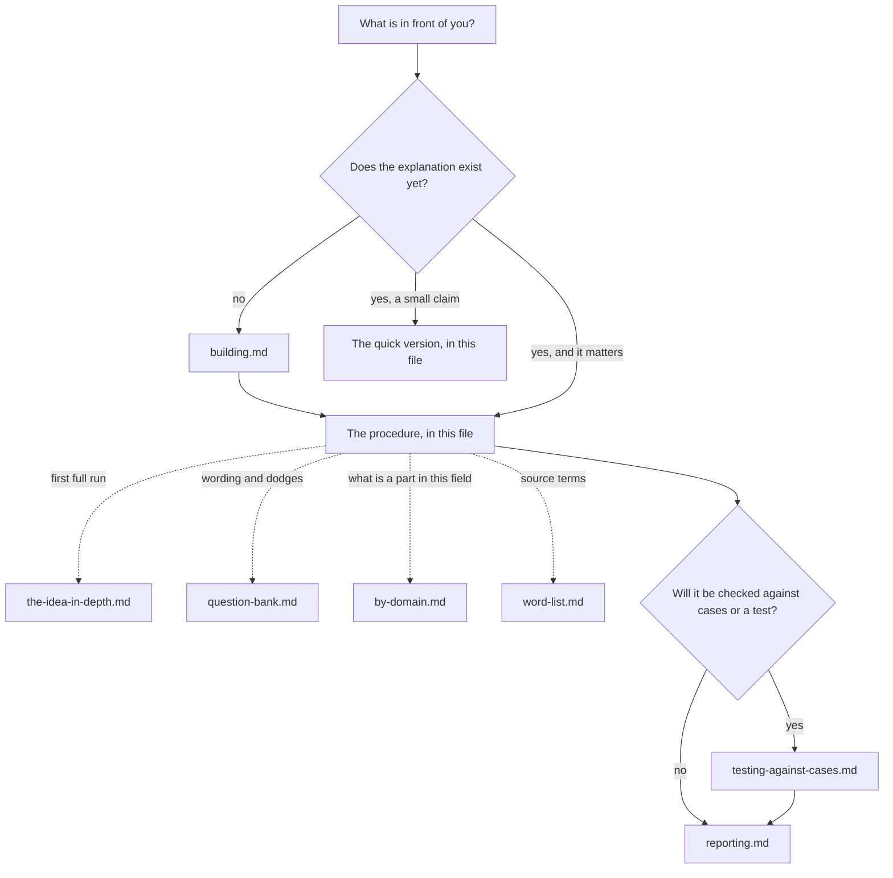

# Hard to vary

A good explanation is hard to vary: you cannot change its parts and still have it explain what it is meant to explain. A bad explanation is easy to vary: its details could be swapped for others and it would "explain" just as well, which shows the details were never held in place by the thing being explained.

The idea is David Deutsch's (*The Beginning of Infinity*). This skill sharpens it using a formal theory supplied by the user, "Claude Fable Semantics". That theory's terms are mapped to plain words in `references/word-list.md`.

This skill is a way of criticising, not a truth-meter. Passing does not prove an explanation true. Failing does not prove it false. It shows which parts are held in place, which are loose, and what would tighten them.

## The idea in one example

Why are there seasons?

*Old story:* a goddess grieves for part of each year, and her grief makes winter. Swap the goddess for another. Change why she grieves. Change the bargain that sets the dates. The story works exactly as well every time. Nothing about winter holds any detail in place. Now add one more job: when it is winter in the north it is summer in the south. The story breaks, because grief would chill the whole world at once.

*Tilt:* the earth's axis leans, so each half of the world gets more direct sun for half the year. Remove the lean: no seasons. Change the angle: stronger or weaker seasons. Flip which half leans towards the sun: the seasons swap. The extra job, opposite seasons in the south, is done with no change at all. Every part is held in place by something you could check.

## Three things that can change. Keep them apart.

Most muddle comes from mixing these up.

1. **The parts of the explanation.** Remove one, swap one, add one, rewire them. This is the "varying" in "hard to vary".
2. **The world.** The changes to the situation that the explanation claims to cover: poke this, remove that, run it somewhere else. This skill calls it the **change list**. An explanation is tested by whether it keeps matching the world as these changes are made. A story that only fits one fixed outcome has not been tested at all.
3. **The question.** What is being explained, over what range, and what exactly is asked. This must be **frozen** during a test. It may be changed afterwards, but that makes a new claim, and must be written down as one.

So: an explanation is hard to vary when few changes of kind 1 survive, where "survive" means it still matches the world under every change of kind 2, for every job it has, with kind 3 held still.

## Where to look, and when

This file is the whole method for judging an explanation that already exists. The other files are modules. Open one only when its row applies.

| You are... | Open | To get |
|---|---|---|
| judging a small claim | nothing else: use "The quick version" below | three questions |
| judging something that matters | `references/the-idea-in-depth.md`, once per conversation | the reason behind each step, so you can adapt it |
| stuck on how to word a test, or getting dodged | `references/question-bank.md` | wording for each test, follow-ups, how to question yourself |
| unsure what counts as a part, a job or a change in this field | `references/by-domain.md` | diagnoses, designs, arguments, history, stories, proofs, rules, instructions |
| making an explanation, theory or design that does not exist yet | `references/building.md` | how the same tests guide building |
| about to check a claim against cases you find, or a test you set up yourself | `references/testing-against-cases.md` | how to keep the check from agreeing with you by construction |
| writing up the result | `references/reporting.md` | the marks, and how to report without counting |
| tracing a step back to the source theory | `references/word-list.md` | plain word to source term, with Part numbers |

**Keeping the map true.** When a module is added, split or changed, update the table and the graph in the same edit. A module with no row is unreachable: give it a row or remove it.

**What belongs in this skill.** One test for any addition: does it help find what holds a part in place, or what would? Habits of project hygiene, however useful, stay out. When in doubt, leave it out and say why in the report.

## The stance

- **Loose is not wrong.** A loose part may be true. It is just not held in place by anything yet. The aim is to find what would hold it.
- **Judge against the question asked.** An explanation can be tight for one question and idle for another.
- **No scores.** Do not count confirmations, jobs or parts. One job that rules out rivals is worth more than ten that rule out nothing.
- **Not on the list of tests:** short, simple, elegant, popular, said by an expert. None of these holds a part in place.
- **Some things are allowed to be loose.** Names, conventions, tastes and free design choices can be otherwise. Say so plainly, and do not dress them as explained.
- **Plain words, concrete verbs.** Remove, swap, flip, reverse, poke, add. Show the case before the general point.

## The procedure

Read `references/the-idea-in-depth.md` before a first full run in a conversation. It gives the reason behind every step.

**Step 1 - Freeze the question.** First make sure there is something to explain: "sales dropped" compared with what? A thing that did not happen needs no explanation, and explaining it anyway is the easiest way to build a loose story. Then say what is being explained, over what range, and what is asked. Name the kind of question, because the tests differ:
- *What produces it?* (forward, from causes)
- *What can we tell from what we see?* (backward, from evidence)
- *Why can it not happen?* (something blocks every route)
- *Why is there none of it?* (something is absent)
- *What counts as what under this rule?*
- *Does it achieve its purpose?*

**Step 2 - List the jobs.** The particular things the explanation has to account for, each put as a contrast: why this *and not that*. Mark where each job came from: **given** (the owner named it), **fixed** (the owner made it a requirement that is not up for test), or **added** (you put it there). A part held only by a job you added is not held. It is *held if* that job is real, and the report must say so. (The tag *added* on a job and the test *Add a job* in Step 5 are different acts; writing the tag does not run the test.)

**Step 3 - Take it apart.** List the parts that are claimed to do the work. Use the owner's own words. Say it back and ask, "Is this a fair version?" Test the strongest version, not a weak one.

**Step 4 - Write the change list.** Which changes to the world does the claim cover? Which does it leave out, and was that said up front or slipped in later? A list with nothing on it that could have mattered is an empty test.

**Step 5 - Run the tests.** Full wording is in `references/question-bank.md`.
- **Remove** each part. Does it still do every job? Then try removing parts in pairs and groups.
- **Swap** each part for a near neighbour. If the swapped version still does every job on the list, the part is loose; a swap that changes what is being explained is not a swap. If not, name what stops it: that is what holds the part in place. When a swap does work, name what the two versions share. That shared thing is often the part that is really held, and it is usually more general than the one first named. Rename the part to it. A swap that works shows the part is loose. It does not show how the part got there; that is a question about its history.
- **Flip the outcome.** Had the opposite happened, could the same explanation have covered it? If yes, it explains nothing. A conclusion that is *derived* (a theorem; a disjunction that follows from a count) covers every outcome because it is derived, not because it is loose: test it with the proofs tests in `by-domain.md` (remove a condition, show a counter-case), not the flip. A derived conclusion is never *fixed* for being derived. Its mark comes from those tests: *held* by a condition you name whose removal breaks it (where several hold it only together, say so); *idle*, and the result more general than stated, if none does.
- **Poke.** For each part, name one change to the world that should alter the outcome, and one that should not; the second must sit next to the disputed line, not remove the ability or the grounds wholesale. A pair that could be found for any part at all is not a pair. A part with no such pair is a label, not a working part. Watch the part as well as the outcome. Under each change ask two things: did the outcome move, and did the part move? A part that moves when you change only how it is read or reported is a measurement of the thing, and answers "what can we tell". The thing that produces the outcome stays put under that change. Keep hold of the same part through every change; sliding from "the reading" to "the thing read" swaps the claim under test.
- **Reverse.** Is it running backwards from the result? Poke the supposed cause and see if the effect moves; poke the effect and see that the cause does not.
- **Hunt the answer in the starting points.** Is the conclusion already sitting there under another name: "nature", "law", "tendency", "that kind of thing"?
- **Add a job.** Find something else that must also be so if the explanation is right. Does it survive unchanged? Did the new job rule out any rival version? If not, it added nothing.
- **Build the best rival.** Find a change that tells the two apart. If no change on the list can, they are the same explanation at this level. Say so, or ask a finer question and record it as new. Do the same to any test you write: run it on the very thing it is meant to catch, and on that thing's nearest innocent neighbour. A test that both pass is measuring something else.
- **Pull.** Take the parts in pairs. Does making one stronger make another weaker? Name each pair that pulls against each other, say which one gives way and where, and what would show that the line was drawn in the wrong place. Parts that each pass alone can still fail together.
- **Check the patches.** When it failed before, how was it rescued? A patch that narrows the claim quietly, or adds a part with no other job, makes it easier to vary. A **catch-all** part ("other", "everything else", a bin, a fallback) is a patch made in advance: it can absorb any failure. It is allowed only with a **gauge**: something that can be measured and that would show the catch-all is swallowing a job. A narrowed range is a part like any other: swap the new limit for a neighbour. A limit that is held comes with its reason inside the explanation (the yeast slows in the cold). What is held is often coarser than what is stated (that temperature matters, not that the line is at twenty degrees). A limit that only says what is being asked about is free; say so. A fix is a new part too: try it on the case that forced it and on the cases it must leave alone.
- **Look inside.** Matching the results is not matching the workings. Two machines can give the same outputs by different routes. To test an explanation of the workings, use changes that reach inside.

**Step 6 - Ask where each part came from.**
- *Fitted:* tuned on past cases. It is held in place only on the kinds of change it has met. Ask what it has never met.
- *Built:* worked out with the thing itself in view, and criticised. It says something definite about unmet changes, so it can be caught out.
- *Asserted:* someone simply said so.

Five word lists, each in its place, never mixed. The eight marks (the list under **Stop** below, and in `references/reporting.md`) say what holds a part in place now. The three provenance words (fitted, built, asserted) say where a part came from; every part gets one mark and one provenance. The three job tags (given, fixed, added) say where a job came from and stay with the jobs. The design words in `by-domain.md` (held, free, inherited) and the how-I-know tags in `testing-against-cases.md` (seen, claimed, recalled, worked out) belong to their own files, and the two mappings across lists (*free* is loose and harmless, *inherited* is fitted; *recalled* is fitted) are mappings, said as such. A word from one list never stands in another's place: *asserted* is not a mark; *borrowed* and *fixed* are not a part's provenance; a job tag is not a mark.

**Step 7 - Report.** See below.

## The quick version

For a small claim, three questions are enough.

1. What exactly is this explaining, and what would we see if it were wrong?
2. Take its most colourful detail and swap it. Does it still work?
3. Flip the outcome. Could it have explained the opposite just as well? (Not for a derived conclusion: drop a condition instead.)

## How to ask

The way a question is put decides whether you get a test or a story.

- **Ask for the change, not the justification.** "Why do you believe that?" invites a story. "What happens to your explanation if we take this part out?" invites a test.
- **One part and one change at a time.**
- **Hand them the tool.** "Give me a different version of this detail that would work just as well." If they can, the part is loose. If they cannot, ask what stops them.
- **Always ask for both halves of a poke:** a change that should matter and one that should not.
- **When the answer is a label** ("it's the culture", "it's the algorithm"), ask: "What would be different, and where would we see it, if that were not so?"
- **When a patch appears,** ask: "Is that the same claim as before, or a new one? What else does the new part have to account for?"
- **When facts are missing, do not guess.** Turn the gap into a poke that could be run: "If we showed the old page to half the visitors now, what does your explanation say would happen?"
- **Keep the tone of a fellow mechanic,** not a prosecutor. You are looking for the loose bolts so they can be tightened.
- **Stop** when every part carries one of the eight marks: held (and by what; where two parts hold a job only together, say "held, jointly with" and name the other), held if (held only by a job that is itself in doubt, or only by a part marked loose, idle or unknown; name it and what would settle it), two routes (either of two parts does the job; name both), loose (and what could replace it), idle (removable), borrowed (held in place by some other explanation that is not being tested here; name it), fixed (this part is one the owner put outside the test, and said so; a part that merely serves a job tagged fixed takes whatever mark holds it, as does a part the owner merely asserts, whose provenance is *asserted*; a free choice is loose), or unknown (and what test would settle it).

## The report

Keep it in proportion. For a full run:

1. **The question, frozen.** What, over what range, what is asked.
2. **The explanation in parts, and the jobs:** the owner's words, numbered; then the jobs, each tagged given, fixed or added.
3. **Part by part:** one of the eight marks: held (by which job or change), held if (which doubtful job, or which part marked loose, idle or unknown), two routes (which two parts), loose (what could replace it), idle (can be removed), borrowed (rests on another explanation; name it), fixed (the part itself put outside the test by the owner, who said so; never a part that merely serves a fixed job, never a part the owner asserts, never a free choice), or unknown (what would settle it). A table is fine. Never add the marks up.
4. **Whole-explanation checks:** flip, reverse (poke the cause, then poke the effect), answer hidden in the starting points, where the jobs came from, add a job, look inside, pairs that pull, check the patches (what was rescued before, and a gauge for every catch-all), what the change list leaves out, rivals, and where the parts came from (fitted, built or asserted, one for every part, beside its mark). (Remove, swap and poke are run part by part and reported in section 3. A test that cannot bite on a document of this kind is named, with the sentence of the document that leaves it nothing to reach, and the part it would have settled is left *unknown* with that test named; it is never simply left out.)
5. **What would make it harder to vary:** the one or two jobs, pokes or cuts that would tighten it most.
6. **What this does not show.** Hard to vary is not the same as true.
7. **One next step.**

## Reference files

See "Where to look, and when" near the top. Every module has a row there and a node in the graph.

## Traps

- **Using it as a truth-meter.** It finds loose parts. It does not certify anything.
- **Letting the question drift mid-test.** Freeze it. If it must change, write down that it changed.
- **Testing only against a fixed outcome.** With nothing on the change list, any story passes.
- **Counting.** More confirmations of the same kind hold nothing new in place.
- **Mistaking a label for a part.** If no change to the world could tell the label from a different one, it does no work.
- **Calling a part idle too soon.** Two parts may each be removable alone but not together. Remove in groups before you cut.
- **Assuming more detail is harmless.** An added part can break an explanation that worked without it.
- **Demanding tightness from things that are free.** Conventions and tastes may be loose. Only the claim that they are *explained* needs testing.
- **Marking your own jobs as the owner's.** When you build, you write the jobs and then the parts that do them. Of course they fit. Say which jobs are yours.
- **Looking before writing down what would count against you.** Research done with no predictions written first can only ever agree with you.
- **Passing your own test.** If you built the test, the cases and the thing tested, a pass may come from any of the three. Freeze the test after one case, and count what you had to patch.
- **Counting ticks.** A table of which candidate has which part is not a score. One missing part can sink a candidate that has all the others.
- **Prosecuting.** People defend stories when attacked and test them when invited.
- **Copying the books.** Use Deutsch's idea in your own words. Do not paste passages from his work.
