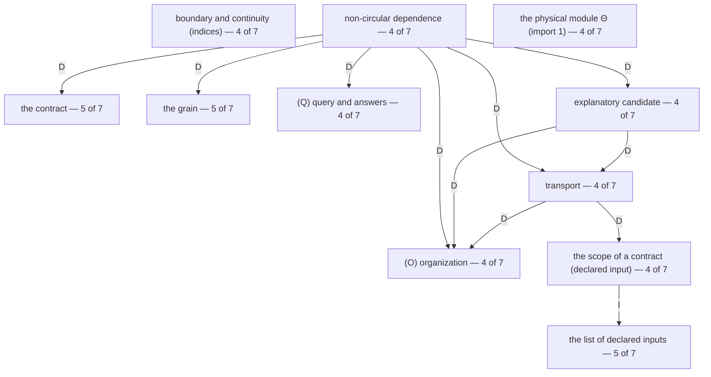

# S101 — What the tested strong candidates depend on

*Log S101, 27 September 2026, under decision S32. Made by program (`S101 What the tested strong candidates depend on - script.py`) from the latest text (`tests/Revision 2 - scrubbed copy, repaired (S96), after cross-examination, theory text.md`), the S98 ledger's sentence index and records, and S100's page and per-unit data; nothing in them was changed. One agent (decision S22). Sentences are quoted byte for byte. The graph is beside this page as JSON (`S101 What the tested strong candidates depend on - graph.json`).*

## What was asked

The owner, 27 September 2026, answering Claude's proposal "trace what the 7 tested strong candidates depend on, the other ideas each one relies on. That's your 'see what else they depend on', and it's the firmest place to start": "Do it". Earlier (decision S31) the aim: to "isolate the strong candidates, See what else they depend on and maybe even figure out, for example, whether values should be part of the theory, or separate."

The seven are S100's strong candidates that were challenged and kept: each has been in all ten versions with no change in substance, its neighbours changed more than those of three sentences in four, and a proposal was made against it and not taken.

## In short

- **The graph:** 94 nodes (the defined terms and symbols of the latest text, the claims and Arguments the seven name or that name them, and the end points the text declares) and 436 edges: 82 definitional edges placed by Part XIV's dependence order, 338 read from the wording of a definition, and 16 inferential edges read from the text. A program proposed 469 edges from the words of each definition; on reading, 75 of the 432 proposed out of sentences that are not end points were dropped (stray matches, words named to say what a definition is not, mentions that point the other way; Appendix B), 9 were entered as inferential edges instead, and 45 edges the program missed were added, each with the sentence it is read from.
- **L546.s1** (A mathematical error): depends on 37 nodes (9 end points; 37 by the wording alone, the order's edges left out); of the 36 with sentences of their own, 8 held, 13 moved a lot. Most altered on its path: the list of declared inputs (L522.s1, 7 substantive changes); the most altered definition: (K) signatures and kinds (L119.s2, 6). No node depends on it.
- **L255.s1** (non-circular dependence): depends on 8 nodes (5 end points; 8 by the wording alone, the order's edges left out); of the 8 with sentences of their own, 2 held, 3 moved a lot. Most altered on its path: the list of declared inputs (L522.s1, 7 substantive changes); the most altered definition: explanatory candidate (L231.s1, 6). 42 nodes depend on it.
- **L441.s4** ("Losses outside P must be exposed."): depends on 36 nodes (11 end points; 23 by the wording alone, the order's edges left out); of the 35 with sentences of their own, 9 held, 9 moved a lot. Most altered on its path: the list of declared inputs (L522.s1, 7 substantive changes); the most altered definition: (K) signatures and kinds (L119.s2, 6). No node depends on it.
- **L51.s1** (grievance 8's answer): depends on 3 nodes (2 end points; 3 by the wording alone, the order's edges left out); of the 2 with sentences of their own, 0 held, 2 moved a lot. Most altered on its path: the Appraisal paragraph (L455.s3, 3 substantive changes). No node depends on it.
- **L517.s1** (the physical module Θ (import 1)): an end point of the text, an import; it depends on nothing, and 35 nodes depend on it.
- **L389.s1** ((K2) Usability): depends on 10 nodes (5 end points; 10 by the wording alone, the order's edges left out); of the 9 with sentences of their own, 0 held, 2 moved a lot. Most altered on its path: the list of declared inputs (L522.s1, 7 substantive changes); the most altered definition: Form_j (L393.s1, 4). 14 nodes depend on it.
- **L437.s1** ((P) Repair): depends on 35 nodes (11 end points; 22 by the wording alone, the order's edges left out); of the 34 with sentences of their own, 9 held, 9 moved a lot. Most altered on its path: the list of declared inputs (L522.s1, 7 substantive changes); the most altered definition: (K) signatures and kinds (L119.s2, 6). 8 nodes depend on it.
- **The shared core** (nodes on the paths of at least four of the seven, the candidate's own node counted): the contract (5 of 7); the list of declared inputs (5 of 7); the grain (5 of 7); (O) organization (4 of 7); (Q) query and answers (4 of 7); explanatory candidate (4 of 7); boundary and continuity (indices) (4 of 7); the scope of a contract (declared input) (4 of 7); non-circular dependence (4 of 7); the physical module Θ (import 1) (4 of 7); transport (4 of 7).
- **Values:** L546.s1: none; L255.s1: none; L441.s4: Part XI's repair definitions ("Losses outside P must be exposed.", (P) Repair, ProducedBy); L51.s1: the appraisal relation (import 2) (the appraisal relation 𝒩 (import 2)), the Appraisal paragraph of Part XI (the Appraisal paragraph); L517.s1: none; L389.s1: none; L437.s1: Part XI's repair definitions ((P) Repair, ProducedBy). No node of the shared core depends on the appraisal relation, on the Appraisal paragraph, or on Part XI's repair or created-explanation definitions. In the whole graph the appraisal relation is used by Argument 6, grievance 8's answer, Part XV's missing-input rule, the Appraisal paragraph only.
- **Loops read from the wording** (not from the order): {Build, provenances of a transport, (R) representation}; {(K2) Usability, argument, Live_j}. Part XIV says "The order has no cycle and no endless descent." (L526.s17)

## 1. How the graph was made

### 1.1 Nodes

A node is a defined term or symbol of the latest text, with the sentences that define it (units of the S98 sentence index; a displayed formula is one unit), or a claim or Argument, or an end point. The end points are those the text declares: (O) and (Q), which "depend on nothing"; the declared indices (grain, boundary, continuity, the contract), and the declared inputs, "which are stated, not defined" (L526.s1); and the two imports (L515.s1–L518.s1). Four more end points are read from the definitions, because the text defines them no further: mathematics used and not defined; "to tentatively accept" (L8.s6, "a person's choice to go on with it"); the declared use task \(U\) of Deploy, which the text calls declared (L403.s1, L453.s3, L497.s1) and does not list among the declared inputs; and the aims \(O_p\) of a question (L147.s1). The list of declared inputs (L522.s1–s2) is a node of its own: each declared input is joined to it by an inferential edge ("named a declared input by the list"), so that the list's changes show on a path without being counted as changes of the input it names.

Where a candidate is one sentence of a longer definition (non-circular dependence, (K2), (P), import 1), the candidate is that definition's node, and the other sentences of the definition are reported apart as "the rest of its own definition".

### 1.2 Edges

- **Part XIV order:** every clause of the dependence order (L526.s2–s15) and of "Everything else is defined in terms of ..." (L520.s2, L520.s6), entered by hand as (from, to) pairs, each tested by the program against the words of the sentence it cites. "(RC), (U1)–(U3) depend on all of the above" (L526.s14) gives an edge from that node to every node the order names before it.
- **Read from the definition:** the program looks, in each node's defining sentences (markup set aside), for the words and symbols of every other node, and proposes an edge for each match. Every proposal was then read: proposals out of an end point are dropped, as the text makes end points depend on nothing; the others are kept unless the reading table drops them with a reason (a stray match of the word; a word named to say what a definition is about or is not; the mention points the other way; reached through another edge). Edges the scan missed were added, each with its sentence. Appendix B lists every dropped proposal and every added edge.
- **One rule of reading, stated because it changes the graph:** a candidate is "for question \(p\)", and \(p=(D,C,b_0,\mathcal Q,O_p,\rho_p)\) carries aims and a provenance. The conditions of (E) read the target, the contract (with its baseline) and the query of \(p\), and never its aims \(O_p\) or its provenance \(\rho_p\); so an edge goes to the question as a whole only where a definition turns on it as a whole (the provenance of a contract, (G)'s "used to address \(p\)", (EX)'s \(p_c\), question-finding). Read the other way, every definition that names a question would reach the provenances, and through them nearly everything.
- **Inferential:** read from the text: the claims and Arguments a candidate names or restates, the Part it points to, the list it is an item of. For what depends on each candidate, the program also lists every sentence whose words name it (§2), and marks those inside a definition that depends on it through the graph.

### 1.3 Stability

Each node's sentences are joined to S100's per-unit data (`S100 ... - data.csv`): versions carried (of ten), criticism-driven changes, substantive changes (criticism-driven + owner-directed + replaced wordings other than vocabulary), and wordings held. A node **held** when every sentence of it has no substantive change; it **moved a lot** when one of its sentences has 3 or more substantive changes (11% of the 694 units S100 counts; the upper tenth begins there) or stands in one of S100's ten most-altered sections (its §4.1); otherwise it **changed a little**. S100 counts on a sentence the proposals and replaced wordings that were written against it, so a sentence can carry many substantive changes and one wording throughout (L231.s1 and L119.s2 do); the tables give the wordings held beside the count. "Most altered on the path" orders the nodes on a path by the largest substantive count of any one sentence, then by criticism-driven changes.

The ten most-altered sections (S100 §4.1): Part XV · (Prov) Genesis (line 542) (6 per unit); Part XV · (QF) Question-finding (line 544) (4 per unit); Part XV · (Nec) Necessity (line 538) (4 per unit); Part XV · (Elim) Reinstatement of kinds (line 540) (4 per unit); Part XV · (Suff) Sufficiency (line 536) (4 per unit); Part XIV · Declared inputs (line 522) (2 per unit); Part 0 · Grievances, anticipated / introduction (lines 33–35) (2 per unit); Part 0 · What is imported, what is an index, and what is defined (lines 29–31) (1.8 per unit); Part X · Ownership (line 427) (1.75 per unit); Part 0 · Grievances, anticipated / 6. "You have replaced explanation with evolution." (line 47) (1.67 per unit).

## 2. The seven, one by one

### 2.1 L546.s1

> **A mathematical error.** A counterexample to the finite monotone claim, (I2), (O1), (T2), (CT2), or Arguments 1–3 under their stated assumptions.

- **Where:** sentence · Part XV · A mathematical error (line 546) · group G15 What would rule this class out.
- **What it came through (S100):** in the text since file 10: 10 of 10 versions; came through 22 of the 22 rounds of edits and proposals. Allowed changes: 5 vocabulary-only changes (the ledger marks them).
  - A-23 · file 20 (before log 25) · edit · declined, proposing:
    > **A mathematical error.** A counterexample to the finite monotone theorem, (I2), (O1), (T2), (CT2), or Derivations 1–3 and 8 under their stated assumptions.

**What it depends on** (37 nodes; the path shown is one shortest path; D = definitional, I = inferential):

| node | how it is reached | last edge | stability | sentences held / all | criticism-driven | marks |
| --- | --- | --- | --- | ---: | ---: | --- |
| Argument 1 | C546 → Arg1 | I, read from the text (L546.s1) | changed a little; most in L556.s2 (1 substantive, 2 wordings) | 4 / 6 | 1 |  |
| Argument 2 | C546 → Arg2 | I, read from the text (L546.s1) | moved a lot; most in L568.s1 (3 substantive, 4 wordings) | 5 / 9 | 4 |  |
| Argument 3 | C546 → Arg3 | I, read from the text (L546.s1) | moved a lot; most in L572.s2 (4 substantive, 2 wordings) | 4 / 11 | 11 |  |
| (CT2) | C546 → CT2 | I, read from the text (L546.s1) | held | 2 / 2 | 0 | holds strong candidate L471.s2 |
| (I2) | C546 → I2 | I, read from the text (L546.s1) | changed a little; most in L329.s5 (1 substantive, 2 wordings) | 3 / 4 | 1 |  |
| (O1) | C546 → O1 | I, read from the text (L546.s1) | held | 2 / 2 | 0 |  |
| (T2) | C546 → T2 | I, read from the text (L546.s1) | moved a lot; most in L363.s2 (5 substantive, 2 wordings) | 0 / 3 | 1 |  |
| Part XV's opening | C546 → XV_frame | I, read from the text (L534.s1) | moved a lot; most in L534.s2 (3 substantive, 2 wordings) | 0 / 2 | 4 |  |
| finite monotone claim | C546 → fmc | I, read from the text (L546.s1) | changed a little; most in L305.s5 (2 substantive, 4 wordings) | 2 / 4 | 3 |  |
| (E) Account | C546 → Arg1 → E | D, read from the definition (L558.s3) | moved a lot; most in L231.s3 (3 substantive, 3 wordings) | 2 / 3 | 1 |  |
| (K) signatures and kinds | C546 → Arg1 → K | D, read from the definition (L554.s1) | moved a lot; most in L119.s2 (6 substantive, 1 wording) | 3 / 5 | 3 | holds strong candidates L113.s1, L113.s2, L115.s1 |
| (O) organization | C546 → Arg1 → O | D, read from the definition (L554.s1) | held | 13 / 13 | 0 | end point, structural vocabulary |
| explanatory candidate | C546 → Arg1 → cand | D, read from the definition (L554.s1) | moved a lot; most in L231.s1 (6 substantive, 1 wording) | 0 / 2 | 2 |  |
| the contract | C546 → Arg1 → contract | D, read from the definition (L558.s1) | changed a little; most in L524.s1 (1 substantive, 2 wordings) | 1 / 2 | 1 | end point, declared index |
| (F1), (F2), (A) fidelity | C546 → Arg1 → fid | D, read from the definition (L554.s1) | changed a little; most in L233.s1 (1 substantive, 3 wordings) | 5 / 7 | 2 |  |
| transport | C546 → Arg1 → transport | D, read from the definition (L554.s1) | held | 3 / 3 | 0 |  |
| (Q) query and answers | C546 → Arg2 → Q | D, read from the definition (L562.s2) | changed a little; most in L141.s3 (1 substantive, 2 wordings) | 2 / 3 | 1 | end point, structural vocabulary |
| provenances of a transport | C546 → Arg3 → prov | D, read from the definition (L572.s1) | changed a little; most in L481.s3 (2 substantive, 1 wording) | 4 / 11 | 8 |  |
| the physical module Θ (import 1) | C546 → Arg3 → theta | D, read from the definition (L572.s3) | held | 1 / 1 | 0 | end point, import; holds strong candidate L517.s1 |
| (CT1) | C546 → CT2 → CT1 | D, read from the definition (L471.s1) | held | 3 / 3 | 0 |  |
| mathematics (used, not defined) | C546 → CT2 → math | D, read from the definition (L471.s2) | no sentence of its own | – | – | end point read from the definition |
| functional transport | C546 → T2 → func | D, read from the definition (L363.s1) | changed a little; most in L353.s2 (2 substantive, 4 wordings) | 1 / 3 | 2 |  |
| (S), (B), (D) routes | C546 → fmc → SBD | D, read from the definition (L305.s1) | moved a lot; most in L299.s2 (5 substantive, 4 wordings) | 3 / 5 | 5 |  |
| non-circular dependence | C546 → Arg1 → E → noncirc | D, read from the definition (L261.s1) | moved a lot; most in L255.s4 (5 substantive, 2 wordings) | 1 / 4 | 3 | holds strong candidate L255.s1 |
| non-vacuity | C546 → Arg1 → E → nonvac | D, read from the definition (L261.s1) | changed a little; most in L257.s3 (2 substantive, 3 wordings) | 0 / 3 | 4 |  |
| the scope of a contract (declared input) | C546 → Arg1 → transport → in_scope | D, read from the definition (L189.s1) | moved a lot; most in L159.s1 (3 substantive, 4 wordings) | 0 / 4 | 6 | end point, declared input |
| Build | C546 → Arg3 → prov → build | D, read from the definition (L197.s1) | changed a little; most in L405.s1 (2 substantive, 2 wordings) | 0 / 2 | 2 |  |
| histories | C546 → Arg3 → prov → hist | D, Part XIV order (L520.s6) | changed a little; most in L375.s1 (1 substantive, 2 wordings) | 0 / 1 | 1 |  |
| (R) representation | C546 → Arg3 → prov → rep | D, read from the definition (L197.s1) | changed a little; most in L205.s1 (1 substantive, 2 wordings) | 1 / 2 | 1 |  |
| tasks and possibility | C546 → CT2 → CT1 → tasks | D, read from the definition (L463.s1) | changed a little; most in L461.s1 (1 substantive, 2 wordings) | 0 / 3 | 1 |  |
| the grain | C546 → Arg1 → E → noncirc → grain | D, read from the definition (L255.s2) | changed a little; most in L524.s1 (1 substantive, 2 wordings) | 0 / 1 | 1 | end point, declared index |
| the list of declared inputs | C546 → Arg1 → transport → in_scope → decl_list | I, read from the text (L522.s1) | moved a lot; most in L522.s1 (7 substantive, 5 wordings) | 0 / 2 | 6 | the list of declared inputs; in one of the ten most-altered sections |
| content | C546 → Arg3 → prov → build → content | D, read from the definition (L405.s1) | held | 1 / 1 | 0 |  |
| boundary and continuity (indices) | C546 → Arg3 → prov → build → idx_bcont | D, read from the definition (L405.s1) | changed a little; most in L524.s1 (1 substantive, 2 wordings) | 0 / 1 | 1 | end point, declared index |
| occurrence | C546 → Arg3 → prov → build → occ | D, read from the definition (L405.s2) | held | 1 / 1 | 0 |  |
| Ownership | C546 → Arg3 → prov → build → own | D, Part XIV order (L526.s11) | moved a lot; most in L427.s2 (3 substantive, 2 wordings) | 1 / 4 | 6 | in one of the ten most-altered sections |
| boundary and continuity of an attribution (declared input) | C546 → Arg3 → prov → build → own → in_bcont | D, Part XIV order (L526.s10) | moved a lot; most in L473.s1 (3 substantive, 1 wording) | 0 / 3 | 6 | end point, declared input |

**Stability of the path:** of 36 nodes with sentences of their own, 8 held, 15 changed a little, 13 moved a lot (the list of declared inputs, (K) signatures and kinds, explanatory candidate, (S), (B), (D) routes, (T2), non-circular dependence, Argument 3, Argument 2, (E) Account, Part XV's opening, boundary and continuity of an attribution (declared input), the scope of a contract (declared input), Ownership). Most altered on the path: **the list of declared inputs** (L522.s1, 7 substantive changes, 5 wordings). Most altered definition on the path, the list of declared inputs left aside: **(K) signatures and kinds** (L119.s2, 6 substantive changes, 1 wording).

**What depends on it:** no node of the graph.

**Sentences whose words name it** (4, 0 of them stray matches set aside): L17.s4 (points to Part XV, of which it is an item); L47.s3 (points to Part XV, of which it is an item); L61.s1 (points to Part XV, of which it is an item); L339.s4 (points to Part XV, of which it is an item)

**Values:** no path reaches the appraisal relation, the Appraisal paragraph, or Part XI's repair or created-explanation definitions.

### 2.2 L255.s1

> **Non-circular dependence.** The answer follows by evaluating \(E\) under its independent boundary conditions.

- **Where:** sentence · Part V · Non-circular dependence (line 255) · group G05 Account.
- **What it came through (S100):** in the text since file 10: 10 of 10 versions; came through 22 of the 22 rounds of edits and proposals. Changes: none of any kind; the same wording in every version.
  - B-270 · S88 · recommendation · not applied, proposing:
    > [no wording given] restore file 00 line 176's bridge (the role of \(\tau\)), if it needs stating once
- **The rest of its own definition:** L255.s2 (Non-circular dependence; since file 10, 10 of 10 versions; criticism-driven 1, substantive 1, wordings 1); L255.s3 (Non-circular dependence; since draft 1, 8 of 10 versions; criticism-driven 0, substantive 3, wordings 2); L255.s4 (Non-circular dependence; since draft 2, 7 of 10 versions; criticism-driven 2, substantive 5, wordings 2).

**What it depends on** (8 nodes; the path shown is one shortest path; D = definitional, I = inferential):

| node | how it is reached | last edge | stability | sentences held / all | criticism-driven | marks |
| --- | --- | --- | --- | ---: | ---: | --- |
| (O) organization | noncirc → O | D, read from the definition (L255.s1) | held | 13 / 13 | 0 | end point, structural vocabulary |
| (Q) query and answers | noncirc → Q | D, read from the definition (L255.s1) | changed a little; most in L141.s3 (1 substantive, 2 wordings) | 2 / 3 | 1 | end point, structural vocabulary |
| explanatory candidate | noncirc → cand | D, read from the definition (L255.s4) | moved a lot; most in L231.s1 (6 substantive, 1 wording) | 0 / 2 | 2 |  |
| the contract | noncirc → contract | D, read from the definition (L255.s4) | changed a little; most in L524.s1 (1 substantive, 2 wordings) | 1 / 2 | 1 | end point, declared index |
| the grain | noncirc → grain | D, read from the definition (L255.s2) | changed a little; most in L524.s1 (1 substantive, 2 wordings) | 0 / 1 | 1 | end point, declared index |
| transport | noncirc → transport | D, read from the definition (L255.s4) | held | 3 / 3 | 0 |  |
| the scope of a contract (declared input) | noncirc → transport → in_scope | D, read from the definition (L189.s1) | moved a lot; most in L159.s1 (3 substantive, 4 wordings) | 0 / 4 | 6 | end point, declared input |
| the list of declared inputs | noncirc → transport → in_scope → decl_list | I, read from the text (L522.s1) | moved a lot; most in L522.s1 (7 substantive, 5 wordings) | 0 / 2 | 6 | the list of declared inputs; in one of the ten most-altered sections |

**Stability of the path:** of 8 nodes with sentences of their own, 2 held, 3 changed a little, 3 moved a lot (the list of declared inputs, explanatory candidate, the scope of a contract (declared input)). Most altered on the path: **the list of declared inputs** (L522.s1, 7 substantive changes, 5 wordings). Most altered definition on the path, the list of declared inputs left aside: **explanatory candidate** (L231.s1, 6 substantive changes, 1 wording).

**What depends on it** (42 nodes: what would be exposed if it were ruled out):

"Losses outside P must be exposed.", A mathematical error, Argument 1, Argument 10, Argument 2 [moved a lot], Argument 3 [moved a lot], Argument 4, Argument 5, Argument 7, Argument 8, Argument 9, (Elim) [moved a lot], a failed answer stays failed, finite monotone claim, (Nec) [moved a lot], (Prov) [moved a lot], (QF) [moved a lot], (Suff) [moved a lot], (E) Account [moved a lot], (EX) created explanation, (G) origin, (K1) Bearing [moved a lot], (K3), (N) newness, (P) Repair, recursion, universality, membership [moved a lot], (S), (B), (D) routes [moved a lot], active route, Build, Deploy, episodes, easy to vary, non-vacuity, a problem for p, ProducedBy, provenances of a transport, provenance of a contract, prediction, violation, surprise, a question as a whole, (R) representation, ruled out / not ruled out, an argument rules out a claim.

**Sentences whose words name it** (10, 0 of them stray matches set aside): L257.s3 (inside a definition that depends on it: non-vacuity); L261.s1 (inside a definition that depends on it: (E) Account); L273.s1 (uses it by name); L275.s1 (uses it by name); L317.s8 (uses it by name); L343.s5 (uses it by name); L397.s7 (uses it by name); L397.s15 (inside a definition that depends on it: an argument rules out a claim); L397.s16 (inside a definition that depends on it: an argument rules out a claim); L536.s2 (inside a definition that depends on it: (Suff))

**Values:** no path reaches the appraisal relation, the Appraisal paragraph, or Part XI's repair or created-explanation definitions.

### 2.3 L441.s4

> Losses outside \(P\) must be exposed.

- **Where:** sentence · Part XI · The aims of a repair (line 441) · group G11 Repair, created explanation, and appraisal.
- **What it came through (S100):** in the text since file 10: 10 of 10 versions; came through 22 of the 22 rounds of edits and proposals. Changes: none of any kind; the same wording in every version.
  - E-16 · S94 · recommendation · declined, proposing:
    > A repair claim exposes its losses outside \(P\).

**What it depends on** (36 nodes; the path shown is one shortest path; D = definitional, I = inferential):

| node | how it is reached | last edge | stability | sentences held / all | criticism-driven | marks |
| --- | --- | --- | --- | ---: | ---: | --- |
| (P) Repair | C441 → P | I, read from the text (L441.s4) | changed a little; most in L435.s1 (1 substantive, 1 wording) | 2 / 4 | 2 | holds strong candidate L437.s1; values: Part XI's repair definitions |
| the aims O and P of a repair (declared input) | C441 → in_aims | D, read from the definition (L441.s1) | moved a lot; most in L441.s1 (3 substantive, 2 wordings) | 0 / 2 | 4 | end point, declared input; aims |
| (E) Account | C441 → P → E | D, Part XIV order (L526.s13) | moved a lot; most in L231.s3 (3 substantive, 3 wordings) | 2 / 3 | 1 |  |
| (G) origin | C441 → P → G | D, Part XIV order (L526.s13) | changed a little; most in L421.s1 (1 substantive, 2 wordings) | 1 / 2 | 1 |  |
| content | C441 → P → content | D, read from the definition (L435.s1) | held | 1 / 1 | 0 |  |
| Deploy | C441 → P → deploy | D, Part XIV order (L526.s13) | changed a little; most in L403.s1 (1 substantive, 3 wordings) | 1 / 2 | 1 |  |
| histories | C441 → P → hist | D, read from the definition (L435.s1) | changed a little; most in L375.s1 (1 substantive, 2 wordings) | 0 / 1 | 1 |  |
| ProducedBy | C441 → P → prodby | D, Part XIV order (L526.s13) | changed a little; most in L441.s5 (2 substantive, 3 wordings) | 0 / 1 | 2 | values: Part XI's repair definitions |
| the list of declared inputs | C441 → in_aims → decl_list | I, read from the text (L522.s1) | moved a lot; most in L522.s1 (7 substantive, 5 wordings) | 0 / 2 | 6 | the list of declared inputs; in one of the ten most-altered sections |
| explanatory candidate | C441 → P → E → cand | D, read from the definition (L231.s3) | moved a lot; most in L231.s1 (6 substantive, 1 wording) | 0 / 2 | 2 |  |
| the contract | C441 → P → E → contract | D, read from the definition (L265.s1) | changed a little; most in L524.s1 (1 substantive, 2 wordings) | 1 / 2 | 1 | end point, declared index |
| (F1), (F2), (A) fidelity | C441 → P → E → fid | D, Part XIV order (L526.s4) | changed a little; most in L233.s1 (1 substantive, 3 wordings) | 5 / 7 | 2 |  |
| non-circular dependence | C441 → P → E → noncirc | D, read from the definition (L261.s1) | moved a lot; most in L255.s4 (5 substantive, 2 wordings) | 1 / 4 | 3 | holds strong candidate L255.s1 |
| non-vacuity | C441 → P → E → nonvac | D, read from the definition (L261.s1) | changed a little; most in L257.s3 (2 substantive, 3 wordings) | 0 / 3 | 4 |  |
| (N) newness | C441 → P → G → N_new | D, read from the definition (L421.s1) | changed a little; most in L413.s1 (2 substantive, 1 wording) | 2 / 3 | 1 |  |
| Build | C441 → P → G → build | D, Part XIV order (L526.s12) | changed a little; most in L405.s1 (2 substantive, 2 wordings) | 0 / 2 | 2 |  |
| the grain | C441 → P → G → grain | D, read from the definition (L421.s1) | changed a little; most in L524.s1 (1 substantive, 2 wordings) | 0 / 1 | 1 | end point, declared index |
| boundary and continuity (indices) | C441 → P → G → idx_bcont | D, read from the definition (L421.s1) | changed a little; most in L524.s1 (1 substantive, 2 wordings) | 0 / 1 | 1 | end point, declared index |
| a question as a whole | C441 → P → G → question | D, read from the definition (L419.s1) | held | 4 / 4 | 0 |  |
| (O) organization | C441 → P → content → O | D, read from the definition (L169.s2) | held | 13 / 13 | 0 | end point, structural vocabulary |
| (CT1) | C441 → P → deploy → CT1 | D, Part XIV order (L526.s9) | held | 3 / 3 | 0 |  |
| provenances of a transport | C441 → P → deploy → prov | D, read from the definition (L403.s1) | changed a little; most in L481.s3 (2 substantive, 1 wording) | 4 / 11 | 8 |  |
| (R) representation | C441 → P → deploy → rep | D, Part XIV order (L526.s9) | changed a little; most in L205.s1 (1 substantive, 2 wordings) | 1 / 2 | 1 |  |
| tasks and possibility | C441 → P → deploy → tasks | D, read from the definition (L403.s1) | changed a little; most in L461.s1 (1 substantive, 2 wordings) | 0 / 3 | 1 |  |
| transport | C441 → P → deploy → transport | D, read from the definition (L403.s1) | held | 3 / 3 | 0 |  |
| the declared use task U | C441 → P → deploy → use_task | D, read from the definition (L403.s1) | no sentence of its own | – | – | end point read from the definition |
| occurrence | C441 → P → hist → occ | D, read from the definition (L375.s1) | held | 1 / 1 | 0 |  |
| the physical module Θ (import 1) | C441 → P → hist → theta | D, read from the definition (L375.s1) | held | 1 / 1 | 0 | end point, import; holds strong candidate L517.s1 |
| active route | C441 → P → prodby → aroute | D, Part XIV order (L526.s13) | changed a little; most in L375.s3 (1 substantive, 1 wording) | 1 / 2 | 1 | holds strong candidate L375.s2 |
| (K) signatures and kinds | C441 → P → E → fid → K | D, Part XIV order (L526.s3) | moved a lot; most in L119.s2 (6 substantive, 1 wording) | 3 / 5 | 3 | holds strong candidates L113.s1, L113.s2, L115.s1 |
| (Q) query and answers | C441 → P → E → fid → Q | D, Part XIV order (L526.s3) | changed a little; most in L141.s3 (1 substantive, 2 wordings) | 2 / 3 | 1 | end point, structural vocabulary |
| the scope of a contract (declared input) | C441 → P → E → nonvac → in_scope | D, read from the definition (L257.s2) | moved a lot; most in L159.s1 (3 substantive, 4 wordings) | 0 / 4 | 6 | end point, declared input |
| Ownership | C441 → P → G → build → own | D, Part XIV order (L526.s11) | moved a lot; most in L427.s2 (3 substantive, 2 wordings) | 1 / 4 | 6 | in one of the ten most-altered sections |
| the aims O_p of a question | C441 → P → G → question → aims_q | D, read from the definition (L137.s1) | held | 1 / 1 | 0 | end point read from the definition; aims |
| provenance of a contract | C441 → P → G → question → prov_c | D, read from the definition (L137.s1) | held | 4 / 4 | 0 |  |
| boundary and continuity of an attribution (declared input) | C441 → P → G → build → own → in_bcont | D, Part XIV order (L526.s10) | moved a lot; most in L473.s1 (3 substantive, 1 wording) | 0 / 3 | 6 | end point, declared input |

**Stability of the path:** of 35 nodes with sentences of their own, 9 held, 17 changed a little, 9 moved a lot (the list of declared inputs, (K) signatures and kinds, explanatory candidate, non-circular dependence, (E) Account, the aims O and P of a repair (declared input), boundary and continuity of an attribution (declared input), the scope of a contract (declared input), Ownership). Most altered on the path: **the list of declared inputs** (L522.s1, 7 substantive changes, 5 wordings). Most altered definition on the path, the list of declared inputs left aside: **(K) signatures and kinds** (L119.s2, 6 substantive changes, 1 wording).

By the wording alone (23 nodes, the order's edges left out), the most altered definition on the path is **explanatory candidate** (L231.s1, 6 substantive changes); (K) signatures and kinds is reached only through the order.

**What depends on it:** no node of the graph.

**Sentences whose words name it** (1, 1 of them stray matches set aside): none.

**Values:** Part XI's repair definitions: "Losses outside P must be exposed.", (P) Repair, ProducedBy. Aims on its path: the aims O_p of a question, the aims O and P of a repair (declared input).

### 2.4 L51.s1

> **8. "Where is aesthetics?"** In Part XI, as a declared appraisal relation.

- **Where:** sentence · Part 0 · Grievances, anticipated / 8. "Where is aesthetics?" (line 51) · group G11 Repair, created explanation, and appraisal.
- **What it came through (S100):** in the text since file 10: 10 of 10 versions; came through 22 of the 22 rounds of edits and proposals. Allowed changes: 2 vocabulary-only changes (the ledger marks them); a change of layout only (file 10 to file 11).
  - C-143 · S90 · recommendation · not applied, proposing:
    > [no wording given] L51 still calls the normative relation "declared"; no entry changes it

**What it depends on** (3 nodes; the path shown is one shortest path; D = definitional, I = inferential):

| node | how it is reached | last edge | stability | sentences held / all | criticism-driven | marks |
| --- | --- | --- | --- | ---: | ---: | --- |
| the appraisal relation 𝒩 (import 2) | C51 → N | D, read from the definition (L51.s1) | moved a lot; most in L518.s1 (3 substantive, 4 wordings) | 0 / 1 | 3 | end point, import; values: the appraisal relation (import 2) |
| the Appraisal paragraph | C51 → appraisal | I, read from the text (L51.s1) | moved a lot; most in L455.s3 (3 substantive, 4 wordings) | 0 / 5 | 9 | values: the Appraisal paragraph of Part XI |
| mathematics (used, not defined) | C51 → appraisal → math | D, read from the definition (L455.s3) | no sentence of its own | – | – | end point read from the definition |

**Stability of the path:** of 2 nodes with sentences of their own, 0 held, 0 changed a little, 2 moved a lot (the appraisal relation 𝒩 (import 2), the Appraisal paragraph). Most altered on the path: **the Appraisal paragraph** (L455.s3, 3 substantive changes, 4 wordings). Most altered definition on the path, the list of declared inputs left aside: **the Appraisal paragraph** (L455.s3, 3 substantive changes, 4 wordings).

**What depends on it:** no node of the graph.

**Sentences whose words name it** (0, 0 of them stray matches set aside): none.

**Values:** the appraisal relation (import 2): the appraisal relation 𝒩 (import 2); the Appraisal paragraph of Part XI: the Appraisal paragraph.

### 2.5 L517.s1

> 1. The **physical module** \(\Theta\): substrate state spaces, attributes, admitted processes, controlled-action interpretation, resources, tolerances, and \(\operatorname{Org}_\ell\), the organization a physical occurrence instantiates at a grain.

- **Where:** list item · Part XIV · Imports (lines 515–518) · group G14 The class collected.
- **What it came through (S100):** in the text since file 10: 10 of 10 versions; came through 22 of the 22 rounds of edits and proposals. Allowed changes: 2 vocabulary-only changes (the ledger marks them).
  - E-26 · S94 · recommendation · declined, proposing:
    > It is the physics adopted, and is itself conjectural: a verdict that turns on what it admits is given with it.

Nothing: it is an end point of the text, an import (L515.s1, L520.s1).

**What depends on it** (35 nodes: what would be exposed if it were ruled out):

"Losses outside P must be exposed.", A mathematical error, Argument 10, Argument 3 [moved a lot], Argument 4, Argument 5, Argument 6, Argument 7, Argument 8, (CT2), (Prov) [moved a lot], (QF) [moved a lot], (Suff) [moved a lot], (CT1), (EX) created explanation, (G) origin, (N) newness, (P) Repair, recursion, universality, membership [moved a lot], active route, Build, owned capability, Deploy, episodes, histories, occurrence, Ownership [moved a lot], achievement and tolerances, ProducedBy, provenances of a transport, provenance of a contract, prediction, violation, surprise, a question as a whole, (R) representation, tasks and possibility.

**Sentences whose words name it** (16, 0 of them stray matches set aside): L31.s1 (uses it by name); L53.s2 (uses it by name); L193.s1 (inside a definition that depends on it: provenances of a transport); L205.s1 (inside a definition that depends on it: (R) representation); L207.s1 (inside a definition that depends on it: (R) representation); L213.s1 (uses it by name); L213.s2 (uses it by name); L461.s3 (inside a definition that depends on it: tasks and possibility); L479.s1 (inside a definition that depends on it: achievement and tolerances); L479.s2 (inside a definition that depends on it: achievement and tolerances); L479.s3 (inside a definition that depends on it: achievement and tolerances); L481.s1 (inside a definition that depends on it: provenances of a transport); L497.s1 (inside a definition that depends on it: recursion, universality, membership); L499.s1 (inside a definition that depends on it: recursion, universality, membership); L502.s1 (inside a definition that depends on it: recursion, universality, membership); L596.s1 (inside a definition that depends on it: Argument 6)

**Values:** no path reaches the appraisal relation, the Appraisal paragraph, or Part XI's repair or created-explanation definitions.

### 2.6 L389.s1

> \[
> \operatorname{Usable}_j(u)\iff\operatorname{Form}_j(u)\land\operatorname{Scope}_j(u)\land\forall d\in\operatorname{Prem}(u),\operatorname{Live}_j(d;u). \tag{K2}
> \]

- **Where:** display · Part IX · Usability (lines 387–393) · group G09 Criticism, use, and usable arguments.
- **What it came through (S100):** in the text since file 10: 10 of 10 versions; came through 22 of the 22 rounds of edits and proposals. Allowed changes: 1 vocabulary-only change (the ledger marks it).
  - C-181 · S93 · recommendation · not applied, proposing:
    > [no wording given] define (K2)'s Lic_j, Scope_j and Live_j (L390 only)
- **The rest of its own definition:** L387.s1 (Usability; since file 10, 10 of 10 versions; criticism-driven 1, substantive 1, wordings 3).

**What it depends on** (10 nodes; the path shown is one shortest path; D = definitional, I = inferential):

| node | how it is reached | last edge | stability | sentences held / all | criticism-driven | marks |
| --- | --- | --- | --- | ---: | ---: | --- |
| argument | K2 → arg | D, read from the definition (L387.s1) | changed a little; most in L397.s1 (2 substantive, 2 wordings) | 2 / 6 | 4 |  |
| Form_j | K2 → formj | D, read from the definition (L389.s1) | moved a lot; most in L393.s1 (4 substantive, 1 wording) | 0 / 1 | 1 |  |
| the assessor's forms, scope and premises (declared input) | K2 → in_assessor | D, Part XIV order (L526.s8) | no sentence of its own | – | – | end point, declared input |
| Live_j | K2 → livej | D, read from the definition (L389.s1) | changed a little; most in L393.s2 (1 substantive, 1 wording) | 0 / 1 | 1 |  |
| Scope_j | K2 → scopej | D, read from the definition (L389.s1) | changed a little; most in L393.s2 (1 substantive, 1 wording) | 0 / 1 | 1 |  |
| the list of declared inputs | K2 → in_assessor → decl_list | I, read from the text (L522.s1) | moved a lot; most in L522.s1 (7 substantive, 5 wordings) | 0 / 2 | 6 | the list of declared inputs; in one of the ten most-altered sections |
| to tentatively accept | K2 → livej → tentative | D, read from the definition (L393.s2) | changed a little; most in L8.s6 (2 substantive, 1 wording) | 0 / 1 | 0 | end point read from the definition |
| the contract | K2 → scopej → contract | D, read from the definition (L393.s2) | changed a little; most in L524.s1 (1 substantive, 2 wordings) | 1 / 2 | 1 | end point, declared index |
| the grain | K2 → scopej → grain | D, read from the definition (L393.s2) | changed a little; most in L524.s1 (1 substantive, 2 wordings) | 0 / 1 | 1 | end point, declared index |
| boundary and continuity (indices) | K2 → scopej → idx_bcont | D, read from the definition (L393.s2) | changed a little; most in L524.s1 (1 substantive, 2 wordings) | 0 / 1 | 1 | end point, declared index |

**Stability of the path:** of 9 nodes with sentences of their own, 0 held, 7 changed a little, 2 moved a lot (the list of declared inputs, Form_j). Most altered on the path: **the list of declared inputs** (L522.s1, 7 substantive changes, 5 wordings). Most altered definition on the path, the list of declared inputs left aside: **Form_j** (L393.s1, 4 substantive changes, 1 wording).

**What depends on it** (14 nodes: what would be exposed if it were ruled out):

Part XV's missing-input rule, (Elim) [moved a lot], a failed answer stays failed, (Nec) [moved a lot], (Prov) [moved a lot], (Suff) [moved a lot], (K3), recursion, universality, membership [moved a lot], argument, easy to vary, Live_j, a problem for p, ruled out / not ruled out, an argument rules out a claim.

**Sentences whose words name it** (26, 0 of them stray matches set aside): L8.s4 (uses it by name); L17.s3 (uses it by name); L55.s4 (uses it by name); L315.s6 (inside a definition that depends on it: ruled out / not ruled out); L315.s7 (inside a definition that depends on it: ruled out / not ruled out); L315.s13 (uses it by name); L315.s14 (uses it by name); L317.s1 (inside a definition that depends on it: a problem for p); L317.s5 (uses it by name); L317.s8 (uses it by name); L317.s9 (uses it by name); L369.s3 (inside a definition that depends on it: a failed answer stays failed); L369.s4 (inside a definition that depends on it: a failed answer stays failed); L369.s5 (inside a definition that depends on it: a failed answer stays failed); L385.s2 (uses it by name); L393.s2 (inside a definition that depends on it: Live_j); L395.s1 (inside a definition that depends on it: (K3)); L397.s4 (inside a definition that depends on it: argument); L397.s5 (inside a definition that depends on it: an argument rules out a claim); L397.s6 (uses it by name); L397.s7 (uses it by name); L397.s10 (uses it by name); L495.s2 (uses it by name); L526.s8 (uses it by name); L526.s15 (uses it by name); L540.s2 (inside a definition that depends on it: (Elim))

**Values:** no path reaches the appraisal relation, the Appraisal paragraph, or Part XI's repair or created-explanation definitions.

### 2.7 L437.s1

> \[
> \operatorname{Repair}_{O,P}(\xi,\xi';\Delta)\iff\exists o\in O[\neg o(\xi)\land o(\xi')]\land\forall r\in P[r(\xi)\Rightarrow r(\xi')]\land\operatorname{ProducedBy}(\Delta,\xi,\xi';O). \tag{P}
> \]

- **Where:** display · Part XI · Repair (lines 435–439) · group G11 Repair, created explanation, and appraisal.
- **What it came through (S100):** in the text since file 10: 10 of 10 versions; came through 22 of the 22 rounds of edits and proposals. Changes: none of any kind; the same wording in every version.
  - C-209 · S90 · recommendation · declined, proposing:
    > [no wording given] adopt (AC) and define ProducedBy by it, as "(AC) applied to the repair as result" (12:451); defer the pre-emption episode
- **The rest of its own definition:** L435.s1 (Repair; since draft 1, 8 of 10 versions; criticism-driven 1, substantive 1, wordings 1); L435.s2 (Repair; since file 10, 10 of 10 versions; criticism-driven 1, substantive 1, wordings 3); L441.s2 (The aims of a repair; since draft 1, 8 of 10 versions; criticism-driven 0, substantive 0, wordings 2).

**What it depends on** (35 nodes; the path shown is one shortest path; D = definitional, I = inferential):

| node | how it is reached | last edge | stability | sentences held / all | criticism-driven | marks |
| --- | --- | --- | --- | ---: | ---: | --- |
| (E) Account | P → E | D, Part XIV order (L526.s13) | moved a lot; most in L231.s3 (3 substantive, 3 wordings) | 2 / 3 | 1 |  |
| (G) origin | P → G | D, Part XIV order (L526.s13) | changed a little; most in L421.s1 (1 substantive, 2 wordings) | 1 / 2 | 1 |  |
| content | P → content | D, read from the definition (L435.s1) | held | 1 / 1 | 0 |  |
| Deploy | P → deploy | D, Part XIV order (L526.s13) | changed a little; most in L403.s1 (1 substantive, 3 wordings) | 1 / 2 | 1 |  |
| histories | P → hist | D, read from the definition (L435.s1) | changed a little; most in L375.s1 (1 substantive, 2 wordings) | 0 / 1 | 1 |  |
| the aims O and P of a repair (declared input) | P → in_aims | D, Part XIV order (L526.s13) | moved a lot; most in L441.s1 (3 substantive, 2 wordings) | 0 / 2 | 4 | end point, declared input; aims |
| ProducedBy | P → prodby | D, Part XIV order (L526.s13) | changed a little; most in L441.s5 (2 substantive, 3 wordings) | 0 / 1 | 2 | values: Part XI's repair definitions |
| explanatory candidate | P → E → cand | D, read from the definition (L231.s3) | moved a lot; most in L231.s1 (6 substantive, 1 wording) | 0 / 2 | 2 |  |
| the contract | P → E → contract | D, read from the definition (L265.s1) | changed a little; most in L524.s1 (1 substantive, 2 wordings) | 1 / 2 | 1 | end point, declared index |
| (F1), (F2), (A) fidelity | P → E → fid | D, Part XIV order (L526.s4) | changed a little; most in L233.s1 (1 substantive, 3 wordings) | 5 / 7 | 2 |  |
| non-circular dependence | P → E → noncirc | D, read from the definition (L261.s1) | moved a lot; most in L255.s4 (5 substantive, 2 wordings) | 1 / 4 | 3 | holds strong candidate L255.s1 |
| non-vacuity | P → E → nonvac | D, read from the definition (L261.s1) | changed a little; most in L257.s3 (2 substantive, 3 wordings) | 0 / 3 | 4 |  |
| (N) newness | P → G → N_new | D, read from the definition (L421.s1) | changed a little; most in L413.s1 (2 substantive, 1 wording) | 2 / 3 | 1 |  |
| Build | P → G → build | D, Part XIV order (L526.s12) | changed a little; most in L405.s1 (2 substantive, 2 wordings) | 0 / 2 | 2 |  |
| the grain | P → G → grain | D, read from the definition (L421.s1) | changed a little; most in L524.s1 (1 substantive, 2 wordings) | 0 / 1 | 1 | end point, declared index |
| boundary and continuity (indices) | P → G → idx_bcont | D, read from the definition (L421.s1) | changed a little; most in L524.s1 (1 substantive, 2 wordings) | 0 / 1 | 1 | end point, declared index |
| a question as a whole | P → G → question | D, read from the definition (L419.s1) | held | 4 / 4 | 0 |  |
| (O) organization | P → content → O | D, read from the definition (L169.s2) | held | 13 / 13 | 0 | end point, structural vocabulary |
| (CT1) | P → deploy → CT1 | D, Part XIV order (L526.s9) | held | 3 / 3 | 0 |  |
| provenances of a transport | P → deploy → prov | D, read from the definition (L403.s1) | changed a little; most in L481.s3 (2 substantive, 1 wording) | 4 / 11 | 8 |  |
| (R) representation | P → deploy → rep | D, Part XIV order (L526.s9) | changed a little; most in L205.s1 (1 substantive, 2 wordings) | 1 / 2 | 1 |  |
| tasks and possibility | P → deploy → tasks | D, read from the definition (L403.s1) | changed a little; most in L461.s1 (1 substantive, 2 wordings) | 0 / 3 | 1 |  |
| transport | P → deploy → transport | D, read from the definition (L403.s1) | held | 3 / 3 | 0 |  |
| the declared use task U | P → deploy → use_task | D, read from the definition (L403.s1) | no sentence of its own | – | – | end point read from the definition |
| occurrence | P → hist → occ | D, read from the definition (L375.s1) | held | 1 / 1 | 0 |  |
| the physical module Θ (import 1) | P → hist → theta | D, read from the definition (L375.s1) | held | 1 / 1 | 0 | end point, import; holds strong candidate L517.s1 |
| the list of declared inputs | P → in_aims → decl_list | I, read from the text (L522.s1) | moved a lot; most in L522.s1 (7 substantive, 5 wordings) | 0 / 2 | 6 | the list of declared inputs; in one of the ten most-altered sections |
| active route | P → prodby → aroute | D, Part XIV order (L526.s13) | changed a little; most in L375.s3 (1 substantive, 1 wording) | 1 / 2 | 1 | holds strong candidate L375.s2 |
| (K) signatures and kinds | P → E → fid → K | D, Part XIV order (L526.s3) | moved a lot; most in L119.s2 (6 substantive, 1 wording) | 3 / 5 | 3 | holds strong candidates L113.s1, L113.s2, L115.s1 |
| (Q) query and answers | P → E → fid → Q | D, Part XIV order (L526.s3) | changed a little; most in L141.s3 (1 substantive, 2 wordings) | 2 / 3 | 1 | end point, structural vocabulary |
| the scope of a contract (declared input) | P → E → nonvac → in_scope | D, read from the definition (L257.s2) | moved a lot; most in L159.s1 (3 substantive, 4 wordings) | 0 / 4 | 6 | end point, declared input |
| Ownership | P → G → build → own | D, Part XIV order (L526.s11) | moved a lot; most in L427.s2 (3 substantive, 2 wordings) | 1 / 4 | 6 | in one of the ten most-altered sections |
| the aims O_p of a question | P → G → question → aims_q | D, read from the definition (L137.s1) | held | 1 / 1 | 0 | end point read from the definition; aims |
| provenance of a contract | P → G → question → prov_c | D, read from the definition (L137.s1) | held | 4 / 4 | 0 |  |
| boundary and continuity of an attribution (declared input) | P → G → build → own → in_bcont | D, Part XIV order (L526.s10) | moved a lot; most in L473.s1 (3 substantive, 1 wording) | 0 / 3 | 6 | end point, declared input |

**Stability of the path:** of 34 nodes with sentences of their own, 9 held, 16 changed a little, 9 moved a lot (the list of declared inputs, (K) signatures and kinds, explanatory candidate, non-circular dependence, (E) Account, the aims O and P of a repair (declared input), boundary and continuity of an attribution (declared input), the scope of a contract (declared input), Ownership). Most altered on the path: **the list of declared inputs** (L522.s1, 7 substantive changes, 5 wordings). Most altered definition on the path, the list of declared inputs left aside: **(K) signatures and kinds** (L119.s2, 6 substantive changes, 1 wording).

By the wording alone (22 nodes, the order's edges left out), the most altered definition on the path is **explanatory candidate** (L231.s1, 6 substantive changes); (K) signatures and kinds is reached only through the order.

**What depends on it** (8 nodes: what would be exposed if it were ruled out):

"Losses outside P must be exposed.", Argument 10, Argument 5, Argument 7, Argument 8, (QF) [moved a lot], (EX) created explanation, recursion, universality, membership [moved a lot].

**Sentences whose words name it** (17, 2 of them stray matches set aside): L307.s4 (uses it by name); L315.s18 (uses it by name); L441.s1 (uses it by name: in the aims O and P of a repair (declared input)); L441.s3 (uses it by name); L441.s5 (uses it by name: in ProducedBy); L441.s6 (uses it by name); L445.s1 (inside a definition that depends on it: (EX) created explanation); L453.s2 (inside a definition that depends on it: (EX) created explanation); L455.s1 (uses it by name: in the Appraisal paragraph); L520.s8 (uses it by name); L522.s1 (uses it by name: in the list of declared inputs); L526.s13 (uses it by name); L612.s1 (inside a definition that depends on it: Argument 8); L612.s3 (inside a definition that depends on it: Argument 8); L628.s2 (inside a definition that depends on it: Argument 10)

**Values:** Part XI's repair definitions: (P) Repair, ProducedBy. Aims on its path: the aims O_p of a question, the aims O and P of a repair (declared input).

### 2.8 Read from the paths, candidate by candidate

- **L546.s1, A mathematical error.** Its own wording depends on nothing but the eight claims it names, so its path is theirs. Three of the eight moved a lot: (T2) (L363.s2, 5 substantive changes), Argument 2 (L568.s1, 3) and Argument 3 (L572.s2, 4). Log S88 records why: "(F1) Derivation 2's claim that two faithful candidates' "components are pairwise of one kind on \(C\)" is false under its stated assumptions, shown by two counter-instances, so Part XV's own defeat entry ("A mathematical error ... under their stated assumptions") is triggered, in both files word for word"; S88 found the like of file 10's Derivation 3 (its F4) and hypotheses left out of (T2) (its F2). The claims were rewritten; this sentence was not. Two of the eight held, (O1) and (CT2), whose second sentence (L471.s2) is itself a never-challenged strong candidate. No node depends on it. Four sentences point to Part XV as a whole (L17.s4, L47.s3, L61.s1, L339.s4); the short list in "Where to attack this" names the five other items and not this one, and ends "Anything else is a detail." (L61.s2–s3).
- **L255.s1, non-circular dependence.** The sentence heads a definition whose later sentences moved: L255.s3 (since draft 1, 3 substantive changes) and L255.s4 (since draft 2, 5), after S88's third finding, "(F3) The set \(\Gamma\) of active commitments in non-circular dependence is never typed" (log S88); the explanatory candidate's definition moved with it (L231.s2, since draft 2). Its path is short (8 nodes) and ends in (O), (Q), the contract and the grain; the scope of a contract and the list of declared inputs come onto it only through transport's "on the stated scope" (L189.s1). It has the most dependants of the seven, 42 nodes, because (E) depends on it and most of the theory depends on (E); 10 sentences use it by name, among them "\"\(p\) because \(p\)\" fails non-circular dependence." (L273.s1), (Suff) (L536.s2) and the paragraph "A premise that is the denial" (L397.s14–s16), which reads a premise "structurally as non-circular dependence reads identity".
- **L441.s4, "Losses outside \(P\) must be exposed."** No other sentence of the text uses it or its words, and "exposed" is defined nowhere: the text does not say who exposes the losses or to whom. The declined proposal E-16 would have said "A repair claim exposes its losses outside \(P\)." Its own terms are the protected aims \(P\), a declared input, and "losses", read from L441.s1 ("a protected condition is lost exactly when it fails on an occasion it covers"). The rest of its path is that of (P), beside which it stands: 36 nodes by the order, 23 by the wording alone.
- **L51.s1, grievance 8's answer.** A pointer. It depends on the Appraisal paragraph (L455) and on import 2 (L518.s1), and both moved: import 2 grew from file 10's "The **normative relation** \(\mathcal N\), when a question invokes one." (quoted in S100) to add "It is taken as an input and the semantics does not define it; the aesthetic relation of Part XI is one instance." Its word "declared" is not Part XIV's word for \(\mathcal N\), which is an import "taken as an input" (L518.s1) and is named apart from the declared inputs (L522.s2); the proposal it came through, C-143 (S90, not applied), said so: "L51 still calls the normative relation "declared"; no entry changes it". The sentence held while what it points to changed. No node depends on it; the front matter "states nothing the body does not state more exactly" (L35.s1).
- **L517.s1, the physical module.** An end point: the text takes it from outside (import 1) and defines nothing it holds. 35 nodes depend on it, through occurrences ("a physically located carrier", L169.s1), histories ("a physical interpretation", L375.s1), the provenances ("Provenance, from physical history", L520.s6), (R) (\(\operatorname{Org}_\ell\), L207.s1, and "The one thing (R) takes from outside", L213.s1), tasks and (CT1), owned capability and Deploy. Three other candidates reach it: A mathematical error through Argument 3 ("a transport the physics and the stated construction admit", L572.s3), and (P) and "Losses outside \(P\)" through histories and the provenances. The declined proposal E-26 would have added "It is the physics adopted, and is itself conjectural: a verdict that turns on what it admits is given with it." Part XII spells out what the module holds; its "Tasks" sentences changed a little or came in with the repaired copy (L461.s4–s6).
- **L389.s1, (K2).** The formula has been in the text since file 10 (one word swapped, \(\operatorname{Lic}_j\) to \(\operatorname{Form}_j\)), and its three predicates were defined only in the last three versions, each marked as Claude's reading: "\(\operatorname{Form}_j(u)\): the inference form of \(u\) is one \(j\) admits [Claude's reading; draft 5 names this predicate and does not define it]." (L393.s1, since the scrubbed copy), and Scope_j and Live_j (L393.s2, since the repaired copy). The proposal it came through, C-181 (S93, not applied), asked to "define (K2)'s Lic_j, Scope_j and Live_j". The assessor's inputs entered the list of declared inputs in the S96 repair (26 September; first in its stage-1 text), and the order's sentence that places (K2) (L526.s8) is as young (since the repaired copy). So its end points are the newest part of its path. 14 nodes depend on it ((K3), recursion, universality, membership, Part XV's missing-input rule, argument, (Elim), easy to vary, a failed answer stays failed, Live_j, (Nec), a problem for p, (Prov), ruled out / not ruled out, an argument rules out a claim, (Suff)), among them four of Part XV's items, each stated as what "an argument ... rules out"; 26 sentences use it by name or by "whoever can use it".
- **L437.s1, (P).** The formula held; the sentences that say what its letters are moved: the aims as declared inputs (L441.s1, since file 11, 3 criticism-driven changes), the contribution \(\Delta\) (L435.s1, since draft 1), ProducedBy (L441.s5, since file 11) and the reading of \(r(\xi')\) (L441.s2, since draft 1). Its path has 35 nodes by the order and 22 by its wording alone: the order places (P) after (G), (E) and Deploy (L526.s13), while (P)'s words use only the aims, the contribution \(\Delta\) (a subhistory) and ProducedBy. By its words alone it does not reach (E), and the text says "An account that produced nothing, an act that repaired without an account, and a repair produced through use of an account are three different attributions." (L441.s6). 8 nodes depend on it: Argument 10, Argument 5, Argument 7, Argument 8, "Losses outside P must be exposed.", (EX) created explanation, recursion, universality, membership, (QF).

## 3. The shared core

How many of the seven have each node on their path (the candidate's own node counted). Nodes on the paths of at least four:

| node | of 7 | which | stability | sentences held / all | marks |
| --- | ---: | --- | --- | ---: | --- |
| the contract | 5 | L546.s1, L255.s1, L441.s4, L389.s1, L437.s1 | changed a little; most in L524.s1 (1 substantive, 2 wordings) | 1 / 2 | end point, declared index |
| the list of declared inputs | 5 | L546.s1, L255.s1, L441.s4, L389.s1, L437.s1 | moved a lot; most in L522.s1 (7 substantive, 5 wordings) | 0 / 2 | the list of declared inputs; in one of the ten most-altered sections |
| the grain | 5 | L546.s1, L255.s1, L441.s4, L389.s1, L437.s1 | changed a little; most in L524.s1 (1 substantive, 2 wordings) | 0 / 1 | end point, declared index |
| (O) organization | 4 | L546.s1, L255.s1, L441.s4, L437.s1 | held | 13 / 13 | end point, structural vocabulary |
| (Q) query and answers | 4 | L546.s1, L255.s1, L441.s4, L437.s1 | changed a little; most in L141.s3 (1 substantive, 2 wordings) | 2 / 3 | end point, structural vocabulary |
| explanatory candidate | 4 | L546.s1, L255.s1, L441.s4, L437.s1 | moved a lot; most in L231.s1 (6 substantive, 1 wording) | 0 / 2 |  |
| boundary and continuity (indices) | 4 | L546.s1, L441.s4, L389.s1, L437.s1 | changed a little; most in L524.s1 (1 substantive, 2 wordings) | 0 / 1 | end point, declared index |
| the scope of a contract (declared input) | 4 | L546.s1, L255.s1, L441.s4, L437.s1 | moved a lot; most in L159.s1 (3 substantive, 4 wordings) | 0 / 4 | end point, declared input |
| non-circular dependence | 4 | L546.s1, L255.s1, L441.s4, L437.s1 | moved a lot; most in L255.s4 (5 substantive, 2 wordings) | 1 / 4 | holds strong candidate L255.s1 |
| the physical module Θ (import 1) | 4 | L546.s1, L441.s4, L517.s1, L437.s1 | held | 1 / 1 | end point, import; holds strong candidate L517.s1 |
| transport | 4 | L546.s1, L255.s1, L441.s4, L437.s1 | held | 3 / 3 |  |

On the paths of three: (CT1), (E) Account, (K) signatures and kinds, Build, content, (F1), (F2), (A) fidelity, histories, boundary and continuity of an attribution (declared input), non-vacuity, occurrence, Ownership, provenances of a transport, (R) representation, tasks and possibility.

By the wording alone (the order's edges left out), the nodes on the paths of at least four are: the contract (5 of 7); the list of declared inputs (5 of 7); the grain (5 of 7); (O) organization (4 of 7); (Q) query and answers (4 of 7); explanatory candidate (4 of 7); boundary and continuity (indices) (4 of 7); the scope of a contract (declared input) (4 of 7); the physical module Θ (import 1) (4 of 7); transport (4 of 7).

The core as one graph (edges among core nodes only; D definitional, I inferential):

Values in the core: none of the core nodes has the appraisal relation, the Appraisal paragraph, or a repair or created-explanation definition on its own path.

The core falls in two. The structural end points held or changed once: (O) (all 13 sentences untouched), transport (3 of 3), the physical module (untouched), and the contract, the grain, boundary and continuity, and the query, each with one change (L524.s1, L141.s3). The definitions in the core moved a lot: the explanatory candidate (L231.s1, one wording and 6 substantive changes from proposals written against it; L231.s2, since draft 2), non-circular dependence (L255.s3–s4), the scope of a contract (L159.s1, 4 wordings), and the list of declared inputs (L522.s1, 5 wordings, from 57 to 111 words by S100's count).

Two of the seven stand apart from the core's main line: grievance 8's answer reaches only the appraisal relation and the Appraisal paragraph, and (K2) reaches the contract, the grain and boundary and continuity through Scope_j, and the list of declared inputs through the assessor's inputs, and nothing of Part V. The physical module is itself in the core, as an end point three others reach.

## 4. Values: what the definitions and the order show

| candidate | appraisal relation (import 2) | Appraisal paragraph (Part XI) | repair definitions (Part XI) | created explanation (Part XI) | aims on the path |
| --- | --- | --- | --- | --- | --- |
| L546.s1 | no | no | no | no | none |
| L255.s1 | no | no | no | no | none |
| L441.s4 | no | no | "Losses outside P must be exposed." (itself), (P) Repair (direct), ProducedBy (through its path) | no | the aims O_p of a question, the aims O and P of a repair (declared input) |
| L51.s1 | the appraisal relation 𝒩 (import 2) (direct) | the Appraisal paragraph (direct) | no | no | none |
| L517.s1 | no | no | no | no | none |
| L389.s1 | no | no | no | no | none |
| L437.s1 | no | no | (P) Repair (itself), ProducedBy (direct) | no | the aims O_p of a question, the aims O and P of a repair (declared input) |

What the definitions and the order show, and no more:

1. **The appraisal relation is used by four nodes of the graph:** Argument 6, grievance 8's answer, Part XV's missing-input rule, the Appraisal paragraph. No definition of Parts II–XIII other than the Appraisal paragraph uses it. The dependence order (L526) does not name it; the list of imports does, "when a question invokes an appraisal" (L518.s1), and Argument 6's claim has "and, where invoked, \(\mathcal N\)" (L596.s1).
2. **One of the seven depends on it directly:** grievance 8's answer, which points to where the text takes it as an input. None reaches it through a path.
3. **Two of the seven are Part XI's repair sentences:** (P) and "Losses outside \(P\) must be exposed." Their paths reach the declared aims \(O\) and \(P\) and, through (G) and the question, the aims \(O_p\) of a question; they do not reach the appraisal relation. The text says of the aims: "Their declaration makes no appraisal of the aims, and (P) puts no order on alternatives." (L441.s3); and of a repair: "Repairing an aim repairs it and says nothing about how anyone appraises the aim, or the question that led to it." (L455.s1). Created explanation (EX) is on no candidate's path; it depends on (P) and is among what depends on it.
4. **The aims \(O_p\) of a question** stand in the question itself, \(p=(D,\ C,\ b_0,\ \mathcal Q,\ O_p,\ \rho_p)\), glossed "\(O_p\) is the set of aims being addressed or protected." (L147.s1); no other sentence of the text uses \(O_p\).
5. **Four of the seven reach no values node and no aims:** A mathematical error, non-circular dependence, the physical module and (K2). No node of the shared core has a values node or an aim on its path.
6. **Part XV's opening names the appraisal relation beside the declared inputs:** "A case whose assessment turns on an input the case does not state, where the input is one of the declared inputs Part XIV lists or the appraisal relation, is a case with a missing input, not an argument that rules a claim out." (L534.s3). The rule governs how a case against any item is read; the claims that "A mathematical error" names use no appraisal.
7. **The text on its two imports:** "The two imports are a theory of matter and, when a question requires it, a theory of appraisal." and "Neither is a predicate about explanation." (L600.s2–s3).

This bears on the owner's question whether values belong inside the theory or beside it. It does not answer it.

## 5. The order and the wording

Each edge of Part XIV's order, against the wording of the definition it starts from:

| from | to | cited | against the wording |
| --- | --- | --- | --- |
| (K) signatures and kinds | (O) organization | L526.s2 | in the wording |
| (K) signatures and kinds | the contract | L526.s2 | in the wording |
| (F1), (F2), (A) fidelity | (O) organization | L526.s3 | in the wording |
| (F1), (F2), (A) fidelity | (Q) query and answers | L526.s3 | in the wording |
| (F1), (F2), (A) fidelity | (K) signatures and kinds | L526.s3 | not in the wording |
| (E) Account | (F1), (F2), (A) fidelity | L526.s4 | in the wording |
| (S), (B), (D) routes | (E) Account | L526.s5 | in the wording |
| (R) representation | (F1), (F2), (A) fidelity | L526.s6 | in the wording |
| (R) representation | provenances of a transport | L526.s6 | in the wording |
| (K1) Bearing | (E) Account | L526.s7 | in the wording |
| (K2) Usability | the assessor's forms, scope and premises (declared input) | L526.s8 | reached through the wording of other definitions |
| (K3) | (K2) Usability | L526.s8 | in the wording |
| Deploy | (R) representation | L526.s9 | in the wording |
| Deploy | (CT1) | L526.s9 | in the wording |
| Ownership | histories | L526.s10 | in the wording |
| Ownership | boundary and continuity of an attribution (declared input) | L526.s10 | in the wording |
| owned capability | Ownership | L526.s10 | in the wording |
| owned capability | (CT1) | L526.s10 | in the wording |
| owned capability | boundary and continuity of an attribution (declared input) | L526.s10 | in the wording |
| Build | histories | L526.s11 | in the wording |
| Build | Ownership | L526.s11 | in the wording |
| Build | (E) Account | L526.s11 | not in the wording |
| (N) newness | Deploy | L526.s12 | in the wording |
| (N) newness | Build | L526.s12 | reached through the wording of other definitions |
| (G) origin | Deploy | L526.s12 | reached through the wording of other definitions |
| (G) origin | Build | L526.s12 | in the wording |
| (P) Repair | (G) origin | L526.s13 | not in the wording |
| (P) Repair | (E) Account | L526.s13 | not in the wording |
| (P) Repair | Deploy | L526.s13 | not in the wording |
| (P) Repair | ProducedBy | L526.s13 | in the wording |
| (P) Repair | the aims O and P of a repair (declared input) | L526.s13 | in the wording |
| (EX) created explanation | (G) origin | L526.s13 | in the wording |
| (EX) created explanation | (E) Account | L526.s13 | in the wording |
| (EX) created explanation | Deploy | L526.s13 | in the wording |
| (EX) created explanation | (P) Repair | L526.s13 | in the wording |
| ProducedBy | histories | L526.s13 | in the wording |
| ProducedBy | active route | L526.s13 | in the wording |
| conflict | (F1), (F2), (A) fidelity | L526.s15 | in the wording |
| conflict | (O) organization | L526.s15 | in the wording |
| conflict with a claim | (F1), (F2), (A) fidelity | L526.s15 | in the wording |
| conflict with a claim | (O) organization | L526.s15 | in the wording |
| rivals | conflict | L526.s15 | in the wording |
| ruled out / not ruled out | argument | L526.s15 | in the wording |
| ruled out / not ruled out | (K2) Usability | L526.s15 | in the wording |
| ruled out / not ruled out | (E) Account | L526.s15 | in the wording |
| a problem for p | rivals | L526.s15 | in the wording |
| a problem for p | ruled out / not ruled out | L526.s15 | in the wording |
| easy to vary | a problem for p | L526.s15 | in the wording |
| roles | (O) organization | L520.s2 | in the wording |
| provenances of a transport | histories | L520.s6 | in the wording |
| provenances of a transport | the physical module Θ (import 1) | L520.s6 | in the wording |

Edges read from the wording of a definition that the order does not state: 176. Most of them go to nodes the order does not place at all (20 defined nodes: a question as a whole, provenance of a contract, families of signatures, occurrence, content, object and simulation layers, transport, explanatory candidate, non-circular dependence, non-vacuity, prediction, violation, surprise, Form_j, Scope_j, Live_j, an argument rules out a claim, tasks and possibility, achievement and tolerances, episodes, the Appraisal paragraph, historical index). Of those whose two ends the order does place, these go to a defined node the order does not put before the one that uses it (11): (G) origin → (N) newness; (K2) Usability → argument; (K3) → argument; argument → (K2) Usability; active route → histories; active route → (R) representation; Build → (R) representation; provenances of a transport → Build; provenances of a transport → (F1), (F2), (A) fidelity; provenances of a transport → (R) representation; ruled out / not ruled out → (K3).

- **Placed by the order, not in the wording** (5 of the order's 51 edges; 3 more reached only through other definitions). (P) after (G), (E) and Deploy (L526.s13): (P)'s formula uses the aims, \(\Delta\) and ProducedBy. (N) after Build (L526.s12): its formula uses the repertoire of Deploy and \(\equiv_\ell\), and reaches Build only through other definitions. (F1), (F2), (A) after (K) (L526.s3): their wording uses no signature, and the text's own link runs from (F1) to signatures ("By (K), no component of \(E\) whose signature on \(C\) differs from its counterpart's meets (F1)", L245.s4; Argument 1). Build after (E) (L526.s11): the nearest wording is "prepares a represented organization for explanatory use of \(c\)" (L405.s1).
- **Loops read from the wording.** {Build, provenances, (R)}: (R) depends on the provenances (the order); a constructed transport needs an episode "whose construction trace prepares \(t\), and in which \(t\), or the organization it carries to, is available as a represented target" (L197.s1), and Build asks for "a represented organization" (L405.s1). Whether this is a loop or a recursion that ends in selected transports, the text does not say; the order says "The order has no cycle and no endless descent." (L526.s17), and "A representation defined only by its own construction ... has not supplied its place in the order" (L526.s18). {(K2), argument, Live_j}: a premise is live for \(j\) when it is "the conclusion of a step of the same argument as \(u\) that is usable by \(j\)" (L393.s2), and an argument is usable "when each of its steps is (K2)" (L397.s4): a recursion over the steps of one argument tree, whose leaves are premises (L397.s2). Of the seven, (K2) is in the second loop; (P), "Losses outside \(P\)" and A mathematical error reach the first, and none is in it.
- **Called declared, not in the list of declared inputs.** The declared use task \(U\) (L403.s1, L453.s3, L497.s1), on the paths of (P) and "Losses outside \(P\)" through Deploy; "the declared contrasts" of an active route (L375.s2); "a declared restriction operation" (L287.s1) and "a declared family \(\mathcal V\) of organization edits" (L299.s3); and "a declared appraisal" (L25.s1) and "a declared appraisal relation" (L51.s1), for what Part XIV makes an import.

When each item entered the list of declared inputs (L522.s1), from S100's run of its wordings:

- the aims O and P of a repair (declared input): first in "file 11".
- the scope of a contract (declared input): first in "file 11".
- boundary and continuity of an attribution (declared input): first in "file 11".
- a weighting of attribution (declared input): first in "draft 1 to draft 5".
- the assessor's forms, scope and premises (declared input): first in "the S96 stage-1 text (not kept)".

## 6. What is unsure

- **Edges read from definitions are a reading.** The scan proposes; a reading keeps, drops or adds (Appendix B). Another reader could drop or add some. One rule of reading changes the graph most: that a definition naming "question \(p\)" reads its target, contract and query and not the whole question (§1.2). Without it, every such definition would reach the provenance of contracts, and through Build nearly the whole text.
- **The order and the wording disagree in places** (§5). Both kinds of edge are in the graph; a path through an edge of the order that is not in the wording (such as (P) to (E)) is the order's placement, not what the definition's words use. The counts "by the wording alone" show the difference.
- **"Moved a lot" is S100's measure.** It counts on a sentence the proposals and replaced wordings written against it: the explanatory candidate's first sentence (L231.s1) and "A kind is an equivalence class of components under this relation." (L119.s2) have one wording each and six substantive changes. The tables give the wordings held beside the count.
- **Seven is a small number.** The shared core, "on the paths of at least four", is a stated line; at three, 14 more nodes come in.
- **Untouched may mean unexamined.** Nodes with no changes, such as (O) and transport, may never have been read closely; the 29 never-challenged strong candidates are not traced here.
- **Words the paths pass through that the text leaves undefined** are not nodes: "exposed" (L441.s4), "counterexample" and "stated assumptions" (L546.s1), the states \(\xi,\xi'\) of (P), "problem-directed activity" (Deploy), "event" (a record leaf), "the offer of one in place of the other" (rivals).
- **The sentences that name a candidate are found by words.** A sentence that uses a candidate's idea without its words is missed; one that names it without depending on it is listed as naming it.
- **The ledger's tree** (`line-up/data/tree.json`) was not needed: sections come from S100's per-unit data, and the proposal ids S100 lists were matched to the ledger's records.

## 7. Files and rerun

- This page; the graph, `S101 What the tested strong candidates depend on - graph.json` (nodes with their sentences, kinds, marks and S100 data; edges with kind, source and the sentence cited; the proposals dropped; the sentences that name each candidate); the script, `S101 What the tested strong candidates depend on - script.py`.
- Inputs, read only, each tested against its md5 by the script: `tests/Revision 2 - scrubbed copy, repaired (S96), after cross-examination, theory text.md` (ebca15a047f686b15d5f5766b69825c9); `results/S98 Ledger of edits and recommendations/group/sentence index of the latest text.jsonl` (fdaf069a0c1d71be4e17b38d2f6bce82); `results/S98 Ledger of edits and recommendations/line-up/data/records.jsonl` (591a7cc8d07cc376dc324dd725a11579); `results/S100 Strong candidates and the most altered sections.md` (db26b70bd5bc8985b8d93a9aa8b6ea19); `results/S100 Strong candidates and the most altered sections - data.csv` (aafca7e15b1515e58161da95227ac354).
- Rerun from `results/`: `PYTHONDONTWRITEBYTECODE=1 python3 "S101 What the tested strong candidates depend on - script.py"` (a few seconds); a rerun gives the same bytes.

## Appendix A. Every node, with its sentences

- **(O) organization: ports, components, admitted edits, boundary conditions, compatible valuations** `O` · end point: structural vocabulary · held · an end point: "(O) and (Q) depend on nothing" (L526.s1)
  - L85.s1 (Organizations; since file 10, 10 of 10 versions; criticism-driven 0, substantive 0, wordings 1)
  - L87.s1 (Organizations; since file 10, 10 of 10 versions; criticism-driven 0, substantive 0, wordings 1)
  - L91.s1 (Organizations; since file 10, 10 of 10 versions; criticism-driven 0, substantive 0, wordings 1)
  - L91.s2 (Organizations; since file 10, 10 of 10 versions; criticism-driven 0, substantive 0, wordings 1)
  - L91.s3 (Organizations; since file 10, 10 of 10 versions; criticism-driven 0, substantive 0, wordings 1)
  - L91.s4 (Organizations; since file 10, 10 of 10 versions; criticism-driven 0, substantive 0, wordings 1)
  - L91.s5 (Organizations; since file 10, 10 of 10 versions; criticism-driven 0, substantive 0, wordings 1)
  - L91.s6 (Organizations; since file 10, 10 of 10 versions; criticism-driven 0, substantive 0, wordings 1)
  - L93.s1 (Organizations; since file 10, 10 of 10 versions; criticism-driven 0, substantive 0, wordings 1)
  - L97.s1 (Organizations; since file 10, 10 of 10 versions; criticism-driven 0, substantive 0, wordings 1)
  - L99.s1 (Organizations; since file 10, 10 of 10 versions; criticism-driven 0, substantive 0, wordings 1)
  - L103.s1 (Organizations; since file 10, 10 of 10 versions; criticism-driven 0, substantive 0, wordings 1)
  - L103.s2 (Organizations; since file 10, 10 of 10 versions; criticism-driven 0, substantive 0, wordings 1)
- **(Q) the query and the answer profile Ans_p** `Q` · end point: structural vocabulary · changed a little; most in L141.s3 (1 substantive, 2 wordings) · an end point: "(O) and (Q) depend on nothing" (L526.s1)
  - L141.s3 (Contracts; since file 10, 10 of 10 versions; criticism-driven 1, substantive 1, wordings 2)
  - L141.s4 (Contracts; since file 10, 10 of 10 versions; criticism-driven 0, substantive 0, wordings 1)
  - L143.s1 (Contracts; since file 10, 10 of 10 versions; criticism-driven 0, substantive 0, wordings 1)
- **the contract C (a declared index; the admitted edit-boundary pairs a claim ranges over)** `contract` · end point: declared index · changed a little; most in L524.s1 (1 substantive, 2 wordings) · a declared index, "stated, not defined" (L526.s1, L524.s1)
  - L141.s2 (Contracts; since file 10, 10 of 10 versions; criticism-driven 0, substantive 0, wordings 1)
  - L524.s1 (Indices, not imports; since file 10, 10 of 10 versions; criticism-driven 1, substantive 1, wordings 2)
- **the grain (a declared index)** `grain` · end point: declared index · changed a little; most in L524.s1 (1 substantive, 2 wordings) · a declared index (L524.s1)
  - L524.s1 (Indices, not imports; since file 10, 10 of 10 versions; criticism-driven 1, substantive 1, wordings 2)
- **boundary and continuity as declared indices** `idx_bcont` · end point: declared index · changed a little; most in L524.s1 (1 substantive, 2 wordings) · declared indices (L524.s1)
  - L524.s1 (Indices, not imports; since file 10, 10 of 10 versions; criticism-driven 1, substantive 1, wordings 2)
- **declared input: the scope a claim states for its contract, and why the question is answered on that restriction** `in_scope` · end point: declared input · moved a lot; most in L159.s1 (3 substantive, 4 wordings) · a declared input (L522.s1, L524.s4)
  - L159.s1 (Scope, and a question that can be in error; since file 10, 10 of 10 versions; criticism-driven 2, substantive 3, wordings 4)
  - L159.s5 (Scope, and a question that can be in error; since file 11, 9 of 10 versions; criticism-driven 2, substantive 3, wordings 2)
  - L159.s7 (Scope, and a question that can be in error; since draft 1, 8 of 10 versions; criticism-driven 1, substantive 3, wordings 2)
  - L524.s4 (Indices, not imports; since draft 1, 8 of 10 versions; criticism-driven 1, substantive 1, wordings 1)
- **declared input: the aims O and P of a repair, with the occasions each covers** `in_aims` · end point: declared input · moved a lot; most in L441.s1 (3 substantive, 2 wordings) · a declared input (L522.s1, L441.s1)
  - L435.s2 (Repair; since file 10, 10 of 10 versions; criticism-driven 1, substantive 1, wordings 3)
  - L441.s1 (The aims of a repair; since file 11, 9 of 10 versions; criticism-driven 3, substantive 3, wordings 2)
- **declared input: the system boundary and continuity of an attribution** `in_bcont` · end point: declared input · moved a lot; most in L473.s1 (3 substantive, 1 wording) · a declared input (L522.s1, L524.s4)
  - L473.s1 (System boundary and continuity; since file 11, 9 of 10 versions; criticism-driven 3, substantive 3, wordings 1)
  - L473.s3 (System boundary and continuity; since file 11, 9 of 10 versions; criticism-driven 2, substantive 2, wordings 1)
  - L524.s4 (Indices, not imports; since draft 1, 8 of 10 versions; criticism-driven 1, substantive 1, wordings 1)
- **declared input: for an assessor j, the inference forms j admits, the scope j declares, the premises j tentatively accepts and has not withdrawn** `in_assessor` · end point: declared input · no sentence of its own · a declared input (L522.s1)
- **declared input: a weighting of attribution among several contributions to one achievement** `in_weight` · end point: declared input · no sentence of its own · a declared input (L522.s1)
- **the list of declared inputs (Part XIV)** `decl_list` · list · moved a lot; most in L522.s1 (7 substantive, 5 wordings) · the list itself
  - L522.s1 (Declared inputs; since file 11, 9 of 10 versions; criticism-driven 5, substantive 7, wordings 5; in a most-altered section)
  - L522.s2 (Declared inputs; since file 11, 9 of 10 versions; criticism-driven 1, substantive 3, wordings 3; in a most-altered section)
- **import 1: the physical module Θ, with Org_ℓ** `theta` · end point: import · held · an import (L515.s1, L520.s1); Argument 6 follows each definition back to the imports (L598.s2)
  - L517.s1 (Imports; since file 10, 10 of 10 versions; criticism-driven 0, substantive 0, wordings 2; strong candidate, challenged and kept)
- **import 2: the appraisal relation 𝒩** `N` · end point: import · moved a lot; most in L518.s1 (3 substantive, 4 wordings) · an import, "taken as an input and the semantics does not define it" (L518.s1)
  - L518.s1 (Imports; since file 10, 10 of 10 versions; criticism-driven 3, substantive 3, wordings 4)
- **mathematics used and not defined (sets, functions, linear maps, metrics, order)** `math` · end point read from the definition · no sentence of its own · used and not defined by the text
- **to tentatively accept a claim (a person's choice to go on with it)** `tentative` · end point read from the definition · changed a little; most in L8.s6 (2 substantive, 1 wording) · defined as "a person's choice to go on with it" (L8.s6); nothing further in the text
  - L8.s6 (Two words, as used here; since scrubbed copy, 3 of 10 versions; criticism-driven 0, substantive 2, wordings 1)
- **the declared use task U (Deploy)** `use_task` · end point read from the definition · no sentence of its own · called "declared" (L403.s1, L453.s3, L497.s1) and not in the list of declared inputs
- **the aims O_p of a question** `aims_q` · end point read from the definition · held · "the set of aims being addressed or protected" (L147.s1); not defined further
  - L147.s1 (Contracts; since file 10, 10 of 10 versions; criticism-driven 0, substantive 0, wordings 2)
- **a question p = (D, C, b_0, 𝒬, O_p, ρ_p) as a whole** `question` · defined · held
  - L135.s1 (Contracts; since file 10, 10 of 10 versions; criticism-driven 0, substantive 0, wordings 1)
  - L137.s1 (Contracts; since file 10, 10 of 10 versions; criticism-driven 0, substantive 0, wordings 1)
  - L141.s1 (Contracts; since file 10, 10 of 10 versions; criticism-driven 0, substantive 0, wordings 1)
  - L147.s2 (Contracts; since file 10, 10 of 10 versions; criticism-driven 0, substantive 0, wordings 1)
- **the provenance ρ_p of a contract (declared, selected, constructed)** `prov_c` · defined · held
  - L155.s1 (Contracts have provenance; since file 10, 10 of 10 versions; criticism-driven 0, substantive 0, wordings 2)
  - L155.s3 (Contracts have provenance; since file 10, 10 of 10 versions; criticism-driven 0, substantive 0, wordings 1)
  - L155.s4 (Contracts have provenance; since file 10, 10 of 10 versions; criticism-driven 0, substantive 0, wordings 2)
  - L155.s6 (Contracts have provenance; since file 10, 10 of 10 versions; criticism-driven 0, substantive 0, wordings 2)
- **roles: input, output, observation** `roles` · defined · changed a little; most in L109.s4 (2 substantive, 2 wordings)
  - L109.s2 (Roles are defined, not supplied; since file 10, 10 of 10 versions; criticism-driven 0, substantive 0, wordings 1)
  - L109.s3 (Roles are defined, not supplied; since file 10, 10 of 10 versions; criticism-driven 0, substantive 0, wordings 1)
  - L109.s4 (Roles are defined, not supplied; since file 10, 10 of 10 versions; criticism-driven 1, substantive 2, wordings 2)
- **(K) signature; of one kind; kind** `K` · defined · moved a lot; most in L119.s2 (6 substantive, 1 wording)
  - L113.s1 (Kinds are edit-signatures; since file 10, 10 of 10 versions; criticism-driven 0, substantive 0, wordings 1; strong candidate, never challenged)
  - L113.s2 (Kinds are edit-signatures; since file 10, 10 of 10 versions; criticism-driven 0, substantive 0, wordings 1; strong candidate, never challenged)
  - L115.s1 (Kinds are edit-signatures; since file 10, 10 of 10 versions; criticism-driven 0, substantive 0, wordings 1; strong candidate, never challenged)
  - L119.s1 (Kinds are edit-signatures; since file 10, 10 of 10 versions; criticism-driven 1, substantive 2, wordings 1)
  - L119.s2 (Kinds are edit-signatures; since file 10, 10 of 10 versions; criticism-driven 2, substantive 6, wordings 1)
- **families of signatures: causal assignment, measurement, rule application** `sigfam` · defined · changed a little; most in L121.s1 (1 substantive, 2 wordings)
  - L121.s1 (Kinds are edit-signatures; since file 10, 10 of 10 versions; criticism-driven 1, substantive 1, wordings 2)
  - L123.s1 (Kinds are edit-signatures; since file 10, 10 of 10 versions; criticism-driven 0, substantive 0, wordings 1; strong candidate, never challenged)
  - L124.s1 (Kinds are edit-signatures; since file 10, 10 of 10 versions; criticism-driven 0, substantive 0, wordings 1; strong candidate, never challenged)
  - L125.s1 (Kinds are edit-signatures; since file 10, 10 of 10 versions; criticism-driven 0, substantive 0, wordings 1; strong candidate, never challenged)
- **occurrence (a physically located carrier)** `occ` · defined · held
  - L169.s1 (Occurrences and contents; since file 10, 10 of 10 versions; criticism-driven 0, substantive 0, wordings 1)
- **content (an organization with its contract-relative commitments)** `content` · defined · held
  - L169.s2 (Occurrences and contents; since file 10, 10 of 10 versions; criticism-driven 0, substantive 0, wordings 1)
- **object layer and simulation layer** `layers` · defined · changed a little; most in L175.s1 (1 substantive, 3 wordings)
  - L175.s1 (The object layer and the simulation layer; since file 10, 10 of 10 versions; criticism-driven 1, substantive 1, wordings 3)
  - L177.s1 (The object layer and the simulation layer; since file 10, 10 of 10 versions; criticism-driven 0, substantive 0, wordings 1)
- **transport t = (π, τ, σ, λ)** `transport` · defined · held
  - L183.s1 (Transports; since file 10, 10 of 10 versions; criticism-driven 0, substantive 0, wordings 1)
  - L185.s1 (Transports; since file 10, 10 of 10 versions; criticism-driven 0, substantive 0, wordings 1)
  - L189.s1 (Transports; since file 10, 10 of 10 versions; criticism-driven 0, substantive 0, wordings 1)
- **(F1), (F2), (A): component, global and question fidelity; faithful on C** `fid` · defined · changed a little; most in L233.s1 (1 substantive, 3 wordings)
  - L189.s2 (Transports; since file 10, 10 of 10 versions; criticism-driven 0, substantive 0, wordings 2)
  - L233.s1 (Component fidelity; since file 10, 10 of 10 versions; criticism-driven 1, substantive 1, wordings 3)
  - L235.s1 (Component fidelity; since file 10, 10 of 10 versions; criticism-driven 1, substantive 1, wordings 2)
  - L239.s1 (Component fidelity; since file 10, 10 of 10 versions; criticism-driven 0, substantive 0, wordings 1)
  - L241.s1 (Component fidelity; since file 10, 10 of 10 versions; criticism-driven 0, substantive 0, wordings 1)
  - L247.s1 (Question fidelity; since file 10, 10 of 10 versions; criticism-driven 0, substantive 0, wordings 1)
  - L249.s1 (Question fidelity; since file 10, 10 of 10 versions; criticism-driven 0, substantive 0, wordings 1)
- **explanatory candidate (E, p, t, Γ): active commitments Γ and the named background** `cand` · defined · moved a lot; most in L231.s1 (6 substantive, 1 wording)
  - L231.s1 (Opening of the Part; since file 10, 10 of 10 versions; criticism-driven 1, substantive 6, wordings 1)
  - L231.s2 (Opening of the Part; since draft 2, 7 of 10 versions; criticism-driven 1, substantive 3, wordings 3)
- **non-circular dependence** `noncirc` · defined · moved a lot; most in L255.s4 (5 substantive, 2 wordings)
  - L255.s1 (Non-circular dependence; since file 10, 10 of 10 versions; criticism-driven 0, substantive 0, wordings 1; strong candidate, challenged and kept)
  - L255.s2 (Non-circular dependence; since file 10, 10 of 10 versions; criticism-driven 1, substantive 1, wordings 1)
  - L255.s3 (Non-circular dependence; since draft 1, 8 of 10 versions; criticism-driven 0, substantive 3, wordings 2)
  - L255.s4 (Non-circular dependence; since draft 2, 7 of 10 versions; criticism-driven 2, substantive 5, wordings 2)
- **non-vacuity** `nonvac` · defined · changed a little; most in L257.s3 (2 substantive, 3 wordings)
  - L257.s1 (Non-vacuity; since file 10, 10 of 10 versions; criticism-driven 1, substantive 1, wordings 1)
  - L257.s2 (Non-vacuity; since file 10, 10 of 10 versions; criticism-driven 1, substantive 2, wordings 3)
  - L257.s3 (Non-vacuity; since file 10, 10 of 10 versions; criticism-driven 2, substantive 2, wordings 3)
- **(E) Account** `E` · defined · moved a lot; most in L231.s3 (3 substantive, 3 wordings)
  - L231.s3 (Opening of the Part; since file 10, 10 of 10 versions; criticism-driven 1, substantive 3, wordings 3)
  - L261.s1 (The conjunction (E); since file 10, 10 of 10 versions; criticism-driven 0, substantive 0, wordings 1)
  - L265.s1 (The conjunction (E); since file 10, 10 of 10 versions; criticism-driven 0, substantive 0, wordings 1)
- **(S), (B), (D): routes of a candidate, critical blocks, the boundary of organization edits** `SBD` · defined · moved a lot; most in L299.s2 (5 substantive, 4 wordings)
  - L287.s2 (Opening of the Part; since file 10, 10 of 10 versions; criticism-driven 1, substantive 2, wordings 2)
  - L289.s1 (Opening of the Part; since file 10, 10 of 10 versions; criticism-driven 0, substantive 0, wordings 1)
  - L295.s1 (Opening of the Part; since file 10, 10 of 10 versions; criticism-driven 0, substantive 0, wordings 1)
  - L299.s2 (Opening of the Part; since file 11, 9 of 10 versions; criticism-driven 4, substantive 5, wordings 4)
  - L301.s1 (Opening of the Part; since file 10, 10 of 10 versions; criticism-driven 0, substantive 0, wordings 1)
- **three provenances of a transport: selected, constructed, declared (Sel, Con, Dec); survival on H; selection in the physical module** `prov` · defined · changed a little; most in L481.s3 (2 substantive, 1 wording)
  - L193.s1 (Three provenances; since file 10, 10 of 10 versions; criticism-driven 1, substantive 1, wordings 2)
  - L195.s1 (Three provenances; since file 10, 10 of 10 versions; criticism-driven 0, substantive 0, wordings 1)
  - L195.s2 (Three provenances; since file 10, 10 of 10 versions; criticism-driven 1, substantive 1, wordings 1)
  - L195.s3 (Three provenances; since draft 1, 8 of 10 versions; criticism-driven 1, substantive 1, wordings 1)
  - L195.s5 (Three provenances; since file 10, 10 of 10 versions; criticism-driven 0, substantive 0, wordings 1)
  - L197.s1 (Three provenances; since file 10, 10 of 10 versions; criticism-driven 1, substantive 1, wordings 3)
  - L197.s2 (Three provenances; since file 10, 10 of 10 versions; criticism-driven 1, substantive 1, wordings 1)
  - L199.s1 (Three provenances; since file 10, 10 of 10 versions; criticism-driven 0, substantive 0, wordings 1)
  - L199.s2 (Three provenances; since file 10, 10 of 10 versions; criticism-driven 0, substantive 0, wordings 1)
  - L481.s1 (Selection in the physical module; since file 10, 10 of 10 versions; criticism-driven 1, substantive 1, wordings 2)
  - L481.s3 (Selection in the physical module; since file 11, 9 of 10 versions; criticism-driven 2, substantive 2, wordings 1)
- **(R) representation** `rep` · defined · changed a little; most in L205.s1 (1 substantive, 2 wordings)
  - L205.s1 (Representation is defined, not supplied; since file 10, 10 of 10 versions; criticism-driven 1, substantive 1, wordings 2)
  - L207.s1 (Representation is defined, not supplied; since file 10, 10 of 10 versions; criticism-driven 0, substantive 0, wordings 1)
- **prediction, violation, surprise; selection and construction responses** `psv` · defined · changed a little; most in L217.s1 (2 substantive, 3 wordings)
  - L217.s1 (Prediction, surprise, violation; since file 10, 10 of 10 versions; criticism-driven 1, substantive 2, wordings 3)
  - L219.s1 (Prediction, surprise, violation; since file 10, 10 of 10 versions; criticism-driven 0, substantive 0, wordings 2; strong candidate, never challenged)
  - L220.s1 (Prediction, surprise, violation; since file 10, 10 of 10 versions; criticism-driven 0, substantive 0, wordings 1; strong candidate, never challenged)
  - L221.s1 (Prediction, surprise, violation; since file 10, 10 of 10 versions; criticism-driven 1, substantive 2, wordings 3)
  - L225.s2 (Prediction, surprise, violation; since file 10, 10 of 10 versions; criticism-driven 1, substantive 1, wordings 2)
  - L225.s3 (Prediction, surprise, violation; since file 10, 10 of 10 versions; criticism-driven 0, substantive 0, wordings 2)
- **histories h** `hist` · defined · changed a little; most in L375.s1 (1 substantive, 2 wordings)
  - L375.s1 (Histories; since file 10, 10 of 10 versions; criticism-driven 1, substantive 1, wordings 2)
- **active route** `aroute` · defined · changed a little; most in L375.s3 (1 substantive, 1 wording)
  - L375.s2 (Histories; since file 10, 10 of 10 versions; criticism-driven 0, substantive 0, wordings 2; strong candidate, never challenged)
  - L375.s3 (Histories; since file 11, 9 of 10 versions; criticism-driven 1, substantive 1, wordings 1)
- **(K1) Bearing** `K1` · defined · moved a lot; most in L377.s2 (5 substantive, 3 wordings)
  - L377.s1 (Bearing; since file 10, 10 of 10 versions; criticism-driven 1, substantive 3, wordings 2)
  - L377.s2 (Bearing; since draft 1, 8 of 10 versions; criticism-driven 2, substantive 5, wordings 3)
  - L379.s1 (Bearing; since file 10, 10 of 10 versions; criticism-driven 1, substantive 1, wordings 2)
- **(K2) Usability** `K2` · defined · changed a little; most in L387.s1 (1 substantive, 3 wordings)
  - L387.s1 (Usability; since file 10, 10 of 10 versions; criticism-driven 1, substantive 1, wordings 3)
  - L389.s1 (Usability; since file 10, 10 of 10 versions; criticism-driven 0, substantive 0, wordings 2; strong candidate, challenged and kept)
- **Form_j: the inference form of a step is one j admits** `formj` · defined · moved a lot; most in L393.s1 (4 substantive, 1 wording)
  - L393.s1 (Usability; since scrubbed copy, 3 of 10 versions; criticism-driven 1, substantive 4, wordings 1)
- **Scope_j: the step is applied within the contract, grain and boundary j has declared** `scopej` · defined · changed a little; most in L393.s2 (1 substantive, 1 wording)
  - L393.s2 (Usability; since repaired copy, 2 of 10 versions; criticism-driven 1, substantive 1, wordings 1)
- **Live_j: a premise is live for j** `livej` · defined · changed a little; most in L393.s2 (1 substantive, 1 wording)
  - L393.s2 (Usability; since repaired copy, 2 of 10 versions; criticism-driven 1, substantive 1, wordings 1)
- **(K3) what a test rules out** `K3` · defined · changed a little; most in L395.s1 (1 substantive, 2 wordings)
  - L395.s1 (What a test rules out; since file 10, 10 of 10 versions; criticism-driven 0, substantive 1, wordings 2)
- **argument: argument tree, steps, record leaves; usable when each step is (K2)** `arg` · defined · changed a little; most in L397.s1 (2 substantive, 2 wordings)
  - L8.s1 (Two words, as used here; since scrubbed copy, 3 of 10 versions; criticism-driven 0, substantive 0, wordings 1)
  - L8.s2 (Two words, as used here; since repaired copy, 2 of 10 versions; criticism-driven 1, substantive 1, wordings 1)
  - L397.s1 (Arguments; since file 10, 10 of 10 versions; criticism-driven 2, substantive 2, wordings 2)
  - L397.s2 (Arguments; since scrubbed copy, 3 of 10 versions; criticism-driven 0, substantive 2, wordings 1)
  - L397.s3 (Arguments; since scrubbed copy, 3 of 10 versions; criticism-driven 1, substantive 1, wordings 2)
  - L397.s4 (Arguments; since repaired copy, 2 of 10 versions; criticism-driven 0, substantive 0, wordings 1)
- **an argument rules out a claim: the claim inconsistent with its conclusion, its denial not among its premises, read structurally** `rules_out` · defined · changed a little; most in L397.s16 (2 substantive, 1 wording)
  - L8.s3 (Two words, as used here; since repaired copy, 2 of 10 versions; criticism-driven 1, substantive 1, wordings 1)
  - L397.s5 (Arguments; since scrubbed copy, 3 of 10 versions; criticism-driven 0, substantive 0, wordings 2)
  - L397.s14 (Arguments; since repaired copy, 2 of 10 versions; criticism-driven 0, substantive 0, wordings 1)
  - L397.s15 (Arguments; since repaired copy, 2 of 10 versions; criticism-driven 0, substantive 0, wordings 1)
  - L397.s16 (Arguments; since repaired copy, 2 of 10 versions; criticism-driven 1, substantive 2, wordings 1)
- **ruled out, and not ruled out, for an assessor** `ruled` · defined · changed a little; most in L315.s6 (2 substantive, 3 wordings)
  - L315.s6 (Rivals; since draft 4, 5 of 10 versions; criticism-driven 1, substantive 2, wordings 3)
  - L315.s7 (Rivals; since scrubbed copy, 3 of 10 versions; criticism-driven 0, substantive 0, wordings 1)
- **conflict between two candidates** `conflict` · defined · changed a little; most in L315.s2 (2 substantive, 4 wordings)
  - L315.s2 (Rivals; since draft 4, 5 of 10 versions; criticism-driven 1, substantive 2, wordings 4)
  - L315.s3 (Rivals; since repaired copy, 2 of 10 versions; criticism-driven 0, substantive 1, wordings 2)
- **conflict of a candidate with a claim** `conflict_claim` · defined · held (younger than file 10)
  - L315.s10 (Rivals; since repaired copy, 2 of 10 versions; criticism-driven 0, substantive 0, wordings 1)
  - L315.s11 (Rivals; since repaired copy, 2 of 10 versions; criticism-driven 0, substantive 0, wordings 1)
- **rivals** `rivals` · defined · held (younger than file 10)
  - L315.s1 (Rivals; since draft 4, 5 of 10 versions; criticism-driven 0, substantive 0, wordings 1)
- **a problem for p** `problem` · defined · held (younger than file 10)
  - L317.s1 (Problems; since draft 4, 5 of 10 versions; criticism-driven 0, substantive 0, wordings 2)
- **easy to vary** `etv` · defined · changed a little; most in L317.s11 (2 substantive, 2 wordings)
  - L317.s11 (Problems; since draft 4, 5 of 10 versions; criticism-driven 0, substantive 2, wordings 2)
- **Deploy (deployment) and the repertoire** `deploy` · defined · changed a little; most in L403.s1 (1 substantive, 3 wordings)
  - L403.s1 (Deployment; since file 10, 10 of 10 versions; criticism-driven 1, substantive 1, wordings 3)
  - L403.s2 (Deployment; since file 10, 10 of 10 versions; criticism-driven 0, substantive 0, wordings 1)
- **tasks, attributes and possibility in the physical module** `tasks` · defined · changed a little; most in L461.s1 (1 substantive, 2 wordings)
  - L461.s1 (Tasks; since file 10, 10 of 10 versions; criticism-driven 1, substantive 1, wordings 2)
  - L461.s2 (Tasks; since file 10, 10 of 10 versions; criticism-driven 0, substantive 1, wordings 2)
  - L461.s3 (Tasks; since file 10, 10 of 10 versions; criticism-driven 0, substantive 1, wordings 1)
- **(CT1) retained realization** `CT1` · defined · held
  - L463.s1 (Retained realization; since file 10, 10 of 10 versions; criticism-driven 0, substantive 0, wordings 1)
  - L465.s1 (Retained realization; since file 10, 10 of 10 versions; criticism-driven 0, substantive 0, wordings 1)
  - L469.s1 (Retained realization; since file 10, 10 of 10 versions; criticism-driven 0, substantive 0, wordings 2)
- **(CT2) retention fixed point** `CT2` · claim · held
  - L471.s1 (Retention fixed point; since file 10, 10 of 10 versions; criticism-driven 0, substantive 0, wordings 1)
  - L471.s2 (Retention fixed point; since file 10, 10 of 10 versions; criticism-driven 0, substantive 0, wordings 1; strong candidate, never challenged)
- **Ownership** `own` · defined · moved a lot; most in L427.s2 (3 substantive, 2 wordings)
  - L427.s1 (Ownership; since file 11, 9 of 10 versions; criticism-driven 2, substantive 2, wordings 1; in a most-altered section)
  - L427.s2 (Ownership; since file 11, 9 of 10 versions; criticism-driven 3, substantive 3, wordings 2; in a most-altered section)
  - L427.s3 (Ownership; since draft 1, 8 of 10 versions; criticism-driven 0, substantive 0, wordings 2; in a most-altered section)
  - L427.s4 (Ownership; since file 11, 9 of 10 versions; criticism-driven 1, substantive 1, wordings 2; in a most-altered section)
- **owned capability Can** `can` · defined · changed a little; most in L475.s3 (1 substantive, 2 wordings)
  - L475.s1 (Owned capability; since file 10, 10 of 10 versions; criticism-driven 0, substantive 0, wordings 1)
  - L475.s2 (Owned capability; since file 10, 10 of 10 versions; criticism-driven 0, substantive 0, wordings 1)
  - L475.s3 (Owned capability; since file 11, 9 of 10 versions; criticism-driven 1, substantive 1, wordings 2)
- **achievement (CA) and tolerances (CT3, CT4)** `phys_results` · defined · changed a little; most in L479.s1 (1 substantive, 3 wordings)
  - L477.s1 (Achievement; since file 10, 10 of 10 versions; criticism-driven 0, substantive 0, wordings 2)
  - L479.s1 (Tolerances; since draft 1, 8 of 10 versions; criticism-driven 1, substantive 1, wordings 3)
  - L479.s2 (Tolerances; since draft 1, 8 of 10 versions; criticism-driven 1, substantive 1, wordings 2)
  - L479.s3 (Tolerances; since file 10, 10 of 10 versions; criticism-driven 0, substantive 0, wordings 2)
- **Build (construction) and the construction trace** `build` · defined · changed a little; most in L405.s1 (2 substantive, 2 wordings)
  - L405.s1 (Construction; since file 10, 10 of 10 versions; criticism-driven 1, substantive 2, wordings 2)
  - L405.s2 (Construction; since file 10, 10 of 10 versions; criticism-driven 1, substantive 2, wordings 2)
- **(N) newness** `N_new` · defined · changed a little; most in L413.s1 (2 substantive, 1 wording)
  - L413.s1 (Newness; since draft 1, 8 of 10 versions; criticism-driven 1, substantive 2, wordings 1)
  - L413.s3 (Newness; since file 10, 10 of 10 versions; criticism-driven 0, substantive 0, wordings 2)
  - L415.s1 (Newness; since file 10, 10 of 10 versions; criticism-driven 0, substantive 0, wordings 1)
- **(G) origin** `G` · defined · changed a little; most in L421.s1 (1 substantive, 2 wordings)
  - L419.s1 (Origin; since file 10, 10 of 10 versions; criticism-driven 0, substantive 0, wordings 1)
  - L421.s1 (Origin; since file 10, 10 of 10 versions; criticism-driven 1, substantive 1, wordings 2)
- **episodes: complete critical episode, recognized difficulty, creative critical episode** `episode` · defined · changed a little; most in L429.s2 (2 substantive, 2 wordings)
  - L429.s1 (Episodes; since file 10, 10 of 10 versions; criticism-driven 1, substantive 1, wordings 1)
  - L429.s2 (Episodes; since draft 1, 8 of 10 versions; criticism-driven 1, substantive 2, wordings 2)
  - L429.s3 (Episodes; since file 10, 10 of 10 versions; criticism-driven 1, substantive 1, wordings 1)
- **(P) Repair, with the contribution Δ and the reading of protected conditions** `P` · defined · changed a little; most in L435.s1 (1 substantive, 1 wording)
  - L435.s1 (Repair; since draft 1, 8 of 10 versions; criticism-driven 1, substantive 1, wordings 1)
  - L435.s2 (Repair; since file 10, 10 of 10 versions; criticism-driven 1, substantive 1, wordings 3)
  - L437.s1 (Repair; since file 10, 10 of 10 versions; criticism-driven 0, substantive 0, wordings 1; strong candidate, challenged and kept)
  - L441.s2 (The aims of a repair; since draft 1, 8 of 10 versions; criticism-driven 0, substantive 0, wordings 2)
- **ProducedBy** `prodby` · defined · changed a little; most in L441.s5 (2 substantive, 3 wordings)
  - L441.s5 (The aims of a repair; since file 11, 9 of 10 versions; criticism-driven 2, substantive 2, wordings 3)
- **(EX) created explanation, with Result and ProducesVia** `EX` · defined · changed a little; most in L445.s1 (2 substantive, 3 wordings)
  - L443.s2 (Created explanation; since file 10, 10 of 10 versions; criticism-driven 0, substantive 0, wordings 2; strong candidate, never challenged)
  - L443.s3 (Created explanation; since file 10, 10 of 10 versions; criticism-driven 0, substantive 0, wordings 2)
  - L445.s1 (Created explanation; since file 10, 10 of 10 versions; criticism-driven 1, substantive 2, wordings 3)
  - L453.s1 (Result, and the index of (EX); since draft 1, 8 of 10 versions; criticism-driven 0, substantive 0, wordings 1)
  - L453.s2 (Result, and the index of (EX); since draft 1, 8 of 10 versions; criticism-driven 1, substantive 2, wordings 2)
- **Appraisal: the appraisal relation taken as an input; the aesthetic case, achievement (AR)** `appraisal` · defined · moved a lot; most in L455.s3 (3 substantive, 4 wordings)
  - L455.s1 (Appraisal; since file 11, 9 of 10 versions; criticism-driven 1, substantive 2, wordings 2)
  - L455.s2 (Appraisal; since file 11, 9 of 10 versions; criticism-driven 2, substantive 3, wordings 3)
  - L455.s3 (Appraisal; since file 10, 10 of 10 versions; criticism-driven 3, substantive 3, wordings 4)
  - L455.s4 (Appraisal; since file 10, 10 of 10 versions; criticism-driven 1, substantive 1, wordings 1)
  - L455.s5 (Appraisal; since file 10, 10 of 10 versions; criticism-driven 2, substantive 2, wordings 3)
- **historical index** `hist_index` · defined · moved a lot; most in L367.s2 (4 substantive, 1 wording)
  - L367.s1 (Historical index; since file 10, 10 of 10 versions; criticism-driven 0, substantive 2, wordings 1)
  - L367.s2 (Historical index; since file 10, 10 of 10 versions; criticism-driven 1, substantive 4, wordings 1)
- **recursion and universality: scrutinizability, (RC), barriers, (U1)-(U3); membership classes** `RCU` · defined · moved a lot; most in L497.s1 (3 substantive, 3 wordings)
  - L487.s1 (Scrutinizability; since file 10, 10 of 10 versions; criticism-driven 0, substantive 0, wordings 1)
  - L491.s1 (Recursive capacity; since file 10, 10 of 10 versions; criticism-driven 0, substantive 0, wordings 1)
  - L495.s1 (Barriers; since file 10, 10 of 10 versions; criticism-driven 0, substantive 0, wordings 1)
  - L495.s3 (Barriers; since draft 1, 8 of 10 versions; criticism-driven 2, substantive 2, wordings 3)
  - L497.s1 (Universality; since file 10, 10 of 10 versions; criticism-driven 2, substantive 3, wordings 3)
  - L499.s1 (Universality; since file 10, 10 of 10 versions; criticism-driven 0, substantive 0, wordings 1)
  - L502.s1 (Universality; since file 10, 10 of 10 versions; criticism-driven 0, substantive 0, wordings 1)
  - L505.s1 (Universality; since file 10, 10 of 10 versions; criticism-driven 1, substantive 1, wordings 2)
  - L528.s1 (Membership; since file 10, 10 of 10 versions; criticism-driven 0, substantive 0, wordings 2)
  - L528.s2 (Membership; since file 10, 10 of 10 versions; criticism-driven 0, substantive 0, wordings 1)
  - L528.s3 (Membership; since file 10, 10 of 10 versions; criticism-driven 0, substantive 0, wordings 2)
  - L528.s4 (Membership; since file 10, 10 of 10 versions; criticism-driven 0, substantive 0, wordings 1)
  - L528.s5 (Membership; since file 10, 10 of 10 versions; criticism-driven 0, substantive 0, wordings 1)
- **finite monotone claim** `fmc` · claim · changed a little; most in L305.s5 (2 substantive, 4 wordings)
  - L305.s1 (Finite monotone claim; since file 10, 10 of 10 versions; criticism-driven 1, substantive 1, wordings 3)
  - L305.s3 (Finite monotone claim; since file 10, 10 of 10 versions; criticism-driven 0, substantive 0, wordings 2)
  - L305.s4 (Finite monotone claim; since file 10, 10 of 10 versions; criticism-driven 0, substantive 0, wordings 2)
  - L305.s5 (Finite monotone claim; since file 10, 10 of 10 versions; criticism-driven 2, substantive 2, wordings 4)
- **functional transport** `func` · claim · changed a little; most in L353.s2 (2 substantive, 4 wordings)
  - L353.s1 (Functional transport; since draft 1, 8 of 10 versions; criticism-driven 1, substantive 1, wordings 1)
  - L353.s2 (Functional transport; since file 10, 10 of 10 versions; criticism-driven 1, substantive 2, wordings 4)
  - L353.s4 (Functional transport; since file 10, 10 of 10 versions; criticism-driven 0, substantive 0, wordings 1)
- **(T2) approximate transport** `T2` · claim · moved a lot; most in L363.s2 (5 substantive, 2 wordings)
  - L363.s1 (Approximate transport; since draft 2, 7 of 10 versions; criticism-driven 0, substantive 1, wordings 1)
  - L363.s2 (Approximate transport; since draft 2, 7 of 10 versions; criticism-driven 1, substantive 5, wordings 2)
  - L363.s3 (Approximate transport; since file 10, 10 of 10 versions; criticism-driven 0, substantive 1, wordings 1)
- **(I2) identification, with its setting** `I2` · claim · changed a little; most in L329.s5 (1 substantive, 2 wordings)
  - L329.s1 (Identification; since file 10, 10 of 10 versions; criticism-driven 0, substantive 0, wordings 1)
  - L329.s2 (Identification; since file 10, 10 of 10 versions; criticism-driven 0, substantive 0, wordings 1)
  - L329.s3 (Identification; since file 10, 10 of 10 versions; criticism-driven 0, substantive 0, wordings 1)
  - L329.s5 (Identification; since file 10, 10 of 10 versions; criticism-driven 1, substantive 1, wordings 2)
- **(O1) obstruction** `O1` · claim · held
  - L335.s1 (Obstruction; since file 10, 10 of 10 versions; criticism-driven 0, substantive 0, wordings 1)
  - L335.s2 (Obstruction; since file 10, 10 of 10 versions; criticism-driven 0, substantive 0, wordings 2)
- **a failed answer stays failed** `failed` · claim · changed a little; most in L369.s4 (2 substantive, 3 wordings)
  - L369.s1 (A failed answer stays failed; since draft 4, 5 of 10 versions; criticism-driven 0, substantive 0, wordings 1)
  - L369.s2 (A failed answer stays failed; since draft 4, 5 of 10 versions; criticism-driven 0, substantive 0, wordings 2)
  - L369.s3 (A failed answer stays failed; since draft 4, 5 of 10 versions; criticism-driven 0, substantive 1, wordings 2)
  - L369.s4 (A failed answer stays failed; since draft 4, 5 of 10 versions; criticism-driven 1, substantive 2, wordings 3)
  - L369.s5 (A failed answer stays failed; since draft 4, 5 of 10 versions; criticism-driven 1, substantive 1, wordings 3)
  - L369.s6 (A failed answer stays failed; since draft 4, 5 of 10 versions; criticism-driven 0, substantive 1, wordings 2)
- **Argument 1: kind preservation needs no condition of its own** `Arg1` · claim · changed a little; most in L556.s2 (1 substantive, 2 wordings)
  - L554.s1 (1. Kind preservation needs no condition of its own; since file 10, 10 of 10 versions; criticism-driven 0, substantive 1, wordings 2)
  - L556.s2 (1. Kind preservation needs no condition of its own; since file 10, 10 of 10 versions; criticism-driven 1, substantive 1, wordings 2)
  - L556.s3 (1. Kind preservation needs no condition of its own; since file 10, 10 of 10 versions; criticism-driven 0, substantive 0, wordings 1)
  - L558.s1 (1. Kind preservation needs no condition of its own; since file 10, 10 of 10 versions; criticism-driven 0, substantive 0, wordings 2)
  - L558.s2 (1. Kind preservation needs no condition of its own; since file 10, 10 of 10 versions; criticism-driven 0, substantive 0, wordings 1)
  - L558.s3 (1. Kind preservation needs no condition of its own; since file 10, 10 of 10 versions; criticism-driven 0, substantive 0, wordings 1)
- **Argument 2: same counterparts, one account** `Arg2` · claim · moved a lot; most in L568.s1 (3 substantive, 4 wordings)
  - L562.s1 (2. Same counterparts, one account; since file 10, 10 of 10 versions; criticism-driven 0, substantive 0, wordings 3)
  - L562.s2 (2. Same counterparts, one account; since draft 2, 7 of 10 versions; criticism-driven 0, substantive 0, wordings 1)
  - L562.s3 (2. Same counterparts, one account; since draft 2, 7 of 10 versions; criticism-driven 1, substantive 1, wordings 3)
  - L564.s2 (2. Same counterparts, one account; since draft 2, 7 of 10 versions; criticism-driven 0, substantive 0, wordings 1)
  - L564.s3 (2. Same counterparts, one account; since draft 2, 7 of 10 versions; criticism-driven 0, substantive 0, wordings 2)
  - L566.s1 (2. Same counterparts, one account; since draft 2, 7 of 10 versions; criticism-driven 0, substantive 0, wordings 2)
  - L566.s2 (2. Same counterparts, one account; since draft 2, 7 of 10 versions; criticism-driven 0, substantive 0, wordings 2)
  - L568.s1 (2. Same counterparts, one account; since file 10, 10 of 10 versions; criticism-driven 2, substantive 3, wordings 4)
  - L568.s2 (2. Same counterparts, one account; since latest text, 1 of 10 versions; criticism-driven 1, substantive 1, wordings 1)
- **Argument 3: selected transports are underdetermined on unseen changes their population leaves open** `Arg3` · claim · moved a lot; most in L572.s2 (4 substantive, 2 wordings)
  - L572.s1 (3. Selected transports are underdetermined on unseen changes their population leaves open; since file 10, 10 of 10 versions; criticism-driven 1, substantive 1, wordings 2)
  - L572.s2 (3. Selected transports are underdetermined on unseen changes their population leaves open; since file 10, 10 of 10 versions; criticism-driven 2, substantive 4, wordings 2)
  - L572.s3 (3. Selected transports are underdetermined on unseen changes their population leaves open; since file 11, 9 of 10 versions; criticism-driven 2, substantive 2, wordings 3)
  - L574.s2 (3. Selected transports are underdetermined on unseen changes their population leaves open; since file 10, 10 of 10 versions; criticism-driven 0, substantive 0, wordings 1)
  - L574.s3 (3. Selected transports are underdetermined on unseen changes their population leaves open; since file 10, 10 of 10 versions; criticism-driven 0, substantive 0, wordings 1)
  - L574.s4 (3. Selected transports are underdetermined on unseen changes their population leaves open; since file 10, 10 of 10 versions; criticism-driven 1, substantive 1, wordings 2)
  - L574.s5 (3. Selected transports are underdetermined on unseen changes their population leaves open; since file 11, 9 of 10 versions; criticism-driven 1, substantive 1, wordings 1)
  - L576.s1 (3. Selected transports are underdetermined on unseen changes their population leaves open; since file 10, 10 of 10 versions; criticism-driven 3, substantive 3, wordings 2)
  - L576.s2 (3. Selected transports are underdetermined on unseen changes their population leaves open; since file 10, 10 of 10 versions; criticism-driven 0, substantive 0, wordings 2)
  - L576.s3 (3. Selected transports are underdetermined on unseen changes their population leaves open; since file 10, 10 of 10 versions; criticism-driven 0, substantive 0, wordings 1)
  - L576.s4 (3. Selected transports are underdetermined on unseen changes their population leaves open; since file 11, 9 of 10 versions; criticism-driven 1, substantive 1, wordings 2)
- **Argument 4: surprise requires an incomplete history** `Arg4` · claim · changed a little; most in L582.s2 (2 substantive, 3 wordings)
  - L580.s1 (4. Surprise requires an incomplete history; since file 10, 10 of 10 versions; criticism-driven 0, substantive 1, wordings 2)
  - L582.s2 (4. Surprise requires an incomplete history; since file 10, 10 of 10 versions; criticism-driven 2, substantive 2, wordings 3)
  - L582.s3 (4. Surprise requires an incomplete history; since file 10, 10 of 10 versions; criticism-driven 1, substantive 1, wordings 2)
  - L582.s4 (4. Surprise requires an incomplete history; since file 10, 10 of 10 versions; criticism-driven 1, substantive 1, wordings 2)
  - L584.s1 (4. Surprise requires an incomplete history; since file 10, 10 of 10 versions; criticism-driven 0, substantive 0, wordings 1)
  - L584.s2 (4. Surprise requires an incomplete history; since file 10, 10 of 10 versions; criticism-driven 1, substantive 1, wordings 3)
- **Argument 5: question-finding is representable** `Arg5` · claim · changed a little; most in L588.s1 (1 substantive, 2 wordings)
  - L588.s1 (5. Question-finding is representable; since file 10, 10 of 10 versions; criticism-driven 1, substantive 1, wordings 2)
  - L588.s2 (5. Question-finding is representable; since file 10, 10 of 10 versions; criticism-driven 0, substantive 1, wordings 2)
  - L590.s2 (5. Question-finding is representable; since file 10, 10 of 10 versions; criticism-driven 0, substantive 0, wordings 1)
  - L590.s3 (5. Question-finding is representable; since file 10, 10 of 10 versions; criticism-driven 1, substantive 1, wordings 2)
  - L590.s4 (5. Question-finding is representable; since file 10, 10 of 10 versions; criticism-driven 0, substantive 0, wordings 1)
  - L590.s5 (5. Question-finding is representable; since file 10, 10 of 10 versions; criticism-driven 0, substantive 0, wordings 1)
  - L592.s1 (5. Question-finding is representable; since file 10, 10 of 10 versions; criticism-driven 1, substantive 1, wordings 3)
  - L592.s2 (5. Question-finding is representable; since file 10, 10 of 10 versions; criticism-driven 0, substantive 0, wordings 1)
  - L592.s3 (5. Question-finding is representable; since file 11, 9 of 10 versions; criticism-driven 1, substantive 1, wordings 2)
- **Argument 6: there are two imports** `Arg6` · claim · changed a little; most in L596.s1 (2 substantive, 4 wordings)
  - L596.s1 (6. There are two imports; since file 10, 10 of 10 versions; criticism-driven 2, substantive 2, wordings 4)
  - L598.s2 (6. There are two imports; since file 10, 10 of 10 versions; criticism-driven 2, substantive 2, wordings 4)
  - L600.s1 (6. There are two imports; since file 10, 10 of 10 versions; criticism-driven 1, substantive 1, wordings 3)
  - L600.s2 (6. There are two imports; since file 10, 10 of 10 versions; criticism-driven 1, substantive 1, wordings 3)
  - L600.s3 (6. There are two imports; since file 10, 10 of 10 versions; criticism-driven 2, substantive 2, wordings 3)
- **Argument 7: the frozen assessment and the moving question are consistent** `Arg7` · claim · changed a little; most in L606.s2 (2 substantive, 3 wordings)
  - L604.s1 (7. The frozen assessment and the moving question are consistent; since file 10, 10 of 10 versions; criticism-driven 0, substantive 0, wordings 2)
  - L606.s2 (7. The frozen assessment and the moving question are consistent; since file 10, 10 of 10 versions; criticism-driven 0, substantive 2, wordings 3)
  - L606.s3 (7. The frozen assessment and the moving question are consistent; since file 10, 10 of 10 versions; criticism-driven 0, substantive 0, wordings 2)
  - L606.s4 (7. The frozen assessment and the moving question are consistent; since file 10, 10 of 10 versions; criticism-driven 0, substantive 1, wordings 2)
  - L608.s1 (7. The frozen assessment and the moving question are consistent; since file 10, 10 of 10 versions; criticism-driven 1, substantive 1, wordings 1)
  - L608.s2 (7. The frozen assessment and the moving question are consistent; since file 10, 10 of 10 versions; criticism-driven 1, substantive 1, wordings 3)
- **Argument 8: equivariance under structure-preserving recoding** `Arg8` · claim · changed a little; most in L612.s1 (1 substantive, 3 wordings)
  - L612.s1 (8. Equivariance under structure-preserving recoding; since file 10, 10 of 10 versions; criticism-driven 1, substantive 1, wordings 3)
  - L612.s3 (8. Equivariance under structure-preserving recoding; since file 10, 10 of 10 versions; criticism-driven 1, substantive 1, wordings 2)
- **Argument 9: output descriptions do not determine accounts** `Arg9` · claim · held
  - L616.s1 (9. Output descriptions do not determine accounts; since file 10, 10 of 10 versions; criticism-driven 0, substantive 0, wordings 1)
  - L616.s3 (9. Output descriptions do not determine accounts; since file 10, 10 of 10 versions; criticism-driven 0, substantive 0, wordings 1)
  - L616.s4 (9. Output descriptions do not determine accounts; since file 10, 10 of 10 versions; criticism-driven 0, substantive 0, wordings 2)
- **Argument 10: a two-layer episode, in exact form** `Arg10` · claim · changed a little; most in L626.s3 (2 substantive, 3 wordings)
  - L620.s1 (10. A two-layer episode, in exact form; since file 10, 10 of 10 versions; criticism-driven 1, substantive 1, wordings 3)
  - L620.s2 (10. A two-layer episode, in exact form; since file 10, 10 of 10 versions; criticism-driven 1, substantive 1, wordings 2)
  - L622.s1 (10. A two-layer episode, in exact form; since file 10, 10 of 10 versions; criticism-driven 1, substantive 1, wordings 2)
  - L622.s2 (10. A two-layer episode, in exact form; since file 10, 10 of 10 versions; criticism-driven 0, substantive 0, wordings 1)
  - L622.s3 (10. A two-layer episode, in exact form; since file 10, 10 of 10 versions; criticism-driven 0, substantive 0, wordings 1)
  - L624.s1 (10. A two-layer episode, in exact form; since file 10, 10 of 10 versions; criticism-driven 0, substantive 0, wordings 1)
  - L624.s2 (10. A two-layer episode, in exact form; since file 10, 10 of 10 versions; criticism-driven 0, substantive 0, wordings 1)
  - L624.s3 (10. A two-layer episode, in exact form; since file 10, 10 of 10 versions; criticism-driven 0, substantive 0, wordings 2)
  - L624.s4 (10. A two-layer episode, in exact form; since file 10, 10 of 10 versions; criticism-driven 0, substantive 0, wordings 2)
  - L626.s1 (10. A two-layer episode, in exact form; since file 10, 10 of 10 versions; criticism-driven 0, substantive 0, wordings 1)
  - L626.s2 (10. A two-layer episode, in exact form; since file 10, 10 of 10 versions; criticism-driven 0, substantive 0, wordings 1)
  - L626.s3 (10. A two-layer episode, in exact form; since file 10, 10 of 10 versions; criticism-driven 2, substantive 2, wordings 3)
  - L626.s4 (10. A two-layer episode, in exact form; since file 10, 10 of 10 versions; criticism-driven 1, substantive 1, wordings 2)
  - L626.s5 (10. A two-layer episode, in exact form; since file 10, 10 of 10 versions; criticism-driven 0, substantive 0, wordings 1)
  - L626.s6 (10. A two-layer episode, in exact form; since file 10, 10 of 10 versions; criticism-driven 0, substantive 0, wordings 2)
  - L626.s7 (10. A two-layer episode, in exact form; since file 10, 10 of 10 versions; criticism-driven 0, substantive 0, wordings 1)
  - L626.s8 (10. A two-layer episode, in exact form; since latest text, 1 of 10 versions; criticism-driven 1, substantive 1, wordings 1)
  - L628.s1 (10. A two-layer episode, in exact form; since file 10, 10 of 10 versions; criticism-driven 1, substantive 1, wordings 3)
  - L628.s2 (10. A two-layer episode, in exact form; since file 10, 10 of 10 versions; criticism-driven 0, substantive 0, wordings 2)
  - L630.s1 (10. A two-layer episode, in exact form; since file 10, 10 of 10 versions; criticism-driven 0, substantive 0, wordings 1)
  - L630.s2 (10. A two-layer episode, in exact form; since draft 2, 7 of 10 versions; criticism-driven 0, substantive 0, wordings 1)
  - L630.s3 (10. A two-layer episode, in exact form; since draft 2, 7 of 10 versions; criticism-driven 1, substantive 2, wordings 2)
  - L630.s4 (10. A two-layer episode, in exact form; since file 10, 10 of 10 versions; criticism-driven 1, substantive 1, wordings 3)
  - L630.s5 (10. A two-layer episode, in exact form; since file 10, 10 of 10 versions; criticism-driven 1, substantive 2, wordings 3)
  - L632.s1 (10. A two-layer episode, in exact form; since file 10, 10 of 10 versions; criticism-driven 0, substantive 0, wordings 2)
  - L632.s2 (10. A two-layer episode, in exact form; since file 10, 10 of 10 versions; criticism-driven 0, substantive 0, wordings 2)
- **Part XV's opening: the claims the rest depends on, each with what would rule it out** `XV_frame` · claim · moved a lot; most in L534.s2 (3 substantive, 2 wordings)
  - L534.s1 (Opening of the Part; since file 10, 10 of 10 versions; criticism-driven 1, substantive 1, wordings 3)
  - L534.s2 (Opening of the Part; since file 10, 10 of 10 versions; criticism-driven 3, substantive 3, wordings 2)
- **Part XV's rule on a case with a missing input** `XV_input_rule` · claim · held (younger than file 10)
  - L534.s3 (Opening of the Part; since draft 1, 8 of 10 versions; criticism-driven 0, substantive 0, wordings 2)
- **(Suff) Sufficiency** `suff` · claim · moved a lot; most in L536.s1 (10 substantive, 5 wordings)
  - L536.s1 ((Suff) Sufficiency; since file 10, 10 of 10 versions; criticism-driven 7, substantive 10, wordings 5; in a most-altered section)
  - L536.s2 ((Suff) Sufficiency; since file 11, 9 of 10 versions; criticism-driven 5, substantive 6, wordings 1; in a most-altered section)
  - L536.s3 ((Suff) Sufficiency; since file 11, 9 of 10 versions; criticism-driven 7, substantive 8, wordings 4; in a most-altered section)
- **(Nec) Necessity** `nec` · claim · moved a lot; most in L538.s1 (7 substantive, 5 wordings)
  - L538.s1 ((Nec) Necessity; since file 10, 10 of 10 versions; criticism-driven 4, substantive 7, wordings 5; in a most-altered section)
  - L538.s2 ((Nec) Necessity; since file 10, 10 of 10 versions; criticism-driven 6, substantive 6, wordings 1; in a most-altered section)
- **(Elim) Reinstatement of kinds** `elim` · claim · moved a lot; most in L540.s2 (6 substantive, 5 wordings)
  - L540.s1 ((Elim) Reinstatement of kinds; since file 10, 10 of 10 versions; criticism-driven 4, substantive 4, wordings 3; in a most-altered section)
  - L540.s2 ((Elim) Reinstatement of kinds; since file 10, 10 of 10 versions; criticism-driven 5, substantive 6, wordings 5; in a most-altered section)
- **(Prov) Genesis** `provit` · claim · moved a lot; most in L542.s1 (6 substantive, 4 wordings)
  - L542.s1 ((Prov) Genesis; since file 11, 9 of 10 versions; criticism-driven 6, substantive 6, wordings 4; in a most-altered section)
- **(QF) Question-finding** `qf` · claim · moved a lot; most in L544.s1 (4 substantive, 5 wordings)
  - L544.s1 ((QF) Question-finding; since file 10, 10 of 10 versions; criticism-driven 4, substantive 4, wordings 5; in a most-altered section)
- **A mathematical error (Part XV)** `C546` · candidate · held
  - L546.s1 (A mathematical error; since file 10, 10 of 10 versions; criticism-driven 0, substantive 0, wordings 2; strong candidate, challenged and kept)
- **Losses outside P must be exposed.** `C441` · candidate · held
  - L441.s4 (The aims of a repair; since file 10, 10 of 10 versions; criticism-driven 0, substantive 0, wordings 1; strong candidate, challenged and kept)
- **grievance 8: "Where is aesthetics?" In Part XI, as a declared appraisal relation.** `C51` · candidate · held
  - L51.s1 (Grievances, anticipated / 8. "Where is aesthetics?"; since file 10, 10 of 10 versions; criticism-driven 0, substantive 0, wordings 3; strong candidate, challenged and kept)

## Appendix B. The reading table

Proposals dropped or re-entered (121: 37 out of end points, which the text makes depend on nothing; 9 entered as inferential edges; 75 dropped on reading):

| from | to | matched in | why dropped |
| --- | --- | --- | --- |
| question | prov | L147.s2 | the provenance of the contract (ρ_p), not of a transport |
| prov_c | hist | L155.s3 | the selection history of Part IV, reached through the provenances |
| prov_c | episode | L155.s4 | the episode named is Build's subhistory with its construction trace; the complete and creative critical episodes are not required |
| prov_c | question | L155.s6 | part of the question tuple; the question depends on it |
| roles | K | L109.s4 | a gloss after "that is"; the observation is defined by the edit it admits |
| content | cand | L169.s2 | stray match of the word ("contract-relative commitments" of a content, not a candidate's active commitments) |
| layers | psv | L177.s1 | the word used in its ordinary sense, not as the defined term ("whose queries are predictions") |
| cand | question | L231.s1 | the conditions read the target, contract and query of p (Part V), not the question as a whole (its aims O_p, its provenance ρ_p) |
| nonvac | E | L257.s3 | the other depends on this one (the mention points the other way) ("not a contract on which an account can be claimed") |
| E | question | L231.s3 | the conditions read the target, contract and query of p (Part V), not the question as a whole (its aims O_p, its provenance ρ_p) |
| SBD | hist | L299.s2 | named to say what it is about or what it is not; not a condition of the definition ("not an active route of a history, Part IX") |
| SBD | aroute | L299.s2 | named to say what it is about or what it is not; not a condition of the definition ("not an active route of a history, Part IX") |
| prov | cand | L195.s1 | stray match of the word ("a population of candidate transports") |
| prov | episode | L197.s1 | the episode named is Build's subhistory with its construction trace; the complete and creative critical episodes are not required |
| psv | hist | L217.s1 | reached through another edge of the same definition (the selection history H, through the provenances) |
| aroute | SBD | L375.s3 | stray match of the word (an active route is meant, not a route of a candidate) |
| K1 | question | L377.s2 | the conditions read the target, contract and query of p (Part V), not the question as a whole (its aims O_p, its provenance ρ_p) |
| scopej | tentative | L393.s2 | stray co-mention: the two share a sentence that states both |
| scopej | K2 | L393.s2 | stray co-mention: the two share a sentence that states both |
| scopej | livej | L393.s2 | stray co-mention: the two share a sentence that states both |
| scopej | arg | L393.s2 | stray co-mention: the two share a sentence that states both |
| livej | contract | L393.s2 | stray co-mention: the two share a sentence that states both |
| livej | grain | L393.s2 | stray co-mention: the two share a sentence that states both |
| livej | scopej | L393.s2 | stray co-mention: the two share a sentence that states both |
| arg | rules_out | L8.s2 | a step "rules out the case in which its premises are met and its conclusion fails"; the ruling out of a claim is built on the argument, not the reverse |
| conflict | arg | L315.s3 | says how it is found, not what it is ("it is found by argument, with no test") |
| conflict_claim | conflict | L315.s10 | named to say what it is about or what it is not; not a condition of the definition (a parallel: "as well as with a rival") |
| conflict_claim | rivals | L315.s10 | named to say what it is about or what it is not; not a condition of the definition (a parallel: "as well as with a rival") |
| rivals | question | L315.s1 | the conditions read the target, contract and query of p (Part V), not the question as a whole (its aims O_p, its provenance ρ_p) |
| etv | contract | L317.s11 | named to say what it is about or what it is not; not a condition of the definition ("on a finer contract") |
| etv | K | L317.s11 | stray match of the word ("of the second kind") |
| etv | E | L317.s11 | named to say what it is about or what it is not; not a condition of the definition ("the term says nothing about which of them ... is an account") |
| deploy | problem | L403.s1 | stray match of the word ("problem-directed activity") |
| deploy | can | L403.s1 | Part XIV places it on (CT1); "retained capability" read as (CT1)'s retained realization |
| tasks | phys_results | L461.s2 | Part XII spells out items of the import; the import is the end point (tolerances) |
| own | contract | L427.s1 | stray match of the word ("resource contract") |
| own | build | L427.s1 | named to say what it is about or what it is not; not a condition of the definition ("The subhistory in Build" names what is owned; the order places Build on Ownership) |
| own | question | L427.s2 | stray match of the word ("a decisive question" supplied from outside) |
| own | content | L427.s3 | named to say what it is about or what it is not; not a condition of the definition ("Contribution of content and ownership of a process are different attributions") |
| own | can | L427.s4 | named to say what it is about or what it is not; not a condition of the definition ("Ownership is not defined by the capability attributed through it") |
| can | contract | L475.s1 | stray match of the word ("resource contract") |
| phys_results | hist | L477.s1 | stray match of the word (the history of an execution) |
| phys_results | own | L479.s2 | reached through another edge of the same definition (through owned capability) |
| episode | content | L429.s1 | named to say what it is about or what it is not; not a condition of the definition ("a content-sensitive response") |
| episode | SBD | L429.s1 | stray match of the word ("critical episode") |
| prodby | tasks | L441.s5 | stray match of the word ("it attributes") |
| prodby | P | L441.s5 | named to say what it is about or what it is not; not a condition of the definition ("runs from Δ to the repair" names the change attributed, not the predicate (P)) |
| appraisal | in_aims | L455.s1 | named to say what it is about or what it is not; not a condition of the definition ("says nothing about how anyone appraises the aim") |
| appraisal | question | L455.s1 | named to say what it is about or what it is not; not a condition of the definition ("or the question that led to it") |
| appraisal | P | L455.s1 | named to say what it is about or what it is not; not a condition of the definition ("Repairing an aim repairs it and says nothing about ...") |
| appraisal | O | L455.s3 | the word used in its ordinary sense, not as the defined term ("an effect organization", a relation on actions, occasions and effects) |
| RCU | question | L495.s1 | stray match of the word ("coherently posed advanceable challenges") |
| func | rep | L353.s1 | the word used in its ordinary sense, not as the defined term ("a represented process", the model side) |
| T2 | rep | L363.s1 | the word used in its ordinary sense, not as the defined term ("a represented next-step process") |
| T2 | in_scope | L363.s2 | a hypothesis of the bound ("every state z of a stated scope"), not the scope of a contract |
| failed | question | L369.s1 | the conditions read the target, contract and query of p (Part V), not the question as a whole (its aims O_p, its provenance ρ_p) |
| Arg2 | SBD | L566.s1 | named to say what it is about or what it is not; not a condition of the definition (a contrast: "Part VI, redundant routes") |
| Arg2 | Arg9 | L566.s1 | named to say what it is about or what it is not; not a condition of the definition (a contrast) |
| Arg2 | Arg8 | L566.s2 | named to say what it is about or what it is not; not a condition of the definition (a contrast: "A coarsening is not a recoding") |
| Arg2 | question | L568.s2 | the conditions read the target, contract and query of p (Part V), not the question as a whole (its aims O_p, its provenance ρ_p) |
| Arg3 | hist | L572.s1 | reached through another edge of the same definition (the selection history H, through the provenances) |
| Arg3 | layers | L576.s2 | the other depends on this one (the mention points the other way) (its Consequence: "why the object layer is fallible") |
| Arg3 | psv | L576.s3 | the other depends on this one (the mention points the other way) (its Consequence: "why surprise is possible") |
| Arg4 | hist | L580.s1 | reached through another edge of the same definition (the selection history H, through the provenances) |
| Arg4 | K | L584.s1 | the word used in its ordinary sense, not as the defined term ("the signature of a selected transport") |
| Arg5 | prov | L592.s2 | the provenance given to contracts is the contract's (ρ_p), added as such |
| Arg5 | rep | L592.s2 | the word used in its ordinary sense, not as the defined term ("cannot represent this", said of a semantics) |
| Arg5 | appraisal | L592.s3 | named to say what it is about or what it is not; not a condition of the definition ("says nothing about how anyone appraises it") |
| Arg6 | rep | L600.s1 | named to say what it is about or what it is not; not a condition of the definition (named among the predicates said not to be residual) |
| Arg6 | EX | L600.s1 | named to say what it is about or what it is not; not a condition of the definition ("(EX) is defined (Part XI)") |
| Arg6 | question | L600.s2 | named to say what it is about or what it is not; not a condition of the definition ("when a question requires it") |
| Arg6 | appraisal | L600.s2 | named to say what it is about or what it is not; not a condition of the definition ("a theory of appraisal") |
| XV_input_rule | appraisal | L534.s3 | the appraisal relation named is import 2, entered as such |
| suff | question | L536.s1 | the conditions read the target, contract and query of p (Part V), not the question as a whole (its aims O_p, its provenance ρ_p) |
| provit | hist | L542.s1 | reached through another edge of the same definition (the selection history, through the provenances) |
| C546 | CT2 | L546.s1 | entered as inferential (it names the claim) |
| C546 | fmc | L546.s1 | entered as inferential (it names the claim) |
| C546 | T2 | L546.s1 | entered as inferential (it names the claim) |
| C546 | I2 | L546.s1 | entered as inferential (it names the claim) |
| C546 | O1 | L546.s1 | entered as inferential (it names the claim) |
| C546 | Arg1 | L546.s1 | entered as inferential (it names the claim) |
| C546 | Arg2 | L546.s1 | entered as inferential (it names the claim) |
| C546 | Arg3 | L546.s1 | entered as inferential (it names the claim) |
| C51 | appraisal | L51.s1 | entered as inferential (it points to Part XI) |

Out of end points: Q → O; contract → O; contract → grain; contract → idx_bcont; grain → contract; grain → idx_bcont; idx_bcont → contract; idx_bcont → grain; in_scope → contract; in_scope → question; in_scope → in_bcont; in_aims → P; in_bcont → idx_bcont; in_bcont → can; in_bcont → contract; in_bcont → in_scope; decl_list → contract; decl_list → in_scope; decl_list → in_aims; decl_list → in_bcont; decl_list → in_assessor; decl_list → in_weight; decl_list → tentative; decl_list → question; decl_list → hist; decl_list → P; decl_list → N; decl_list → appraisal; theta → O; theta → grain; theta → occ; theta → tasks; theta → phys_results; N → question; N → appraisal; tentative → arg; aims_q → in_aims.

Edges added on reading (45):

| from | to | sentence | what is read |
| --- | --- | --- | --- |
| question | O | L141.s1 | "\(D\) is the target", an organization |
| fid | contract | L233.s1 | "every \((a,b)\in C\)"; "faithful on \(C\)" |
| noncirc | contract | L255.s4 | "There exist \((a,b)\in C\)" |
| E | contract | L265.s1 | "under the changes in \(C\)" |
| SBD | O | L299.s3 | "a declared family \(\mathcal V\) of organization edits" |
| prov | contract | L195.s1 | "a finite history \(H\subseteq C\)" |
| aroute | contract | L375.s2 | "under the declared contrasts" |
| formj | in_assessor | L393.s1 | "the inference form of \(u\) is one \(j\) admits" |
| scopej | idx_bcont | L393.s2 | "within the contract, grain and boundary \(j\) has declared" |
| scopej | in_assessor | L393.s2 | "the scope \(j\) declares" (L522.s1) |
| livej | in_assessor | L393.s2 | "a premise \(j\) tentatively accepts ... and not withdrawn" |
| conflict | contract | L315.s1 | "in \(C\) or outside it" |
| CT2 | CT1 | L471.s1 | "states whose executions all complete and return into \(C\)" |
| CT2 | math | L471.s2 | "monotone", "greatest fixed point" |
| deploy | CT1 | L403.s1 | "as a retained capability (Part XII)", read as (CT1)'s retained realization |
| N_new | deploy | L413.s3 | "\(R_{<e}(s,h)=\bigcup_{\xi\text{ before }e}R_{\beta,\ell}(s,\xi)\)": the repertoire of Deploy |
| N_new | content | L413.s1 | "transports from \(d\) to \(c\)", contents of a repertoire |
| G | question | L419.s1 | "\(c\) is actually used to address \(p\)" |
| G | content | L425.s1 | "The content \(c\) may be an organization, a transport, or a contract" |
| EX | hist | L445.s1 | "\(e_c\preceq_h e\)" |
| EX | use_task | L453.s3 | "\(U_c\) is the declared use task for \(c\)" |
| EX | question | L445.s1 | "\(\operatorname{Origin}_{\beta,\ell}(s,c,p_c,h,e_c)\)": the question \(p_c\) of an origin |
| EX | transport | L453.s3 | "\(t_c\) and \(\Gamma_c\) are the transport and the identified commitments" |
| appraisal | math | L455.s3 | the sets \(\mathit{Act}\), \(\mathit{Occ}\), \(\mathit{Eff}\) and the relation (AR) |
| fmc | math | L305.s1 | "finite", "upward closed", minimal members |
| func | math | L353.s2 | composition of maps; induction |
| T2 | math | L363.s2 | a metric, a Lipschitz constant, a sum |
| I2 | math | L329.s5 | linear maps and kernels |
| O1 | math | L335.s1 | relations, invariants, paths |
| Arg3 | contract | L572.s1 | "a finite history \(H\subsetneq C\)" |
| Arg5 | prov_c | L592.s2 | "by giving contracts provenance" |
| Arg5 | N_new | L590.s5 | "Deploy, Build, and New apply" |
| Arg6 | contract | L596.s1 | "declared indices and declared inputs" |
| Arg6 | idx_bcont | L596.s1 | "declared indices" |
| Arg6 | in_scope | L596.s1 | "declared inputs" |
| Arg6 | in_aims | L596.s1 | "declared inputs" |
| Arg6 | in_bcont | L596.s1 | "declared inputs" |
| Arg6 | in_assessor | L596.s1 | "declared inputs" |
| Arg6 | in_weight | L596.s1 | "declared inputs" |
| XV_input_rule | decl_list | L534.s3 | "one of the declared inputs Part XIV lists" |
| qf | N_new | L544.s1 | "be new" |
| qf | G | L544.s1 | "the originative contribution of an episode" |
| C441 | in_aims | L441.s1 | "a protected condition is lost exactly when it fails on an occasion it covers" |
| C51 | N | L51.s1 | "a declared appraisal relation" |
| sigfam | roles | L123.s1 | "intervention on its output port" |
