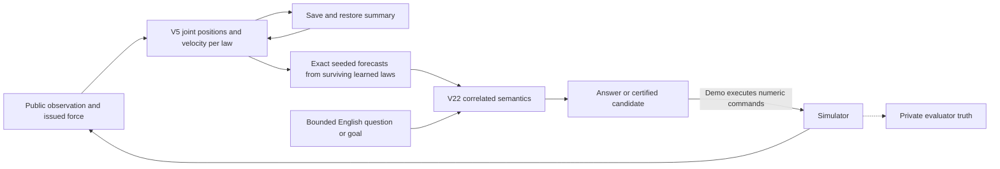

# V5 continuation memory: viability report

**Viable as a bounded conditional prototype; the stronger physics-change detection test failed.** V5 now carries saved state through continuation, bounded language, planning and simulator execution. Runtime, CLI, demo and final functional evidence checks passed. The added attack failed its predicted full-family detection deadline, so scientific qualification remains failed. Independent review accepted that adverse evidence, and the deadline remains unchanged.

## What V5 adds

V5 implements a continuation state that can be saved and restored without rereading the current episode's earlier observation packets. It carries exact joint position alternatives and velocity conditional on each surviving supplied law. New observations filter that carried state. Bounded English questions and candidate plans use the complete alternatives of the **surviving learned subset** through the inherited correlated semantic bridge. Their certificates are conditional on that subset; they do not assert agreement across every surviving law in the wider bank. The full 648-law bank is retained to distinguish learned-model mismatch from full-family contradiction.

This is an engineered application of temporal memory to the local Pinker integration. It is not a biological neuron implementation, a new physical-law learner, a neural perception result, or ordinary language understanding. Language expresses a limited proposition or goal; mathematics decides its support. A learned point estimate cannot turn uncertainty into a justified answer.

The runnable interface is described in [README.md](<C:/Users/darre/OneDrive/Desktop/Codex/Neuron timing and Memory/v5 continuation memory/README.md>). The implementation and all new evidence are in this workspace. Pinker and the completed V1–V4 sources remain read-only.



The evaluator's private truth scores saved target outputs. It is not an input to the carried state or an authority for the target's language answers.

State propagation and joint-set comparisons use exact rational arithmetic. The separate comparison with floating-point simulator truth permits position error of 1e-9 and velocity error of 1e-8. A truth-containment result therefore reports that declared numerical check, not an exact-arithmetic theorem about the simulator.

## Where this sits in the project

The original temporal-neuron report motivated history-sensitive internal state. V1 implemented persistent force impulse and its integral, with a fitted linear readout, and separately tested directional event-pair features. The [V1 report](<C:/Users/darre/OneDrive/Desktop/Codex/Neuron timing and Memory/v1 timing and memory/VIABILITY_REPORT.md>) records those experiments and the research qualifications. The features are mathematical accumulators, not spikes, dendrites, learned wiring or an energy measurement.

V2 integrated the persistent approximation as a way to order candidate actions. The exact V21/V22 path retained decision authority. Its eight fixed planning problems used nine exact checks with persistent ranking, compared with eleven for a memoryless readout and twelve for fixed order. That is inherited finite-benchmark evidence, not a V5 result or a general runtime advantage. See the [V2 report](<C:/Users/darre/OneDrive/Desktop/Codex/Neuron timing and Memory/v2 integrated timing and memory/VIABILITY_REPORT.md>).

V3 exposed finite-summary collisions, extrapolation limits and hidden-regime ambiguity. It also ran the user's requested fixed outside-family planning scenes: once public evidence excluded the family, the unchanged V2 planner produced no exact yes or selected action. Approximate guesses were often yes, demonstrating why the mathematical check matters. See the [V3 report](<C:/Users/darre/OneDrive/Desktop/Codex/Neuron timing and Memory/v3 temporal limits/LIMITATIONS_REPORT.md>).

V4 owned and replayed a bounded observation journal. It diagnosed learned-law mismatch separately from full-family contradiction and exposed conditional current position and velocity. It also preserved an adverse finding: a wrong law can fit a short coarse history, so its conditional state can miss actual truth before observations exclude it. See the [V4 report](<C:/Users/darre/OneDrive/Desktop/Codex/Neuron timing and Memory/v4 observed memory/VIABILITY_REPORT.md>).

V5 changes the memory contract. It replaces the current-episode journal with a sufficient state for forward computation under the supplied assumptions. This trades away self-contained historical replay. The new path uses fixed or effort-based candidate ordering; the old learned temporal ranker remains on V2/V4's full-prefix route. V5 receives no credit for a newly learned ranking, language connection or physical ontology.

## Frozen question and scope

The [build plan](<C:/Users/darre/OneDrive/Desktop/Codex/Neuron timing and Memory/v5 continuation memory/BUILD_PLAN.md>) freezes this question: under the existing finite affine family, rest at the original episode start, a stationary other reference and the inherited visual-cover/correspondence premises, can a serialized joint state preserve future physical support, language truth support and exact candidate authorization without rereading past packets?

| Job | Origin | Required distinction |
| --- | --- | --- |
| Continue temporal memory through language and simulation | given | A usable connected system, including continued observation after a handoff |
| Refuse yes when observed evidence contradicts the supporting laws | given | Evidence-sensitive conditional answers rather than trust in a trained checkpoint |
| Preserve mathematical authority | fixed | Complete joint alternatives rather than a point prediction or fluent explanation |
| Edit only this workspace; defer neural perception | fixed | Local integration without changing Pinker or adding a perception model |
| Carry state without current-episode history | added and approved as the V5 next step | A genuine continuation rather than replay hidden inside a checkpoint |
| Source-bound persistence, CLI, finite limits | added engineering requirements | Inspectable, reproducible bounded operation |
| Force full-family exclusion by 31 after the added hidden stop | added experimental prediction | A stronger identification expectation than correct continuation; the first frozen test falsified it |

The finite range is 32 consecutive public observations, indices 0–31, at 0.1-second cadence: at most 3.1 seconds of observation. Future programs contain 1–16 commands; planning accepts at most eight candidates. A mathematical forecast may extend past global index 31, but its response explicitly marks it as outside executable feedback through this public protocol. These numbers are interface and resource choices, not natural limits of memory.

The test changes include force schedules, motion/coast, quiet hidden mass, a learned-family mismatch, fixed handoff locations, checkpoint/source corruption and resource pressure. The uncommanded velocity changes are adversarial changes outside the supplied dynamics, not supported regime continuation. Actual truth can leave current support before coarse public evidence excludes the family; the required response is contradiction and refusal once that exclusion is established. The added post-16 pair asks whether this separation occurs by 31. Neural perception, arbitrary initial velocity estimation, new laws, recovery after a latched stop, contact, noisy sensors, missing-observation recovery, object birth/death, re-identification, new grammar, 3D and part/texture learning are outside this increment. Retrospective questions about arbitrary discarded history are also unsupported.

## Why the carried state can suffice

**Worked out from the supplied recurrence:** for a fixed law and issued force, let acceleration be `a = gain * force + bias`. With cadence `H`, its controlled reference advances by

```text
displacement = H * velocity + beta * H^2 * a
next_velocity = retention * velocity + H * a
```

The original rest premise and observed command sequence determine velocity exactly conditional on that law. Position remains uncertain. V5 carries a union of joint rectangle pairs tied to the current correspondence nodes. It translates the controlled rectangle, intersects both references with the next visual cover, and keeps only permitted correspondence edges. Translation of an intersection equals the intersection of its translated components. Consequently, under the fixed law, older positional constraints can be folded into current rectangles instead of replayed from the episode start. The terminal graph nodes retain the information needed for the next adjacent correspondence step.

This argument depends on the supplied recurrence and tracker being Markov at the carried state. It does not prove that arbitrary physical dynamics or general object identity have this property. V18 supplies conditional reference-slot correspondence; V5 does not establish a real-world object identity independently of that assumption.

V5 retains the full 648-law family as well as membership in the learned subset. This distinguishes learned support becoming empty from completed exclusion of the entire declared family. A resource stop or unavailable cover is a third kind of result; it must never be reported as physical contradiction. All certificates remain conditional on the declared law and visual premises. An actual state outside a still-publicly-compatible wrong law defeats an unconditional accuracy claim, but is not by itself proof that conditional calculation was unsound.

Forecasts use a new V5 exact projection from carried nonzero velocity for the surviving learned laws. They are not described as an unchanged call to V21's rest-only public forecaster. The unchanged V22 bridge receives the disclosed current local origin and complete joint projections within that learned cohort. Its endpoint relation evaluations feed the sealed acquired grammar. The forecast authority and the combined physical/semantic certificate are named separately in returned records.

## Why the runtime originally stopped

**Seen:** the first accepted implementation exhausted pairwise containment work on correctly generated stationary and gentle-motion inputs at observation 5. These were nominal availability failures. Unknown answers and absent actions correctly prevented authority after a stop, but did not make the memory useful on those scenes.

Two bounded exact optimizations address that work without widening physical possibilities:

1. Reuse complete transition geometry within one observation when controlled reference, exact displacement and the entire prior joint state sequence agree. Each law still receives its own next velocity and independently owned states. Every logical state remains charged. Cached geometry records its pending peak so that the original pending-plus-retained pressure limit is checked on both misses and hits.
2. At one correspondence node, prove that the distinct joint rectangle pairs form the full Cartesian product of their two marginal sets. Only then prune the marginal sets separately. The maximal elements of a finite product order equal the product of its marginal maximal elements. Select only existing states and retain the original deterministic ordering. Missing cross-pairs or duplicate raw states take the unchanged general joint path. Complete exact marginal sets can reuse their maxima within that one advance, with a bounded cache.

The second change never fills a hole between correlated alternatives or replaces a union with a hull. Its counterexamples include two anti-diagonal pairs, outer/inner and inner/outer. Applying V5's selection-only shortcut without proving the product would wrongly discard both pairs because neither existing pair contains both marginal maxima. A different algorithm that reconstructed the marginal product would instead invent the absent outer/outer combination. The nearby complete four-pair product may be pruned safely. Additional tests preserve multiple incomparable maxima, node/state identity, input-order invariance, cache capacity and the original pending-state pressure refusal.

Work accounting is explicit: the generic route counts one actual candidate-versus-retained joint comparison; the marginal route counts one actual rectangle comparison; an exact cache hit performs none. The numerical work and state limits stay unchanged. Cache bookkeeping and its bounded extra memory are the cost. No claim follows about biological efficiency, optimal data structures or performance on arbitrary scenes.

The first transition-reuse candidate quietly changed a pressure guard. Independent review rejected it, and the original policy was restored before acceptance. All results from that rejected source remain labeled as candidate diagnostics. A later protocol test also had to change: the exact-product optimization made all 32 repeated synthetic frames available, so the old assertion expecting a natural containment stop was obsolete. The repaired test requires availability, nonempty support, a valid forecast and atomic rejection of packet 33. It does not substitute for a real moving scene.

## Evidence available before the final campaign

The complete chronology and exact source hashes are in [GATE_LOG.md](<C:/Users/darre/OneDrive/Desktop/Codex/Neuron timing and Memory/v5 continuation memory/GATE_LOG.md>). Runtime, CLI and evaluator changes received separate read-only reviews. Counts below describe executed checks, not independent trials or a probability of truth.

| Evidence | Observed result | What it does not establish |
| --- | --- | --- |
| Corrected-camera baseline, old runtime | Stationary and gentle stop at index 5 with containment limit | A physical contradiction |
| Accepted transition reuse | Stationary reaches 8 then stops at 9; gentle reaches 5 then stops at 6 | Nominal endpoint availability |
| Accepted exact-product pruning diagnostic | Stationary reaches 15; gentle reaches 25; every observation available | Full private-truth, language and handoff qualification |
| Repaired 32-packet protocol test | Available throughout; valid projection; packet 33 refused atomically | A new physical simulation case |
| Fresh development integration | Exact joint/forecast/semantic/plan agreement at 5, 10, 15; restored sessions agree; moving reset loses truth containment | Generalization to the other fixed scenes |

The final direct diagnostic ends stationary with 216 full-family laws and 21,024 joint states, versus two learned laws and 32 states. Gentle ends with six full-family laws and 328 states, versus two learned laws and 168 states. Source/input hashes are unchanged before and after its calls. The target reads only previously saved public packets; private truth is not loaded by that diagnostic.

An earlier seven-scene run (`fixed_03`) is preserved as a diagnostic, not final qualification: the old harness used the wrong frozen camera variant. It also contained several comparison/applicability defects. The corrected harness independently checks complete public packets against canonical rollout, distinguishes physical support classes before normalizing refusal wrappers, and requires nonempty supported states before claiming that a stationary velocity reset is harmless. Empty matching outputs cannot pass as useful memory.

Early failed development runs did not all preserve full source preimages. Their hashes and logs remain evidence of those attempts, but do not make every early state exactly reconstructable. This limitation is not erased by the final source freeze.

### A failed prediction about the stationary control

The first corrected-input full campaign, `fixed_04_runtime_repair`, exposed an error in the frozen experimental expectation. We had predicted that setting every carried velocity to zero would leave the stationary scene's entire state unchanged. At cut 5 it did not: the full checkpoint and joint state changed, while the learned forecast remained equal. The original criterion remains recorded as failed.

**Seen in saved evidence and independently reviewed:** all 648 full-family laws still fit that short coarse history. Of them, 576 have nonzero carried velocity, exactly the nonzero-bias laws; 72 have zero velocity. Both learned laws already have zero velocity. Unchanged V21 conditioning and V5 agree on the complete original full and learned joint sets. Thus physically stationary truth does not imply that every publicly compatible hypothesis is stationary. Resetting all velocities removes real uncertainty from the full-family state. The two learned laws used for prediction are untouched, explaining the equal forecast.

The independently accepted evaluator correction keeps the scene, cut and reset operation. It explicitly asks a narrower question: does the reset leave the **learned prediction route** unchanged when every surviving learned velocity is already zero? It also accounts for the exact full-state mutation and tests a same-path scale-1 operation that should change nothing. This is a changed post-failure question, not a vindication of the original innocent-control prediction. No production repair was justified by this finding alone, and the runtime remains unchanged.

The corrected development run passed its moving discriminator: learned velocities were nonzero, resetting them changed the joint state and forecast and lost true-state containment, and scale 1 preserved state and outputs. It also preserved canonical comparisons and restored-session agreement. The source-frozen full rerun subsequently passed the revised stationary claim: its learned IDs, joint state, forecast, answer and plan remained equal, all authority checks passed, and original/reset learned and full support contained the true state. The full-state mutation gauge and scale-1 control passed too.

### First full campaign on the accepted runtime

**Seen:** [fixed_04_runtime_repair](<C:/Users/darre/OneDrive/Desktop/Codex/Neuron timing and Memory/v5 continuation memory/results/fixed_04_runtime_repair/summary.json>) completed all seven scenes with 168 applicable checks, no execution errors and one failed check: the original stationary reset prediction above. Its scientific digest is `1fbdd8be9df94578b160448d06e0e376b8285fb530d05defa38eb3dd5a2a4c1c`. Root independently recomputed that digest, the failure set and source identity. These are audit counts, not independent confirmations or a confidence score.

| Frozen scene | Observed behavior | Distinction established |
| --- | --- | --- |
| Accelerate then coast | Available through 15; final full 4/learned 2 | Carried motion survives handoff; resetting it changes prediction and loses true-state containment |
| Stationary mass1 | Available through 15; final full 216/learned 2 | Quiet learned prediction works, while the wider conditional state remains uncertain |
| Stationary mass3 | Available through 15; final full 216/learned 2 | Identical quiet public evidence cannot identify the hidden mass |
| Gentle long motion | Available through 25; final full 6/learned 2; true position and velocity jointly contained throughout | Forward continuation works beyond the original 16-observation reference range on this trace |
| Hidden kick | Private truth first missed at 5; full-family contradiction at 6 and retained thereafter | Delayed evidence of a changed physical regime; queried post-contradiction answers unknown with no selected action |
| Zero-kick control | Available through 25; final full 120/learned 2 | The same intervention mechanism with zero change does not itself cause contradiction |
| Excited mass2 | Learned mismatch at 6 with full 297/learned 0; final full 4/learned 0, full truth retained | Learned-family failure stays distinct from exclusion of the whole supplied family |

All single-cut, chained and fresh-process handoffs agreed with uninterrupted execution. Within the canonical comparison range, full and original learned joint states, forecasts, language and plans agreed. Beyond that range, the evidence is V5 split/unsplit agreement and evaluator truth, not an unchanged V4 oracle. The scenes had no contacts or clipping and respected the declared adjacent-step bound.

### Fresh run with the corrected ablation question

**Seen:** [fixed_05_ablation_scope](<C:/Users/darre/OneDrive/Desktop/Codex/Neuron timing and Memory/v5 continuation memory/results/fixed_05_ablation_scope/summary.json>) completed seven scenes with all 174 applicable checks passing, no execution errors and no N/A checks. Its scientific digest is `2906532573ca18a4a255a445ae4fda3d03a08003875d6e646e2062270649630f`. The evaluator and runtime remained at their declared hashes. Canonical comparisons, restored and fresh-process continuations, physical bounds and the scene outcomes in the table above all passed again. The two revised ablation criteria passed with their unconditional prerequisites and exact mutation controls.

Independent review accepted the saved full result after reconciling every scene, source identity and scientific digest. The unchanged [fixed_06_replay](<C:/Users/darre/OneDrive/Desktop/Codex/Neuron timing and Memory/v5 continuation memory/results/fixed_06_replay/summary.json>) subsequently passed the same 174 applicable checks on seven scenes with the identical scientific digest. Independent review confirmed complete scientific-body equality and byte-identical contents for all 28 per-scene artifacts. Only run metadata differs. This establishes repeatability for these frozen cases. These successful runs answer the explicitly narrower stationary question; they do not erase the failed original full-family innocent-control claim.

The later [added case](<C:/Users/darre/OneDrive/Desktop/Codex/Neuron timing and Memory/v5 continuation memory/added_cases.json>) was frozen and independently reviewed before implementation or execution. It pairs a hidden velocity stop after observation 16 with a same-path identity operation. A separate public-history ledger audits full and learned joint support through 31 using canonical cumulative motion in initial coordinates, independently of V5's continuation code. First public divergence at 17 and first family exclusion at 18 were recorded timing forecasts; successful operational separation was required by 31. The ledger shares the canonical law and visual premises, and does not independently audit the terminal index-32 forecast.

### Independent audit route for the added case

The [ledger](<C:/Users/darre/OneDrive/Desktop/Codex/Neuron timing and Memory/v5 continuation memory/attack_ledger.py>) is implemented and independently accepted after focused verification. It seeds from unchanged canonical conditioning at observation 15, retains joint rectangles in the original coordinates, and backtranslates later public covers using canonical cumulative offsets. V5 instead advances current rectangles using carried velocity. Neither route replaces joint alternatives with marginal hulls. Agreement between these two routes tests continuation filtering while leaving their shared physical-law, perception and correspondence assumptions explicit.

**Seen on the designated development evidence:** extending a canonical seed from 14 to 15 gives the same exact joint support as fresh canonical conditioning at 15. A fresh subprocess accepts a public-only request and reports its actual imported source origins. The ledger never imports V5's runtime or experiment code. It retains public history for audit, so its existence does not establish V5's history-free property.

The first ledger review found two resource-accounting defects: it recorded final seed size instead of peak live-state use, and its short crosscheck did not carry the requested limits and seed-anchor charges. Both were repaired before the added scenes ran. A real seed with a higher historical peak than terminal size now stops when its cap lies between those values; the public crosscheck also stops under the lowered cap. The [captured focused-test receipt](<C:/Users/darre/OneDrive/Desktop/Codex/Neuron timing and Memory/v5 continuation memory/results/added_ledger_development_01/review_repair_01/focused_suite_receipt.json>) records the accepted sources and seven passing tests. This qualified the local audit implementation for the added experiment; it is not itself an outcome of that pair.

Seed witnesses are checked terminal anchors. Parent pointers describe subsequent extensions; no complete pre-seed path or enumeration of all histories is claimed. A work stop remains inconclusive. Exhaustive full-family death requires completing every surviving branch without a stop. The raw evidence and scorer must keep a surviving but physically wrong hypothesis, erroneous support filtering, and an unjustified certificate as different findings.

The runner and saved-evidence scorer also underwent separate review before the pair ran. Review found and corrected incomplete raw-record validation, misleading resource/physical finding labels, and a wrapper that could label a caught scoring exception as passed. The corrected real wrapper returns scoring_failed and a nonzero CLI result for a controlled scoring exception. An actual separate-process low-cap ledger run produced state_limit and remained inconclusive. The backward-limit classification was worked out from the two accepted source routes and structurally exercised with constructed records, including over-cap and unknown-reason rivals; it was not an observed physical run that reached that limit. These were evaluator repairs; the frozen scene parameters, V5 runtime and accepted ledger stayed unchanged. Exact source versions, failures and focused checks are retained under results/added_runner_development_01 and described in the gate log.

### First post-16 attack outcome

**Seen in the first saved result and independently reconciled:** [added_01_velocity_scale](<C:/Users/darre/OneDrive/Desktop/Codex/Neuron timing and Memory/v5 continuation memory/results/added_01_velocity_scale/summary.json>) completed both scenes with 42 applicable checks, two failures, no N/A checks and no execution/scoring errors. Its scientific digest is `5234d1e1cac151182091de5093c8549c59e268f9af045947871d2cdae3e78531`. All frozen source and input hashes remained unchanged during execution. The reviewer regenerated the complete scientific body and verified all 28 manifest artifacts, including source and request/output bindings.

The failed prediction was that the hidden stop would exclude the entire supplied family by 31. It did not: the independent ledger retains three laws and 104 joint states at 31, and V5 agrees with that support. Consequently there is no independent full-family death or V5 full-family contradiction to latch. The two mandatory exclusion/latch criteria remain failed. This cannot qualify under the frozen rule, and is not merely a miss in nongating timing.

| Measurement | First saved outcome |
| --- | --- |
| First public difference between attack and control | 21, versus the timing forecast17 |
| First private truth-containment miss | 17, while publicly compatible laws remain |
| Learned subset exhausted | 24; V5 reports learned_model_mismatch |
| Full family excluded | Never through 31; three laws and 104 states remain |
| Independent full and original-learned joint comparisons | Agree at 16,18,24,31 in both scenes |
| Single-cut, chained and fresh-process handoffs | All agree with uninterrupted results |
| Same-path identity control | Supported through 31; intervention and truth-containment checks pass |
| Conditional-authority or support-calculation findings | None reported by the saved scorer |

The result distinguishes correct conditional memory from unconditional physical adequacy. Actual motion changed, but the available public observations still admit other fixed-law histories. Forcing the full bank to become empty merely because the evaluator knows the hidden intervention would discard genuine public-compatible alternatives. The first result is preserved; no replacement scene, runtime patch or relaxed deadline has been substituted for it.

### Why the wrong physics remains compatible

**Seen in the saved witnesses; recurrence worked out from the supplied law definitions:** the actual setter changes mover velocity from about 1 to 0 after observation 16. Its true center then stays at approximately x=-4.65208. The public tracking abstraction does not observe velocity and retains an identity-unestablished mover cover spanning x in [-5,-4] at every declared cut.

| Surviving law | Gain | Retention | x-bias | beta |
| --- | --- | --- | --- | --- |
| law-8beab068de8375af | 2 | 1/2 | 2 | 1/2 |
| law-e1f9ac31c57919dc | 2 | 1/2 | 2 | 23/48 |
| law-e861d30be8c37af8 | 1 | 1/2 | 2 | 1 |

With zero suffix forces and H=0.1, these laws obey `next_velocity = 0.5 * velocity + 0.2` and `displacement = 0.1 * velocity + 0.02 * beta`. Velocity tends toward 0.4. Their surviving position witnesses begin near x=-4.95 at 16 and drift inside the broad outer cover, reaching approximately [-4.207,-4.000] at 31. The true mover is stationary farther left, but the public abstraction still admits these distinct trajectories. Raw attack/control packets first differ at 21; a raw difference does not imply that the retained positional constraints exclude every alternative law.

This is a limitation of the current certified observation/tracking abstraction together with the supplied family. It is not an information-theoretic proof that no observer could extract more from the original raw packets, nor a proof that each surviving cover witness would reproduce every raw sample under a complete rendering model. Whether a stronger interpretation of the same raw data could remove the ambiguity is untested here.

The learned laws have retention 1 and zero bias, so they continue the earlier velocity and lose their final witnesses at 24. That accounts for learned-model mismatch without full-family contradiction. Saved questions at 15,16,18 still answer yes to the bounded endpoint left-of relation and select the +20 candidate under the learned-law certificate. The private physical state is already outside the represented support from 17; a coarse qualitative relation can remain true while the predicted trajectory is wrong. Those proposed actions were not executed in the attack world. At 24 and 31 the answers are unknown/unavailable, certificates are absent, and no plan candidate is selected.

At 31, an **identity-certified** mover-center observation in [-4.75,-4.5], or a direct observation of zero x-velocity, would separate the saved true state from all three surviving witnesses. This is a discriminator derived from saved geometry, not a new experiment or a capability of the existing sensor interface. Merely running longer has not been shown to solve the problem. Richer observations, an active force probe, or an enlarged changing-law family would each change a named part of the question and require a prospective test.

### Final scientific qualification

The accepted qualifier re-derives the added result from saved evidence and binds the declarations, source snapshots, exact artifact inventories, manifests, scene records, complete scientific body and provenance. It requires the exact 42 mandatory criteria, all applicable and passed. Only the two declared timing forecasts are nongating; endpoint survival remains fatal.

Its20 focused implementation controls passed, including genuine-evidence integrity, altered evidence, missing/duplicate/N/A criteria, and a rival that repairs counts and digests after removing a criterion. Abstract positive controls test classifier logic only; none is presented as a successful physical experiment. The first adapter attempt had two comparison defects involving manifest basenames and canonical tuple/list equivalence. These were corrected without changing the scientific rule. That intermediate source snapshot/hash was not captured; its failed stream remains, but the intermediate version is not claimed reconstructable. The accepted final source and focused run are bound.

Independent review accepted the qualifier. The actual [qualification record](<C:/Users/darre/OneDrive/Desktop/Codex/Neuron timing and Memory/v5 continuation memory/qualification.json>) then returned `status: failed` with `reason: failed_scientific_gate`, evidence integrity passed, scientific disposition failed, and `qualifying: false`. Its source-frozen command exited 1. The root record and saved run summary are byte-identical at SHA `aaaf73d2677ff90726c0798c26e1bef9594d643252a46da443d7eea76d234caf`.

As required, that gate stopped before running the runtime/CLI suites, launcher or preservation audit. Those items are explicitly marked unrun in the failed qualification. A separately declared functional verification executed the original matrix while preserving this failure by hash. It establishes that the prototype's interfaces work; it cannot make the failed detection prediction pass.

### Executed functional verification

The separate [first functional record](<C:/Users/darre/OneDrive/Desktop/Codex/Neuron timing and Memory/v5 continuation memory/results/functional_verification_01/summary.json>) preserves the actual commands and their receipts:

| Execution | Observed result |
| --- | --- |
| Runtime suite in a fresh isolated process | Eight tests passed, no skips, 262.896 seconds |
| CLI suite in a separate fresh isolated process | Two tests passed, no skips, 87.943 seconds |
| Actual PowerShell launcher from an isolated directory | Available; coast selected; ten numeric commands executed; final index 15; restored joint state equal |
| Preservation before and after | All 1,935 baseline files and 36 approved skill-comparison files unchanged; no unexpected file outside V5 |
| Source and evidence stability | All declared executable/dependency seals, saved evidence, driver and failed scientific qualification unchanged |

The tests exercise meaningful state, authority, persistence and interface behavior rather than merely checking file existence. The [completed demonstration](<C:/Users/darre/OneDrive/Desktop/Codex/Neuron timing and Memory/v5 continuation memory/results/functional_verification_01/launcher_demo/demo.json>) and its saved continued session can be inspected without rerunning it. The demo is a development-scene simulation, not an outside-family recovery experiment.

The first aggregate functional record nevertheless remains **failed**. Its campaign verifier expected 31 files where each accepted full/replay directory legitimately held 33: the original `run_receipt.json` and `stdout.txt` were omitted from the verifier's expected inventory. No campaign artifact was missing. Both scientific bodies independently re-derived174 applicable checks with no scientific failures and the same digest. The failed aggregate and all successful command receipts are preserved.

The bounded inventory/transport repair is independently accepted. The original command executor was qualifier SHA `beb7982472e399d2f33d6c20bc11413b0834aa4de413f66f8a0483fcd2545c32`; the repaired saved-evidence verifier is `f92e210f4ec16e9b2b0d7596d4a492b94a243da9f8fb99c98c787743710513a5`. The change admits and validates the two exact command artifacts and strengthens full/replay reference binding. Scientific reconciliation and the added attack's42 mandatory criteria are unchanged. Its first candidate expected LF where the original artifacts used CRLF; both candidates and the failed result are preserved, and the final byte-format correction changes no scientific rule.

The actual [fresh saved-evidence reconciliation](<C:/Users/darre/OneDrive/Desktop/Codex/Neuron timing and Memory/v5 continuation memory/results/qualification_development_03/real_result.json>) under the repaired verifier passes full/replay inventories, transport validation, complete scientific-body agreement and determinism. It also reconfirms the added evidence's integrity and unchanged scientific failure. Missing, unexpected, malformed and altered transport controls fail as intended. The [repair record](<C:/Users/darre/OneDrive/Desktop/Codex/Neuron timing and Memory/v5 continuation memory/results/qualification_development_03/development_report.json>) preserves that evidence. Independent review accepted reuse of these executed checks and the earlier successful runtime/CLI/launcher commands, conditional on unchanged source and evidence seals.

The [final functional aggregation](<C:/Users/darre/OneDrive/Desktop/Codex/Neuron timing and Memory/v5 continuation memory/results/functional_verification_02/summary.json>) completed with `status: passed`, `scientific_qualification_status: failed`, `qualifying: false`, and `does_not_override_scientific_failure: true`. Its source comparison confirms that only the qualifier differs among the 27 declared seals. It verifies the original command receipts, exact demo artifacts, unchanged raw evidence and failed qualification, the executed repaired reconciliation, and fresh preservation/source checks. The old runtime/CLI/launcher commands are reused, not represented as new executions. The matrix obligations carried from the original run include freshly rechecked preservation and source integrity; only full/replay reconciliation and their derived determinism replace failed obligations from the first aggregate.

Independent read-only review accepted that aggregation. Its `reused_from_original` field names carried matrix obligations; the actual execution provenance is:

| Evidence | Execution provenance |
| --- | --- |
| Runtime tests, CLI tests, launcher | Reused original successful commands from `functional_verification_01` |
| Full campaign, replay and deterministic pairing | Reused accepted reconciliation executed under the repaired qualifier in `qualification_development_03` |
| Preservation, AST, dependency identities, source/evidence stability, failed-qualification preservation and aggregation-driver stability | Freshly checked by `functional_verification_02` |

Two early attempts at this one-off aggregator interrupted on a string/Path conversion error and on treating progress output as a single JSON document. Their exact scripts, declarations, receipts, streams and interrupted summaries are preserved. The third attempt validates the original sequence of progress records and completes successfully. These are reporting-script repairs; they changed no product behavior, physical evidence or scientific acceptance rule. A PowerShell syntax typo before one AST process started changed no files and is not presented as an executed test.

## Costs and remaining boundaries

A V5 checkpoint is a trusted derived summary. Its checksum, canonical schema and source binding reject specified corruption and incompatible code. After deleting history, those checks cannot prove the historical derivation of an otherwise valid summary. Scientific evaluation keeps public inputs separately and uses an uninterrupted execution plus an independent canonical calculation where that API applies. This is a different trust contract from V4's self-contained replay.

The summary is sufficient only for the admitted future questions. It is not a general episodic record. Different pasts can lead to the same current conditional state while differing in facts a later retrospective question might ask. No general compression, memory-saving, real-time, throughput or energy claim is supported. Exact alternatives can consume substantial memory even when the episode is short.

**Seen, with the same compact JSON encoding on both sides:** at stationary cut 5 the carried state excluding the immutable base occupies 6,088,934 bytes, versus 33,748 bytes for the six public packets. The complete checkpoint occupies 6,343,981 bytes. At cut 10 the state is 4,087,025 bytes versus 61,915 bytes for eleven packets. The [size audit](<C:/Users/darre/OneDrive/Desktop/Codex/Neuron timing and Memory/v5 continuation memory/results/memory_size_audit_01.json>) binds those measurements to the saved input/output hashes. The state is smaller later, consistent with fewer surviving possibilities; it remains substantially larger than this short packet history. These are representation sizes, not process-allocation measurements or an isolated causal decomposition of the byte reduction.

The accepted-runtime direct diagnostics took 63.072 seconds for the stationary observations through 1.5 seconds of simulated time, and 115.516 seconds for gentle motion through 2.5 seconds. They do not establish real-time operation on this machine. The fuller campaign adds independent conditioning, comparisons, repeated restores and subprocess checks, so its elapsed time is not a target-only throughput measurement.

The original learned-law membership stays fixed. V5 filters it and diagnoses its failure; it does not learn a replacement from the mismatch. Once a resource, tracking or full-family failure is latched, later observations do not silently reset the episode. Recovery, uncertain initial-state inference and changing-law models require separate interfaces and experiments.

The language implementation remains the sealed finite acquired grammar and supplied endpoint mapping. Its uncertainty is preserved. No new conversational context, temporal grounding of arbitrary prose, part-whole concepts or ordinary-language action router is acquired here.

The user's eventual 3D and parts examples make sense as a later requirement, but they add new representational questions: persistent whole/part identity, nested spatial boundaries, attachment relations, texture observations and uncertainty about ownership. This two-reference planar continuation does not settle them. A future perception front end would need to emit supported alternatives that preserve such relations; attaching an object detector alone would not supply that representation or its temporal proof obligations.

## Skill comparison and its effect on this work

The requested with/without hard-to-vary comparison is complete in [skill comparison/REPORT.md](<C:/Users/darre/OneDrive/Desktop/Codex/Neuron timing and Memory/skill comparison/REPORT.md>). Two matched pairs answered five frozen cases, and a separately authored later case was tested with another fresh pair. The tested arms reached materially equivalent correct conclusions; blinded assessment agreed. There was no demonstrated correctness advantage on that sample. The original subjects self-reported additional reading/tool overhead; controlled latency and per-token costs were not measured. This small comparison may reflect a ceiling on these finite cases and does not establish general equivalence or that the method cannot help on project work.

The skill and the user's standing usage requirement were left unchanged. The practical result used here is to keep concrete counterexamples, frozen questions, independent derivations and adverse evidence central. Reading the method or accumulating pass counts is not evidence that a physical explanation is true.

The mistaken stationary all-law reset expectation also survived the initial method-driven design and reviews. Inspecting the saved alternative velocities exposed it. This is a concrete limit on treating procedural compliance as assurance: the evidence and derivation still have to do the work.

## What holds the explanation in place

This assessment concerns forward conditional continuation, not the origin of intelligence or a biological mechanism. The part names below are the implemented proposal's parts. **Seen** means executed evidence; **worked out** means a derivation from the named assumptions. Borrowed dependencies remain explicit even when integration comparisons pass.

| Part | Status and separating evidence | Scope | Dependency | Provenance |
| --- | --- | --- | --- | --- |
| Carried velocity associated with its law | **Held, jointly with the law and joint positions.** Seen: zeroing velocity in the moving case changes the exact forecast and loses true-state containment; the same-path scale-1 control preserves state and outputs. The revised stationary learned-route control preserves prediction. The original stationary all-law innocent-control prediction was false: quiet true motion does not establish zero velocity for every permitted law. | in test | V21 supplied recurrence, original rest premise | built |
| Correlated pairs of current position rectangles and terminal correspondence nodes | **Held, jointly with law and velocity.** Worked out: separate marginal hulls can invent cross-pairs. Seen: the anti-diagonal pruning control retains both genuine alternatives; the neighboring complete product permits exact pruning. Canonical comparisons examine joint sets and valuation associations. General physical identity is not established by these comparisons. | in test | V17 covers, V18 correspondence and V21 rectangle semantics | built |
| Full-family support distinguished from learned support | **Held** by the required diagnostic distinction. Worked out: removing the full bank would conflate a false learned subset with exclusion of every declared law. Seen in fixed_04 and fixed_05: the excited mass2 case empties learned support while full-family support still contains the true state. | in test | Supplied finite family and inherited learned membership | built |
| Exact conditional language and candidate authorization | **Held, jointly with complete physical support within the surviving learned subset.** Seen: independent canonical comparisons preserve semantic truth support, and certificate-removal/wrong-authority controls reject the same otherwise definite result. These certificates are conditional on the learned cohort, not every surviving full-bank law. Private simulator truth containment is a separate evaluator check. Unsupported states cannot authorize a selected program. | in test | Acquired V20 grammar and supplied V22 endpoint semantics; no claim of general language understanding | fitted |
| Derived persistence without current-episode packet history | **Held for the approved forward-only handoff job, jointly with the exact joint summary.** Seen: save/load and fresh-process suffix execution reproduce the development result; prior packet/result reads are denied after pinned imports. Historical self-proof cannot be recovered from the checksum. | in test | Trusted checkpoint producer, source binding, V2 bounded atomic JSON IO | built |
| Exact work reduction under the stated reuse and complete-product preconditions | **Held** by nominal availability and exact support together. Worked out: those preconditions preserve the represented union. Seen: original and reuse-only implementations stop on nominal traces; the final implementation reaches their declared endpoints, with support preserved on the accepted scenes and targeted branch/counterexamples. All valid bounded packet histories have not been exhaustively verified. The particular cache and pruning implementation is replaceable by another exact algorithm; its complete-product precondition is necessary for its own selection-only shortcut. | in test | Finite partial-order argument and inherited rectangle inclusion | built |
| Inherited observation, forecast and candidate bounds | **Loose as explanatory constants.** They define this interface and resource scope; no physical explanation fixes 32, 16 or eight as necessary values. Boundary tests verify enforcement, not that neighboring limits would be affordable or correct without other changes. | in test | V15 packet protocol and V21/V2 forecast/planning limits | fitted |
| File names and candidate labels | **Loose and harmless conventions.** Other names can express the same design. Selection uses the numeric commands and exact support; a label supplies no physical authority. | in test | none named | built |
| Neural perception and learned 3D part/texture structure | **Not assessed.** The user deferred neural perception and identified 3D/parts as a later concern. | owner-fixed/outside this increment | none tested here | asserted |

No statuses are added up. A failed authority or joint-support obligation would defeat the useful integration claim regardless of other successes. No part is declared idle from a single deletion: velocity, law and position support jointly determine continuation.

| Whole-explanation check | Result at this stage |
| --- | --- |
| Flip the outcome | **N/A as a literal story-flip test:** the conditional output is a derived conclusion from a fixed recurrence and support rules. Its appropriate condition-removal test has a **result**: dropping carried velocity changes the moving projection and loses true-state containment. Source freezes and replay separately test repeatability; they are not flip evidence. |
| Reverse the claimed direction | **N/A for question-to-world causation or learned feedback:** no such causal claim is made. Packets constrain the inferred state and explicit force programs define conditional projections. An ordinary question or plan does not itself execute a physical action. The actual demonstration separately executed ten numeric commands in simulation; this practical integration result does not establish general causal learning. |
| Answer hidden in the starting points | **Result:** fixed laws, original rest and stationary other-reference premises supply substantial knowledge. V5 does not discover them. Within those premises, it still must preserve competing witnesses; the expected result is not installed as a single trajectory. |
| Where the jobs came from | **Result:** given/fixed/added origins are recorded above. The history-free handoff, persistence and CLI are engineering choices within the approved next step, not evidence that neurons use this representation. |
| Add a job | **Result, including a failed stronger prediction:** the independently proposed post-16 pair preserves target/ledger joint support and all handoffs through 31, while its full-family-exclusion deadline fails. Three alternative laws remain compatible. Exact continuation alone does not imply that every hidden physical change will become identifiable within the observation bound. The stronger operational prediction remains failed; it is not rescued by the preserved continuation comparisons. |
| Look inside | **Result:** comparisons inspect law membership, carried velocity, joint physical unions and language valuation associations, not just a matching final yes/no. Runtime pressure and missing-cross-pair controls reach inside the reuse/pruning mechanism. |
| Pairs that pull | **Result:** preserving more uncertainty raises computation and serialized-state cost; exact reuse reduces work without deleting alternatives. Discarding history permits forward handoff but removes self-contained retrospective audit. Uncertainty can force abstention rather than a useful plan. |
| Check the patches and catch-alls | **Result:** incorrect camera construction, comparison applicability, resource exhaustion and the rejected pressure-policy change are separately recorded. Nominal availability is measured independently of safe refusal, so refusal cannot absorb every failure. The original stationary ablation prediction remains false; its narrower replacement is explicitly a different question. Unconditional prerequisite checks prevent missing support or authority from becoming a passing N/A. |
| What the change list leaves out | **Result:** the declared exclusions remain in force, including arbitrary initial velocity, changing laws/recovery, noisy sensing, contacts and general identities. These limits narrow the engineering claim; they do not explain why physical intelligence should have those limits. |
| Best rivals | **Result:** rest-restarting loses carried motion; a packet journal can reproduce within-range results but fails the approved history-free handoff job; marginalization can invent unsupported combinations. Alternative exact sufficient representations remain viable rivals at this level. |
| Where the parts came from | **Result:** the recurrence-based summary and exact optimizations were built from inspected interfaces and criticized with counterexamples. Learned grammar and membership are inherited. No test infers a biological history from matching computational outputs. |

The post-16 intervention has now exposed a concrete observational ambiguity despite correct conditional continuation. The passed reconstruction, CLI/launcher and preservation checks cannot overturn that scientific failure. A prospective observation or active-probe discriminator would test a new identification question. No finite successful set would prove unconditional physical adequacy or arbitrary-duration sufficiency.

## Delivery scope

The seven-scene full run, deterministic replay, added attack evidence, inventory-only verifier repair and final functional aggregation have received independent review. The local source integration and preserved evidence are delivered together; older project files and the sibling Pinker project remain unchanged. The [delivery manifest](<C:/Users/darre/OneDrive/Desktop/Codex/Neuron timing and Memory/v5 continuation memory/delivery_manifest.json>) inventories every V5 file except itself, including preserved failures and development fixtures. Those historical fixtures are evidence, not recommended runtime inputs. The original all-criteria scientific gate is still failed. This report does not claim a qualified release or unconditional physical reliability.

## Viability decision

**Viable as a bounded conditional reference implementation.** The implemented path runs from observations through carried mathematical state, persistence, continuation, finite language, candidate selection and simulator execution. The actual runtime, CLI and demonstration evidence supports using it for further controlled experiments. It is integrated locally with the preserved Pinker sources through this workspace; it is not merged into the sibling Pinker project. Language remains a bounded expression interface, with exact conditional mathematical support deciding certification.

**The stronger detection claim failed.** The frozen hidden-stop experiment did not eliminate every supplied law by observation 31. That result is not repaired by save/restore correctness or by the learned subset's earlier refusal at 24. A certificate remains conditional on its stated learned models and observation premises; it does not guarantee that the actual world obeys them. V5 is not qualified as a general detector of every physics change, a replacement physical-law learner, or an unconditional autonomous planner.

**Scaling viability remains poor and incompletely measured.** The observed state can be much larger than the packet history and the measured execution is slower than simulated time. The exact implementation is useful as a reference against which a faster or learned representation could be checked. These results do not yet justify claims about practical memory savings, real-time operation, biological plausibility, general language, or 3D whole/part understanding.

The next experiment I recommend is one prospectively frozen **active force probe using the existing observation interface**. Before execution, specify a probe intended to separate the surviving affine alternatives from the changed world, a nearby unchanged-world control, and the same conditional-answer and physical-scope obligations. Judge separation and correct refusal independently of continuation fidelity. A probe that leaves both worlds indistinguishable is an informative failure, not a reason to move the endpoint afterwards. This would test whether action can expose the present ambiguity before introducing neural perception or expanding to 3D; it is a new identification question, not a rerun that can erase this failed deadline.
