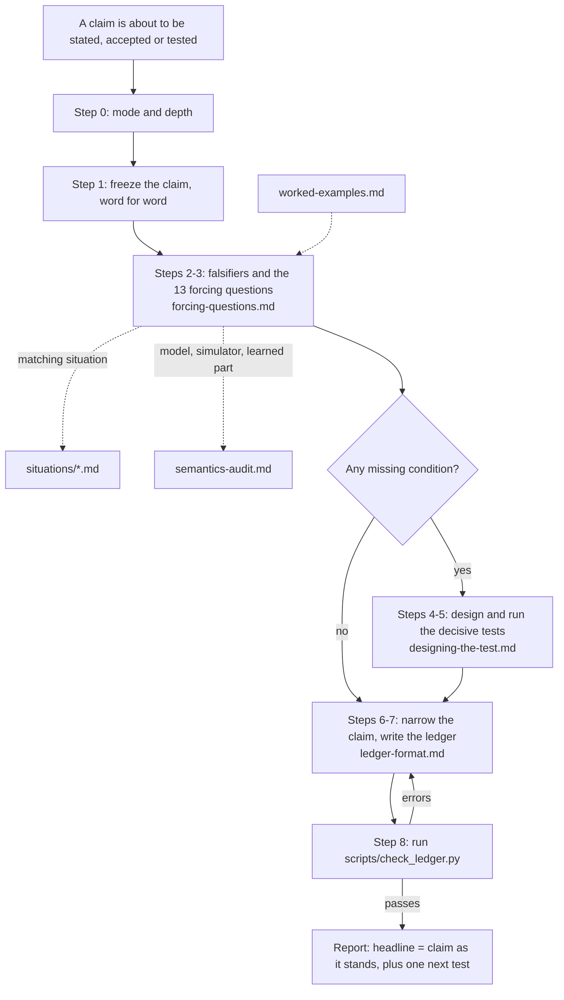

# Prove it wrong

A claim is worth as much as the tests that could have sunk it. This skill makes you find those tests before you state or accept the claim. It does not make claims weaker on principle: a claim that has met its falsifiers is reported as strong.

## One example first

An engineer reports: "Our learned memory makes planning more efficient: 9 exact checks against 12 for fixed order, on our 8-case benchmark. The exact check guarantees every chosen plan reaches the goal."

Asking only "is this right?" gets "the numbers look fine". The forcing questions get the tests that were missing:
- **Scope (Q1).** The guarantee holds only if the world obeys one of the supplied physics models. Nothing tested a world outside the list. *Falsifier:* in at least one of three scenes outside the list, the planner answers a confident "yes" that turns out wrong.
- **Supplied answer (Q2).** The "memory" is two running totals of force, which is Newton's law written in by hand. *Falsifier:* a version with no learning at all also needs about 9 checks.
- **Rivals (Q3).** No rival used that same supplied physics without learning. So the credit for "learned" is not established.
- **Same by construction (Q4).** "Numbers set to zero" must order options exactly like "least effort first". So 5 arms are really 4. "Checks" and "first try" are one measurement counted twice.
- **Draws and size (Q9).** There was one set of training lessons, 8 cases, and a gain of 3 checks.

None of these says the claim is false. Each names a test that could show it false, and the claim may only be stated as far as those tests have gone.

## The rule

**No claim leaves your hands without its falsifier ledger.** For each claim, the ledger states:
- what observation would show the claim wrong;
- whether that observation was actually sought, and by whom;
- what it showed.

A falsifier that was not sought is a **missing condition**. The claim is then narrowed, or reported as *held if* that condition holds.

## Where to look, and when

This file is the procedure. Read `references/forcing-questions.md` on first use in a conversation. Open the other modules only when their row applies.

| You are... | Open | To get |
|---|---|---|
| running the procedure on any claim | `references/forcing-questions.md` | the 13 questions, each with what it catches, a test, a real case where it was missed, and when it does not apply; the answer rules; the reassuring-words table |
| writing the ledger | `references/ledger-format.md` | the table formats, status words, short form and design form; then run `scripts/check_ledger.py` |
| designing the test that a missing condition calls for, or a whole test plan | `references/designing-the-test.md` | prediction first, a ladder of rivals, an innocent neighbour, controls not the same by construction, draws and size |
| auditing a claim that rests on a model, a simulator or a learned part, or a test design in depth | `references/semantics-audit.md` | the audit drawn from Claude Fable Semantics: scope, supplied answers, question type, parts against whole, provenance, receipts, repairs |
| wanting to see a full run | `references/worked-examples.md` | three complete ledgers: a planner benchmark, a "fixed" flaky test, and a well-tested claim that needs almost nothing |
| testing or changing this skill | `evals/README.md` | the test suite, marking lists, results, and how to rerun |

**Applying it to a situation.** During Steps 2 and 3, open the file that matches the claim. It says where the falsifiers usually hide in that kind of work. If none matches, the general procedure is enough. When several match, the most specific wins, and the project file wins for the project's own reports. Open at most two.

| The claim is about... | Open |
|---|---|
| the thinking-machine project (our use case): a version report, a viability report, a cannot-claims entry, a simulation test, a request to the engineer | `references/situations/our-thinking-machine-project.md` |
| software: a root cause, a fix, a flaky test, performance, a migration | `references/situations/software-and-incidents.md` |
| an experiment, an A/B test, a growth or business result, a pilot, a before-and-after, a survey, "studies show" | `references/situations/experiments-and-ab-tests.md` |
| a model's score or capability, a benchmark, a learned module, an ablation, a model-graded evaluation | `references/situations/ml-and-model-evaluation.md` |
| a treatment, a trial, an observational health finding, side effects | `references/situations/health-and-medicine.md` |
| a physical test, a sensor or estimator, a simulation, a controller | `references/situations/engineering-and-simulation.md` |
| an agent's "checked", "verified" or "done", including your own report before you send it | `references/situations/agent-reports-and-self-checks.md` |
| a metric, a dashboard, a data pipeline, a forecast or backtest, a match rate, "no difference" or "just as good" | `references/situations/metrics-data-and-forecasts.md` |
| a process, a supplier's or library's guarantee, a training programme, a claim that lasts or that scales | `references/situations/processes-guarantees-and-scale.md` |
| something that does not or cannot happen: safety, security, "no side effects", "no learner could" | `references/situations/absence-and-safety-claims.md` |

When a module is added, split or removed, update both tables and the graph in the same edit.

## The procedure

**Step 0. Choose the mode and the depth.**
- **Mode:**
  - **Review:** someone else's claim, with evidence already in a report. Tests the report describes but you did not see run are *reported*, not *survived*.
  - **Claimant:** your own claim, or one whose tests you can run now.
  - **Design:** a test plan before anything has run. The ledger becomes the plan: every falsifier is *planned*, with its prediction and pass mark.
- **Depth:** the full procedure is required when any of these applies:
  - someone else will read the claim or act on it;
  - money, health, safety, security or anything hard to undo is involved;
  - the claim is about a learned, simulated or agent-run system;
  - the claim will be reused as a premise.

  Otherwise (a private, reversible, cheap claim) use the **short form** in `ledger-format.md`: the falsifier rows, plus one line naming the questions that came out *missing*.

**Step 1. Freeze the claim.**
- **Quote each claim word for word**, one per line, with an ID (C1, C2 ...), and give a `Source:` line saying where it was quoted from.
  - The headline sentence (title, summary, conclusion) is the claim.
  - If the body narrows it, freeze both as separate claims.
  - Never freeze a softer paraphrase.
- **Every strength word in the original must appear in a frozen claim**, so that it faces Q5. Strength words include, among others: *all, every, never, always, none, exact, complete, guarantees, works, improves, causes, understands, perfect, safe, secure, robust, reliable, stable, accurate, significant, no errors*, and any rate or score over many cases ("97%").
- **Say what kind of claim it is**, because the falsifiers differ:
  - *produces*: X causes or improves Y;
  - *tells apart*: we can identify or predict Y from what we see;
  - *absence*: no Z, never Z;
  - *capability*: it can do or understand T;
  - *guarantee*: Y always holds if...;
  - *comparison*: A beats B.
- **Write the scope:** what the claim covers, and what it does not. A limit added after a failure is a new claim. Record it as one.

**Step 2. Name a falsifier for each claim.**
- **Test only the claims that were made.** Every falsifier tests a frozen claim. Do not test a claim the source does not make, such as credit to a component when the claim only compares two products.
- A falsifier states:
  - what would be observed;
  - where;
  - how it would be measured;
  - the result that counts against the claim, with a threshold where possible.

  Example: "with the cache still on and the race removed, the same 20 one-hour load runs still crash at least once".
- The test of a falsifier: could someone else run it from your words alone? "It would fail if it didn't work" is not a falsifier.
- If you cannot name one, the claim says nothing testable. Say less, or make it sharper.

**Step 3. Ask the 13 forcing questions** (`references/forcing-questions.md`) against every claim.
- **Think first, then classify.** For each question, first write the strongest concrete way this claim could fail under that question, in this case. Only then answer.

Every question gets one of three answers:
- **covered**: by which evidence, citing a survived or reported falsifier, or quoting the evidence;
- **missing**: citing the falsifier row that records it;
- **does not apply**: name the failure you considered, and why the question's stated exemption rules it out here.

No question is skipped silently. A skipped question is how missing conditions survive. The answer rules:
- **Live risk only.** A *missing* answer names what in this case makes it a real risk. Worries that would fit any claim go in one "Routine checks" line.
- **Cannot tell means missing.** If you cannot find out whether a condition was tested, it is *missing*. The falsifier is then "obtain the dated plan, the raw log, or who ran it".
- **Quote it, or it is missing.** Every fact you take from the source must be quoted word for word. A fact the source does not state is unknown: never fill it in. A design feature that is reported, such as parallel trends before a change, rules out only what it rules out. It does not cover rival explanations that arrive at the same time.
- **One condition per row, and one row per condition.** Two different conditions are two falsifiers, even when related. That includes the **knock-out**: remove the proposed mechanism entirely, and the effect should vanish. Rows that would be tested the same way are one row: merge them.
- **Write the strongest rival explanation out in full** (Q3), in two or three sentences:
  - what else could have happened;
  - by what route it would produce the same evidence;
  - what it predicts that the claim does not.

  A list of words ("confounds, seasonality") is not a rival.
- **Check the mechanism's lever** (Q7). If the claim works through an intermediate step, did that step actually move? Examples: traffic for an emissions zone; the drug reaching the blood; users opening the email. If it did not move, the effect needs another explanation.
- **Look for displacement** (Q12, Q13). Was the effect pushed elsewhere: across the boundary, to other times, to other groups?
- **Big enough to settle it.** For every proposed test, say whether its planned size could tell the claim from its rival, using the base rate or effect size in the case.
- **Reassuring words** (held out, replicated, randomized, significant, scanned clean, audited, QC passed, verified, independent): say what each rules out and what it does not, using the table in `forcing-questions.md`.
- **A mostly covered ledger is a success.** When the main falsifiers were sought and survived, say so. Do not invent gaps to look thorough.

| ID | Short name | Asks |
|---|---|---|
| Q1 | Scope | Which conditions, operating points and time spans lie outside what was tested, and is each exclusion stated? |
| Q2 | Supplied answer | What did the setup hand in, and could the result follow from that alone? |
| Q3 | Rivals | What else could have produced the same evidence (events at the same time, spillover between compared groups, selection, reverse cause), and, for credit claims, what is the strongest simple rival method? What observation tells them apart? |
| Q4 | Same by construction | Could two arms, controls or measures agree by construction? |
| Q5 | Worst single case | Behind a strength word, a rate or an average, what is the worst single case, and was the event even observed there? |
| Q6 | Premise match | Does the test match the claim's premise and the same version, build and data, and what else differs between the compared cases? |
| Q7 | Same question | Does the evidence answer the question claimed: produces or tells apart, workings or outputs, proxy or outcome? |
| Q8 | Unseen changes | For anything fitted, learned or tuned, what has it never met, and what fits the same past but differs there? |
| Q9 | Draws and size | How many independent draws, and could the result, or the absence of a result, be luck at this size? |
| Q10 | Order of events | Were the test, prediction and pass mark fixed before the results? How many metrics, subgroups or cut-offs were tried? |
| Q11 | Receipts | For every "checked", "verified" or "works", what was run, what did it print, who wrote the record, and has that check ever caught a planted fault? |
| Q12 | Consequences | What else must be true if the claim is true, and what does the fix or change give up? |
| Q13 | What is counted | Who or what was included, who decided, did the definition or boundary change, and would the result survive counting what was left out? |

**Step 4. Choose what to test.**
- Rank the missing conditions by how much of the claim each could overturn.
- Pick the cheapest decisive test first. Design it with `references/designing-the-test.md`:
  - a written prediction;
  - the rival it must beat (for comparative or credit claims);
  - an innocent neighbour it must leave alone.

**Step 5. Run what can be run here.**
- Record each run as a receipt: what was run, what it printed, where the output is.
- What cannot be run here is *blocked*. A blocked row names who could run the test and its pass mark, written as a request they could act on.
- If the claimant cannot or will not answer, the condition stays *missing*.
- Not run is never passed.

**Step 6. Narrow the claim to what survived.**
- Restate each claim at the scope its tests reached. Example: "inside the supplied model list, on these 8 cases, with one set of lessons".
- Where a missing condition matters, write the claim as *held if* that condition holds. Keep the old wording as the earlier claim.
- A claim held only if more than three things hold says little. Say so plainly.
- A limit of scope is not a gap. A falsifier for something the claim never asserted is *outside the claim*. An example: rare harms, for a trial that claims only a 12-week effect.
- **A *held if* must be a condition whose failure would overturn the claim as stated.** For a claim whose main falsifiers were sought and survived, the remaining caveats are limits of scope (*outside the claim*) or routine checks. They are not conditions of acceptance. Do not make a well-tested claim wait on extra tests.

**Step 7. Write the ledger** in the formats of `references/ledger-format.md`. It has six parts:
1. the claims;
2. the source;
3. the falsifier table;
4. the question table (or the short-form line);
5. `Claim as it stands:`;
6. `Next test:`.

**Step 7b. The fact-check pass.** Before checking the ledger, reread the source. For every statement about the case in your ledger:
- if it is quoted, keep it;
- if the source does not state it, rewrite it as a condition ("if the crews knew which plots were treated, ...") or as "not reported";
- if it contradicts the source, delete it.

"Not reported" is not "not done": write "the report does not say whether a reference check was run", not "no reference check was run".

**The headline follows the ledger.** Any summary, title or message that reports the claim quotes the claim as it stands. It may not carry a strength word the narrowed claim lost.

**Step 8. Check the ledger.** Run `python3 scripts/check_ledger.py <file>` once the ledger is written.
- Fix every error in one pass, then run it again. Three runs per ledger should be enough. If errors remain after that, report them rather than looping.
- Warnings are advice. Act on those that point at a real problem; the rest can stand.
- If you cannot run scripts, apply the rules listed at the top of the script by hand, and say that you did.

## Hard rules

These hold even when the claim looks obviously right.

1. **Not run is never passed.** "Checked", "verified", "works", "fixed" and "confirmed" each need a receipt. A check still in progress is *pending*, never done. Never write that something was checked before the check has finished.
2. **A receipt is a run you performed or witnessed, with its captured output.** A record made by anyone else is a claim that a check happened: the claimant's report, a log line saying "verified", a library's README, a vendor's benchmark. Mark that falsifier *reported*, not *survived*, unless you reran it or checked it independently.
3. **Repeating the same run is repeatability, not replication.** Independence needs a different draw, maker or site.
4. **Missing evidence stays missing.** "Not found" or "not observed" means *unknown*, unless the search could have found it. Say how big the search was, and whether it ever found a planted instance.
5. **A strength word must survive its worst single case.**
   - "Never", "all", "always" and any rate over many cases are checked case by case, not on a summary or an average.
   - Cases where the claimed event was not observed at all are outside the claim, not support for it.
6. **Two arms that must agree by construction count as one.** Say so, and do not count their agreement as evidence.
7. **A result that could not have come out otherwise is not evidence.** That covers an identity, a quantity read back from where it was put, and an answer present in the supplied inputs. Say so, then find a test that could fail.
8. **Credit goes only as far as the rivals reach, and an explanation only as far as its rival explanations were ruled out.** A comparative or credit claim names its strongest simple rival: one using the same supplied parts without the claimed part, and a "no change" rung. If that rival was not run, the claimed part's contribution is unmeasured.
9. **A change of question, metric, scope or stopping point after seeing results makes a new claim.** Record it as new. Never let it silently replace the old one.
10. **Do not prosecute.** The point is the test, not a verdict. Do not call the claim false unless a falsifier was sought and found. Do not call it weak when its falsifiers were sought and it survived. Do not invent doubts the source rules out.
11. **State only what the source says.** Guesses are conditions ("if ..."). Gaps are "not reported". Never fill in a fact.

## When to stop

Stopping means the ledger is complete, not that nothing is left to test: the report always carries one next test. Stop when all of these hold:
- every claim, quoted word for word, has at least one falsifier of its own;
- every question has an answer for every claim;
- every missing condition is run (with a receipt), *blocked* (with who could run it and a pass mark), or written into the claim as a *held if*;
- the checker passes, and its warnings are dealt with.

Give **one next test**: the one that could overturn the most for the least work.

## Traps

- **Asking "is this right?"** It invites agreement. Ask "what result would show it wrong, and did anyone look for it?"
- **Ticking the table.** Marking rows *covered* or *does not apply* without first writing how the claim could fail there. The table records the thinking; it does not replace it.
- **Filling in facts.** Writing that something was "fixed in advance" or "all followed up" when the source does not say so. Quote, or mark it missing.
- **Missing the rival explanation.** A comparison group, a control or parallel trends does not rule out an event that hit at the same time, or the compared groups affecting each other.
- **Generic checklists.** "More data", "test edge cases" and "consider confounds" name nothing. Every missing condition names this case's particular change, rival or case.
- **Padding.** Nine falsifiers of which three would fit any claim are worse than six that fit only this one.
- **Merging.** "Vary the tremor" is not "remove the tremor". When two conditions would be tested differently, they are two rows.
- **Stopping at the first missing condition.** Missing conditions come in clusters. Finish all 13 questions.
- **Freezing a weak version.** Quote the claimant's strongest wording, then test that.
- **Trusting a reported test as if you saw it.** In review mode, most of what you have is *reported*.
- **Parking.** Marking the decisive test *blocked* and moving on. Every blocked row is a written request with a pass mark.
- **Letting your own write-up skip the ledger** because you made the claim yourself. Your own claims are where missing conditions hide best.
- **Counting confirmations.** Ten runs that could not have failed are worth less than one that could.

## Keeping the skill current

When a missing condition is found in the wild, after the fact, by a reviewer or by you, add it to the matching situation file's list, with the case where it was missed. That is how the situation files grow.
