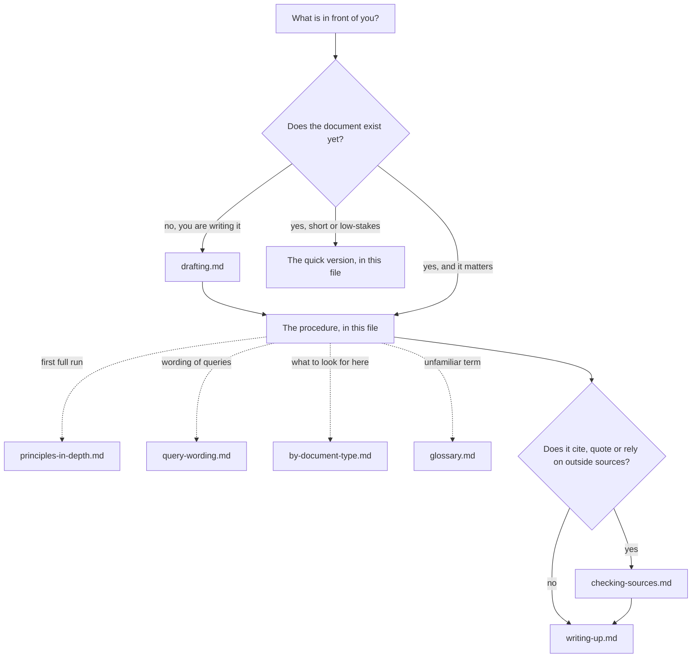

# Careful review

A careful review reads a document the way its most attentive reader would, and then goes further: it checks that the document says what it means, that its pieces agree with each other, that its numbers and steps are right, and that its sources say what it claims they say. Every problem found is reported with a location, a severity and, where possible, a correction.

A review is not a verdict on whether the author's view is right. It is a record of where the document, as written, fails its readers: where it is wrong, where it contradicts itself, where it cannot be followed, and where a reader would be misled. A document can be sound in its main idea and still full of errors. A document can be clean on every line and still argue for something mistaken. Keep the two apart, and say which you are reporting.

## The idea in one example

A two-page project report says, in its summary: "Costs fell by 12% year on year, from £480,000 to £410,000 (see Table 3)."

*A quick read* nods along. The sentence is fluent, it gives a figure, and it points to evidence.

*A careful read* checks three things. First, the arithmetic: a fall from 480,000 to 410,000 is 70,000, which is 14.6% of 480,000, not 12%. Second, the cross-reference: Table 3 turns out to list staff numbers; the costs are in Table 4. Third, consistency: in section 5 the same costs appear as "£480k and £421k". So the summary has a wrong percentage, a wrong pointer and a figure that disagrees with the body. None of these is visible without stopping to check, and each would mislead a reader who trusted the summary and read no further, which is what most readers of a summary do.

The report of this finding reads: "Summary, sentence 2 (major): the fall from £480,000 to £410,000 is 14.6%, not 12%; the table cited is Table 4, not Table 3; and section 5, paragraph 3 gives the later figure as £421k. One of the two figures is wrong. If £421k is right, the fall is 12.3%, which would match the stated percentage, so the likely error is £410,000 in the summary." That is a finding: located, graded, checked, and with a proposed correction whose reasoning the author can follow.

## Three kinds of problem. Keep them apart.

Most weak reviews mix these together, and the author cannot tell which comments matter.

1. **Errors.** Something in the document is false, miscalculated, misquoted, or does not follow. A wrong sum, a step in a proof that does not hold, a citation that does not say what is claimed, a date that is wrong. These are the heart of the review.
2. **Inconsistencies.** Two places in the document disagree with each other: a term defined one way and used another, a figure given twice with different values, a section cross-referenced that does not exist, a symbol that means one thing on page 2 and another on page 9. Each place may look fine alone. The fault is in the pair.
3. **Presentation problems.** Nothing is false, but the reader is badly served: the order is confusing, a key term is used before it is defined, a paragraph tries to do three things, the notation is heavier than it needs to be, the audience is misjudged.

An error is always worth reporting. An inconsistency is always worth reporting, because at least one of the two places is an error, or the reader will think so. A presentation problem is worth reporting when it would actually cost a reader something: time, understanding, or a wrong conclusion. Mark each finding with its kind.

## Where to look, and when

This file is the whole method for reviewing a document that already exists. The other files are modules. Open one only when its row applies.

| You are... | Open | To get |
|---|---|---|
| reviewing something short or low-stakes | nothing else: use "The quick version" below | four checks |
| reviewing something that matters | `references/principles-in-depth.md`, once per conversation | the reason behind each step, so you can adapt it |
| unsure how to word a query to the author, or a note to yourself | `references/query-wording.md` | wording for queries, follow-ups, self-checks |
| unsure what to look for in this kind of document | `references/by-document-type.md` | papers, reports, specifications, proofs, manuals, policies, essays, notes |
| writing a document of your own that others will check or rely on | `references/drafting.md` | how to write so the review finds little |
| about to check quotations, citations or figures against their sources | `references/checking-sources.md` | how to verify without fooling yourself |
| writing up the result | `references/writing-up.md` | severity grades, the layout of a finding, the order of a report |
| unsure what a reviewing term means | `references/glossary.md` | plain meanings of editorial and reviewing terms |

**Keeping the map true.** When a module is added, split or changed, update the table and the graph in the same edit. A module with no row cannot be found: give it a row or remove it.

**What belongs in this method.** One test for any addition: does it help a reviewer find, locate or report a problem in a document? General writing advice, however good, stays out unless it helps a reviewer judge a draft. When in doubt, leave it out.

## The stance

- **Serve the reader.** Every comment should be justified by what it would cost a reader if left alone. "I would have written it differently" is not a finding.
- **Check, do not assume.** A number that looks right has not been checked. A reference that looks plausible has not been followed. Do the sum. Follow the pointer.
- **Locate everything.** A finding without a location is a complaint. Give section, paragraph, line, equation, table, or a short quotation.
- **Grade everything.** Say how much each finding matters. An author with forty unranked comments will fix the easy ones and miss the one that matters.
- **Be exact about what you checked.** "I checked all arithmetic in sections 2 to 4; I did not check section 5" is useful. "Looks fine" is not.
- **Propose a fix where you can.** A correction the author can accept or reject saves a round of messages.
- **Be courteous and plain.** Write about the document, not the author. "This sum gives 14.6%, not 12%" rather than "the author has miscalculated". The tone of a good colleague, not a judge.
- **Do not rewrite the document in your own voice.** Suggest changes where something is wrong or unclear; leave the author's style alone otherwise.

## The procedure

Read `references/principles-in-depth.md` before a first full run in a conversation. It gives the reason behind every step.

**Step 1 - Settle the brief.** Before reading closely, be clear what you are asked to do. Who is the document for? What is it meant to achieve: to inform, to persuade, to specify, to prove, to instruct? What kind of review is wanted: a full referee's report, a correctness check, a proofread, a check of references only? What stage is the draft at? A first draft needs comments on structure; a final proof needs comments on typos. If the brief is unclear and you cannot ask, state the brief you have assumed at the top of your report.

**Step 2 - Skim the whole.** Read the title, abstract or summary, headings, first and last paragraphs, figures and tables, and the conclusion, quickly and in order. Aim to answer: what is the document's main claim or purpose, how is it organised, and where is the heavy material? Write the main claim down in one or two sentences of your own. If you cannot, that is already a finding about clarity. Note first impressions, but do not report them yet: many are answered later in the document.

**Step 3 - Build an inventory.** Before the close read, make lists you will check against:
- **Terms and symbols:** each defined term and symbol, where it is defined, and what it is defined as.
- **Numbered items:** sections, figures, tables, equations, theorems, appendices, footnotes, with their numbers as they actually appear.
- **Key figures:** every number that appears more than once, or that the conclusion rests on.
- **Claims:** the main claims, with where each is stated and where each is supported.
- **Sources:** every citation, with what it is cited for.

The inventory turns consistency checking from memory work into lookup. For a short document it can live in your head; for anything over a few pages, write it down.

**Step 4 - Read closely, in order.** Read every sentence. At each paragraph ask: what is this paragraph for, does it say it clearly, and is it right? Mark every place where you had to reread, where you were surprised, where you could not tell what a word referred to, or where a claim appeared without support. Keep notes in the order you find things, each with its location; sort them later.

**Step 5 - Run the checks.** Full wording is in `references/query-wording.md`. For each check, record what you covered as well as what you found.
- **Terms.** Each technical term defined before use, or clearly assumed known by this audience. Each used in the same sense throughout. Watch for a term that quietly widens or narrows between sections, and for two different words used for what seems to be one thing, which leaves the reader wondering whether they differ.
- **Cross-references.** Every "see section 4", "as in Table 2", "by Lemma 3", "above" and "below" points to something that exists, has that number, and says what it is cited for. Check numbering is in sequence with no gaps or duplicates.
- **Arithmetic and figures.** Redo every sum, percentage, average, unit conversion and total you can. Check that numbers repeated in the text match their tables. Check that percentages in a breakdown add to 100 (allowing for stated rounding). Check that units are stated and consistent.
- **Worked examples.** Work each example yourself from the stated inputs. An example is where readers learn the method; a wrong one teaches them wrong.
- **Proofs and derivations.** For each step, name the rule, earlier result or assumption that licenses it. Check that what is proved is exactly what was stated, with the same quantifiers and cases. Check that every case is covered and that edge cases (zero, empty, one element, equality) are not skipped. Check that every assumption the proof leans on appears in the statement or in an earlier stated result.
- **Quotations and citations.** Each quotation matches its source word for word, with omissions marked. Each citation supports what it is cited for. Details (authors, year, title, pages) are correct and consistent with the reference list. See `references/checking-sources.md`.
- **Figures and tables.** Each has a caption, labelled axes and units, and is referred to in the text. What the text says about it matches what it shows.
- **Structure.** Each section does what its heading says. The order lets the reader meet ideas before they are needed. Nothing important is buried in a footnote or an appendix.
- **Audience.** The level of explanation fits the stated reader. Jargon is either defined or appropriate. Nothing is explained at great length that the reader already knows, while something essential is skipped.
- **Notation.** Each symbol has one meaning. Each meaning has one symbol. Subscripts, fonts and brackets are used the same way throughout. Notation is introduced near first use.
- **Mechanics.** Spelling, grammar, punctuation, capitalisation, numbering style, date formats, spelling of names. Report these as a batch unless one changes the meaning.

**Step 6 - Second pass and triage.** Reread the document quickly with your notes beside you. Delete notes answered later in the text. Merge notes that are one problem seen in several places. Confirm each remaining finding by checking it again. Then grade each finding (see "The report" below and `references/writing-up.md`). If you found nothing in some check, say so; it is useful to know.

**Step 7 - Report.** See below.

## The quick version

For a short or low-stakes document, four checks are enough.

1. What is this document for, and does it do it?
2. Redo the sums and follow the cross-references. Are they right?
3. Are the key terms used the same way throughout?
4. Where would a reader in its intended audience get stuck or be misled?

## How to ask

When you cannot settle something yourself, put it to the author as a query. The way a query is worded decides whether you get a quick answer or a long defence.

- **Point, then ask.** Quote or locate the passage first, then ask one question about it. "Section 3, paragraph 2 says 'all participants'. Table 1 lists 40, but the method section says 42 were recruited. Were two excluded?"
- **One query, one issue.** Stacked questions get partial answers.
- **Say what you checked.** "I get 14.6% from these figures; is the base different from the one I used?" gives the author something to answer. "Is this right?" does not.
- **Offer the likely fix.** "Should this read 'Table 4'?" is quicker to answer than "which table do you mean?"
- **Keep queries for real doubt.** If you can check it yourself, check it. Queries are for things only the author knows: intent, missing data, unpublished sources.
- **Distinguish a query from a correction.** A correction says "this is wrong; here is the right version". A query says "I cannot tell; please confirm". Mark which is which.
- **Keep the tone collegial.** You and the author want the same thing: a document that is right.
- **Stop** when every note is either confirmed as a finding with a grade, withdrawn as answered, or turned into a query you have stated plainly.

## The report

Keep it in proportion. For a full review:

1. **The brief.** What you were asked to review, for whom, and at what depth. Any assumption you made about the brief.
2. **Summary of the document.** Its main claim or purpose, in two or three sentences, so the author can see you read it as intended.
3. **Overall assessment.** A short paragraph: the document's main strengths, its most serious problems, and whether it is ready for its purpose.
4. **Major findings.** Each with location, kind (error, inconsistency, presentation), what is wrong, the evidence, and a proposed fix. Most serious first.
5. **Minor findings.** Same layout, shorter. Grouped by section or in document order.
6. **Mechanical corrections.** Typos, formatting, spelling: a list, in document order, or marked directly on a copy.
7. **Queries.** Things you could not settle, with what would settle them.
8. **Coverage.** What you checked, and what you did not.

See `references/writing-up.md` for the grading scale and the layout of a single finding.

## Reference files

See "Where to look, and when" near the top. Every module has a row there and a node in the graph.

## Traps

- **Reviewing only the part you like.** Sections that look dull or technical are where errors hide. Give every section its turn.
- **Trusting the summary.** Summaries, abstracts and conclusions are written last, often in a hurry, and often disagree with the body. Check them against the body.
- **Skipping the arithmetic because it "looks right".** Numbers that look plausible are exactly the ones nobody else checks either.
- **Checking a worked example by reading it.** Work it yourself, from the inputs, before you look at the author's answer.
- **Following a cross-reference in your head.** Go and look. Numbers shift when sections are added.
- **Letting a quotation stand because you remember the source.** Memory rounds off wording. Compare with the source itself, or say you could not.
- **Burying the major finding.** One wrong result among thirty typo notes will be missed. Put it first.
- **Comments without locations.** The author cannot act on "some terms are used inconsistently". Say which, and where.
- **Rewriting for taste.** Your preferred phrasing is not a finding.
- **Reviewing the author, not the document.** Keep every comment about the text.
- **Claiming coverage you did not do.** If you checked a sample, say it was a sample.
- **Confusing "I don't follow" with "this is wrong".** Both may be worth reporting, but they are different findings.
